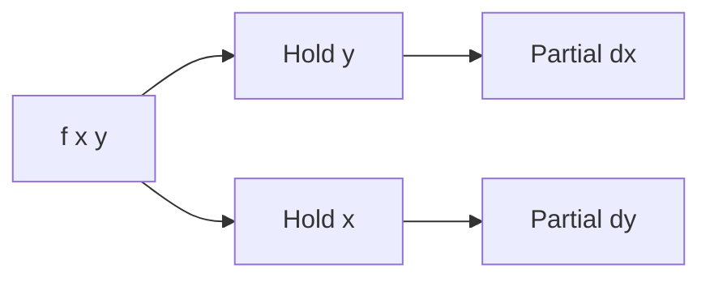

# 편미분

> Calculus for ML 101 시리즈 (3/10)


## 이 글에서 다룰 문제

ML 모델의 *모든 가중치* 는 *편미분* 으로 *책임 비율* 을 받습니다.

## 개념 한눈에 보기



## Before/After

**Before**: *모든 입력* 을 한꺼번에 본다.

**After**: *한 입력* 만 *분리* 해서 본다.

## 실습: 미니 편미분 키트

### 1단계 — 다변수 함수

```python
def f(x, y):
    return x ** 2 + 3 * y
```

### 2단계 — x에 대한 편미분

```python
def partial_x(f, x, y, h=1e-5):
    return (f(x + h, y) - f(x - h, y)) / (2 * h)
```

### 3단계 — y에 대한 편미분

```python
def partial_y(f, x, y, h=1e-5):
    return (f(x, y + h) - f(x, y - h)) / (2 * h)
```

### 4단계 — 두 편미분 한 번에

```python
def partials(f, x, y):
    return partial_x(f, x, y), partial_y(f, x, y)
```

### 5단계 — ML 가중치 직관

```python
def loss(w1, w2):
    return (w1 - 1) ** 2 + (w2 + 2) ** 2

g1, g2 = partials(loss, 0.0, 0.0)  # 각 가중치의 책임
```

## 이 코드에서 주목할 점

- *편미분* 은 *변수 하나* 만 *움직임*.
- *나머지* 는 *고정*.
- *각 가중치* 가 *각자의 기울기*.

## 자주 하는 실수 5가지

1. ***모든 변수* 를 동시에 *바꿈*.**
2. ***h* 를 *변수마다* 다르게 잡음.**
3. ***고정* 변수의 *값* 영향을 무시.**
4. ***편미분* 과 *전미분* 혼동.**
5. ***기울기 벡터* 의 *순서* 혼동.**

## 실무에서는 이렇게 쓰입니다

*가중치별 책임* 을 계산해 *역전파* 가 *각 파라미터* 를 *적절히* 갱신합니다.

## 체크리스트

- [ ] *변수* 분리.
- [ ] *순서* 명시.
- [ ] *고정* 값 기록.
- [ ] *벡터화* 로 묶기.

## 정리 및 다음 단계

다음 글은 *Gradient* 입니다.

<!-- toc:begin -->
- [미분이란 무엇인가](./01-what-is-derivative.md)
- [함수와 기울기](./02-functions-and-slope.md)
- **편미분 (현재 글)**
- Gradient (예정)
- 연쇄 법칙 (예정)
- 손실 함수 (예정)
- 경사하강법 (예정)
- 최적화 (예정)
- 역전파 직관 (예정)
- 딥러닝에서의 미분 (예정)
<!-- toc:end -->

## 참고 자료

- [Partial Derivatives - Khan Academy](https://www.khanacademy.org/math/multivariable-calculus/multivariable-derivatives)
- [Multivariable Calculus - MIT OCW](https://ocw.mit.edu/courses/18-02-multivariable-calculus-fall-2007/)
- [Deep Learning Book - Chapter 4](https://www.deeplearningbook.org/contents/numerical.html)
- [JAX Automatic Differentiation](https://jax.readthedocs.io/en/latest/notebooks/autodiff_cookbook.html)

Tags: Calculus, ML, PartialDerivative, MultiVariable, Beginner
