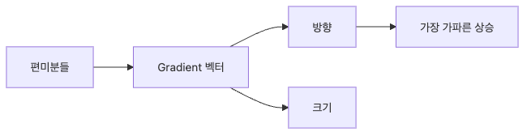

# Gradient

편미분까지 이해했다면 이제 질문이 하나 더 생깁니다. 여러 변수에 대한 변화율을 각각 따로 계산한 뒤, 그 정보를 어떻게 한 번에 사용해야 할까요? 모델은 보통 파라미터를 한 개씩 따로 움직이지 않고, 현재 상태 전체를 기준으로 한 번의 업데이트를 수행합니다.

Gradient는 바로 그때 필요한 표현입니다. 여러 편미분을 순서 있는 벡터로 묶어, 함수가 가장 빠르게 증가하는 방향을 하나의 객체로 나타냅니다. 그래서 gradient는 단순한 숫자 모음이 아니라, 현재 지점에서 움직일 방향과 신호 강도를 함께 담은 구조입니다.

이 글은 Calculus for ML 101 시리즈의 네 번째 글입니다.

이 글에서는 gradient를 방향, 크기, 등고선, 반대 방향이라는 관점에서 설명하겠습니다. 핵심은 “편미분이 여러 개 있다”에서 멈추지 않고, 그것이 왜 업데이트 방향이 되는지 이해하는 것입니다.

끝까지 읽고 나면 gradient를 벡터 기호가 아니라 손실 지형 위에서 길을 찾는 지도처럼 해석하게 될 것입니다.

## 이 글에서 다룰 문제

- 여러 편미분을 하나의 gradient vector로 묶는다는 것은 정확히 무엇을 뜻할까요?
- gradient의 방향과 크기는 각각 어떤 실무 의미를 가질까요?
- 왜 gradient는 손실이 가장 빠르게 증가하는 방향을 가리킬까요?
- 경사하강법이 gradient의 반대 방향으로 움직이는 이유는 무엇일까요?
- 등고선 관점으로 보면 gradient를 왜 더 직관적으로 이해할 수 있을까요?

## 왜 이 글이 중요한가

optimizer는 scalar 하나가 아니라 parameter vector 전체를 다룹니다. 따라서 손실을 줄이려면 각 weight에 대한 편미분을 따로 보는 데서 한 걸음 더 나아가, 전체 상태를 움직일 방향을 정해야 합니다. gradient는 이 역할을 수행하는 가장 기본적인 수학적 표현입니다.

실무에서 gradient norm을 모니터링하거나, exploding gradient를 진단하거나, learning rate와 gradient magnitude를 함께 해석하는 이유도 여기에 있습니다. gradient를 단지 “autograd가 준 숫자 배열”로 보면 이런 현상이 분절된 이벤트처럼 보이지만, 방향 벡터라는 관점으로 보면 훨씬 일관되게 해석됩니다.

또한 gradient를 이해해야 다음 글의 chain rule과 backpropagation이 왜 효율적인지 자연스럽게 이어집니다. backpropagation은 결국 전체 모델의 gradient를 빠르게 계산하는 메커니즘이기 때문입니다.

## Gradient를 이해하는 가장 좋은 방법: 손실 지형 위에서 가장 가파르게 올라가는 방향 벡터로 보는 것입니다

Gradient를 가장 잘 이해하는 방법은 손실 함수를 지형으로 상상하는 것입니다. 현재 위치에서 어느 쪽이 가장 가파르게 올라가는지 알려 주는 화살표가 gradient입니다. 이 화살표의 방향은 상승 방향을, 길이는 변화의 강도를 나타냅니다.

경사하강법은 이 화살표를 반대로 뒤집어 한 걸음 이동합니다. 즉 gradient를 알면 “어느 쪽으로 올라가는가”를 알고, 그 반대 방향으로 가면 “어느 쪽으로 내려가는가”를 알 수 있습니다. 그래서 gradient는 단지 미분의 결과가 아니라, 학습의 직접적인 제어 신호가 됩니다.

> Gradient는 여러 편미분의 목록이 아니라, 현재 위치에서 손실이 가장 빠르게 증가하는 방향과 강도를 동시에 담은 벡터입니다.

## 핵심 개념

gradient의 핵심 흐름은 다음과 같습니다.



*gradient 흐름: 여러 편미분이 방향과 크기를 가진 하나의 벡터로 묶입니다.*
### gradient는 편미분을 묶은 벡터입니다

```python
def grad(f, x, h=1e-5):
    g = []
    for i in range(len(x)):
        xp = x.copy(); xm = x.copy()
        xp[i] += h; xm[i] -= h
        g.append((f(xp) - f(xm)) / (2 * h))
    return g
```

이 함수는 각 좌표를 하나씩 움직여 편미분을 계산하고 리스트로 모읍니다. 구현은 단순하지만 의미는 분명합니다. 입력 벡터의 각 축에 대해 독립적인 변화율을 계산하고, 그 순서를 유지한 채 하나의 벡터로 묶습니다.

### 손실 함수에 적용하면 방향 정보가 드러납니다

```python
def loss(w):
    return (w[0] - 1) ** 2 + (w[1] + 2) ** 2
```

이 손실은 2차원 지형처럼 볼 수 있습니다. 특정 지점에서 gradient를 계산하면, 현재 위치에서 손실이 가장 빨리 증가하는 방향이 벡터로 나옵니다.

```python
g = grad(loss, [0.0, 0.0])  # about [-2, 4]
```

예를 들어 여기서는 첫 번째 축으로는 왼쪽, 두 번째 축으로는 위쪽 성분이 있다는 뜻입니다. 중요한 것은 각 성분을 따로 보는 것을 넘어서, 이 둘이 합쳐져 하나의 방향 화살표를 만든다는 점입니다.

### 크기는 신호의 강도를 말해 줍니다

```python
import math

def norm(v):
    return math.sqrt(sum(x ** 2 for x in v))
```

gradient norm은 현재 지점에서 얼마나 급한 지형에 서 있는지 알려 줍니다. norm이 크면 작은 이동에도 손실이 크게 변할 수 있고, norm이 작으면 평평한 지역에 가까울 수 있습니다. gradient clipping, exploding gradient 모니터링 같은 실무 기법도 결국 이 크기 해석에 기대고 있습니다.

### 반대 방향이 감소 방향입니다

```python
def step(w, g, lr=0.1):
    return [wi - lr * gi for wi, gi in zip(w, g)]
```

gradient는 증가 방향이므로, 손실을 줄이려면 부호를 뒤집어 이동해야 합니다. 이 한 줄이 경사하강법의 본질입니다. learning rate는 이 벡터를 얼마나 길게 반영할지 조절하는 배율이고, gradient 자체와는 다른 개념입니다.

### 등고선 관점이 특히 유용합니다

2차원 손실 표면을 등고선으로 생각하면 gradient는 항상 등고선에 수직인 방향을 가리킵니다. 그리고 그 방향이 가장 가파른 상승 방향입니다. 그래서 등고선 사이를 비스듬히 헤매는 대신, gradient를 따라가면 가장 직접적인 상승 경로를 얻게 됩니다. 경사하강법은 정확히 그 반대 경로를 택합니다.

## 흔히 헷갈리는 지점

- gradient를 scalar처럼 취급하면 각 좌표의 책임과 전체 방향을 동시에 놓치게 됩니다.
- learning rate와 gradient magnitude를 같은 것으로 생각하면 업데이트가 왜 커졌는지 잘못 해석할 수 있습니다.
- gradient의 부호를 반대로 읽으면 손실을 줄이는 대신 키우는 방향으로 움직일 수 있습니다.
- 좌표 순서가 weight 순서와 맞지 않으면 gradient vector 전체가 잘못 적용됩니다.
- 등고선 직관 없이 수치만 보면 왜 특정 방향이 선택되는지 설명이 약해집니다.

## 운영 체크리스트

- [ ] gradient를 벡터로 보고 각 성분과 전체 방향을 함께 해석한다
- [ ] learning rate와 gradient norm을 분리해서 모니터링한다
- [ ] 좌표 순서와 parameter 순서가 코드 전반에서 일치하는지 확인한다
- [ ] exploding 또는 vanishing gradient 징후를 norm 관점에서 읽는다
- [ ] 경사하강법은 gradient의 반대 방향이라는 기본 규칙을 항상 점검한다

## 정리

Gradient는 여러 편미분을 한데 묶은 벡터이며, 현재 지점에서 손실이 가장 빠르게 증가하는 방향을 가리킵니다. 방향은 어디로 움직일지를, 크기는 그 신호가 얼마나 강한지를 알려 줍니다. 그래서 gradient는 미분 결과이면서 동시에 학습 제어 신호입니다.

경사하강법은 이 gradient를 반대로 따라갑니다. 즉 gradient를 이해하는 것은 “왜 optimizer가 저 방향으로 움직였는가”를 이해하는 일과 같습니다. 실무에서 gradient norm, clipping, exploding gradient 같은 표현이 자연스럽게 쓰이는 이유도 모두 이 벡터 관점에서 설명됩니다.

다음 글에서는 함수가 함수 안에 들어가는 합성 구조에서 gradient가 어떻게 전달되는지 보겠습니다. 그러면 chain rule이 왜 backpropagation의 핵심인지 훨씬 분명해집니다.

<!-- toc:begin -->
## 시리즈 목차

- [미분이란 무엇인가](./01-what-is-derivative.md)
- [함수와 기울기](./02-functions-and-slope.md)
- [편미분](./03-partial-derivatives.md)
- **Gradient (현재 글)**
- 연쇄 법칙 (예정)
- 손실 함수 (예정)
- 경사하강법 (예정)
- 최적화 (예정)
- 역전파 직관 (예정)
- 딥러닝에서의 미분 (예정)

<!-- toc:end -->

## 참고 자료

### 공식 문서
- [Gradient - Khan Academy](https://www.khanacademy.org/math/multivariable-calculus/multivariable-derivatives/partial-derivative-and-gradient-articles)
- [Vector Calculus - 3Blue1Brown](https://www.3blue1brown.com/topics/calculus)
- [Deep Learning Book - Numerical Computation](https://www.deeplearningbook.org/contents/numerical.html)
- [PyTorch Autograd Mechanics](https://pytorch.org/docs/stable/notes/autograd.html)

### 관련 시리즈
- [Linear Algebra 101](../../linear-algebra-101/ko/)
- [MLOps 101](../../mlops-101/ko/)

Tags: Calculus, ML, Gradient, Vector, Beginner
