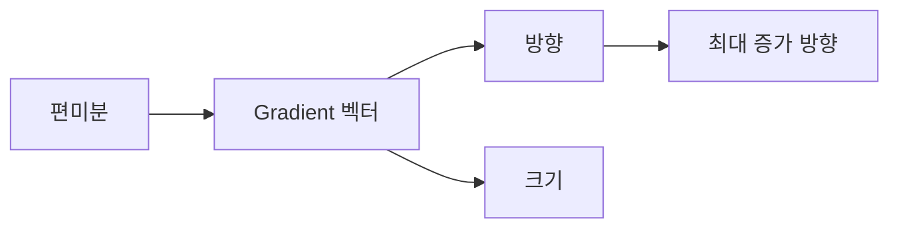

# Gradient

Gradient는 모든 편미분을 한 벡터로 모아 손실이 가장 가파르게 변하는 방향을 드러냅니다.

이 글은 Calculus for ML 101 시리즈의 4번째 글입니다.

## 이 글에서 다룰 문제

- 여러 편미분을 왜 하나의 벡터로 묶을까요?
- gradient는 방향과 크기 가운데 무엇을 알려 줄까요?
- 왜 gradient의 반대 방향으로 움직이면 손실이 줄어들까요?
- 등고선 관점은 최적화를 어떻게 쉽게 설명해 줄까요?

> gradient는 각 변수의 편미분을 한 벡터로 묶은 값입니다. 이 벡터는 손실이 가장 빠르게 증가하는 방향을 가리키고, 경사하강법은 그 반대 방향으로 이동합니다.

> Calculus for ML 101 시리즈 (4/10)

## 이 글에서 배울 것

- gradient의 정의를 벡터 관점에서 이해합니다.
- 방향과 크기가 각각 무슨 뜻인지 구분합니다.
- 가장 가파르게 증가하는 방향이라는 해석을 익힙니다.
- 반대 방향이 왜 학습 방향인지 설명할 수 있습니다.

## 왜 중요한가

경사하강법은 gradient의 반대 방향으로 한 걸음 움직이는 알고리즘입니다. 따라서 gradient를 단순한 숫자 목록으로 보면 학습을 읽기 어렵고, 방향 벡터로 보면 모델이 현재 어디를 향해 가는지 보입니다.

## 개념 한눈에 보기



## 핵심 용어

- **gradient**: 편미분을 모아 만든 벡터입니다.
- **방향**: 어느 쪽으로 가장 크게 증가하는지 나타냅니다.
- **크기**: 변화가 얼마나 강한지 나타냅니다.
- **등고선**: 함수값이 같은 점들을 이은 선입니다.
- **최대 증가**: 가장 빠르게 커지는 방향입니다.

## Before / After

**Before**: 변수별 기울기를 따로따로 봅니다.

**After**: 하나의 벡터로 묶어 전체 이동 방향을 읽습니다.

## 단계별 실습: 미니 Gradient 키트

### Step 1 — Gradient 함수

```python
def grad(f, x, h=1e-5):
    g = []
    for i in range(len(x)):
        xp = x.copy(); xm = x.copy()
        xp[i] += h; xm[i] -= h
        g.append((f(xp) - f(xm)) / (2 * h))
    return g
```

각 좌표를 하나씩 건드려 편미분을 계산한 뒤 리스트로 묶습니다. 이것이 gradient의 가장 단순한 구현입니다.

### Step 2 — 손실 함수

```python
def loss(w):
    return (w[0] - 1) ** 2 + (w[1] + 2) ** 2
```

두 개의 가중치를 가진 손실 함수를 준비합니다. 이제 각 축에서 손실이 얼마나 민감한지 볼 수 있습니다.

### Step 3 — Gradient 계산

```python
g = grad(loss, [0.0, 0.0])  # [-2, 4]
```

현재 위치에서 첫 번째 좌표는 오른쪽으로, 두 번째 좌표는 아래쪽으로 움직여야 손실이 줄어들 가능성이 높다는 뜻을 읽을 수 있습니다.

### Step 4 — 크기

```python
import math

def norm(v):
    return math.sqrt(sum(x ** 2 for x in v))
```

벡터의 길이는 지금 기울기 신호가 얼마나 큰지 보여 줍니다.

### Step 5 — 반대 방향 한 걸음

```python
def step(w, g, lr=0.1):
    return [wi - lr * gi for wi, gi in zip(w, g)]
```

손실을 줄이고 싶다면 gradient와 같은 방향이 아니라 반대 방향으로 이동해야 합니다.

## 이 코드에서 주목할 점

- gradient는 스칼라가 아니라 벡터입니다.
- 반대 방향 이동이 손실 감소의 기본 원리입니다.
- 크기는 현재 지형이 얼마나 가파른지 알려 주는 신호입니다.

## 자주 하는 실수 5가지

1. gradient를 하나의 숫자처럼 다룹니다.
2. 부호를 뒤집지 않고 gradient 방향으로 그대로 이동합니다.
3. 학습률과 gradient 크기를 같은 개념으로 생각합니다.
4. 등고선 직관 없이 좌표별 숫자만 봅니다.
5. 가중치 순서와 gradient 좌표 순서를 어긋나게 둡니다.

## 실무에서는 이렇게 생각합니다

실무에서 gradient는 단순한 기울기 계산 결과가 아니라 모델 상태를 읽는 지도입니다. 크기가 너무 크면 발산을 의심하고, 너무 작으면 학습 정체를 의심합니다. 좌표가 잘못 정렬되면 업데이트 자체가 틀어지므로 데이터 구조와 파라미터 순서를 고정하는 습관도 중요합니다.

## 체크리스트

- [ ] gradient가 벡터라는 점을 전제로 코드를 읽었습니다.
- [ ] 업데이트에서 부호가 반대로 적용되는지 확인했습니다.
- [ ] gradient 크기를 모니터링할 이유를 이해했습니다.
- [ ] 좌표 순서와 가중치 순서를 일치시켰습니다.

## 정리 및 다음 글

gradient는 여러 편미분을 하나의 이동 신호로 묶은 벡터입니다. 이 벡터가 가장 빠르게 증가하는 방향을 가리키기 때문에, 학습은 그 반대 방향으로 진행됩니다. 다음 글에서는 이 연결을 가능하게 하는 연쇄 법칙을 보겠습니다.

<!-- toc:begin -->
- [미분이란 무엇인가](./01-what-is-derivative.md)
- [함수와 기울기](./02-functions-and-slope.md)
- [편미분](./03-partial-derivatives.md)
- **Gradient (현재 글)**
- 연쇄 법칙 (예정)
- 손실 함수 (예정)
- 경사하강법 (예정)
- 최적화 (예정)
- 역전파 직관 (예정)
- 딥러닝에서의 미분 (예정)
<!-- toc:end -->

## 참고 자료

- [Gradient - Khan Academy](https://www.khanacademy.org/math/multivariable-calculus/multivariable-derivatives/partial-derivative-and-gradient-articles)
- [Vector Calculus - 3Blue1Brown](https://www.3blue1brown.com/topics/calculus)
- [Deep Learning Book - Numerical Computation](https://www.deeplearningbook.org/contents/numerical.html)
- [PyTorch Autograd Mechanics](https://pytorch.org/docs/stable/notes/autograd.html)

Tags: Calculus, ML, Gradient, Vector, Beginner
