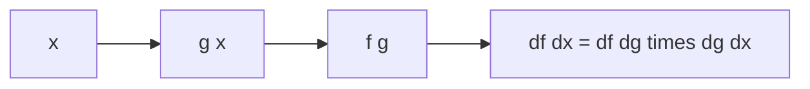

# 연쇄 법칙

연쇄 법칙은 함수 안에 함수가 들어간 구조에서 기울기를 끝까지 전달하는 핵심 규칙입니다.

이 글은 Calculus for ML 101 시리즈의 5번째 글입니다.

> Calculus for ML 101 시리즈 (5/10)


## 이 글에서 다룰 문제

신경망은 작은 함수가 여러 단계로 이어진 구조이고, 연쇄 법칙은 그 전체 기울기를 빠짐없이 계산하는 핵심 도구입니다.

## 전체 흐름


## Before/After

**Before**: 합성 함수의 전체 미분이 막막합니다.

**After**: 각 단계의 미분을 연결해서 전체 미분을 구합니다.

## 미니 연쇄 법칙 키트

### 1단계 — 합성 함수

```python
def g(x):
    return 2 * x + 1

def f(u):
    return u ** 2

def h(x):
    return f(g(x))
```

### 2단계 — 안과 바깥 미분

```python
def dg(x):
    return 2.0

def df(u):
    return 2 * u
```

### 3단계 — 연쇄 법칙

```python
def dh(x):
    return df(g(x)) * dg(x)
```

### 4단계 — 수치 검증

```python
def deriv(f, x, h=1e-5):
    return (f(x + h) - f(x - h)) / (2 * h)

assert abs(dh(1.0) - deriv(h, 1.0)) < 1e-3
```

### 5단계 — 다단 합성

```python
def chain(*derivs):
    p = 1.0
    for d in derivs:
        p *= d
    return p
```

## 이 코드에서 주목할 점

- 연쇄 법칙의 핵심은 바깥 미분과 안쪽 미분을 이어서 곱하는 데 있습니다.
- 수치 미분으로 결과를 비교하면 구현이 맞는지 빠르게 확인할 수 있습니다.
- 합성 단계가 늘어나도 원리는 바뀌지 않습니다.

## 자주 하는 실수 5가지

1. 합성 순서를 거꾸로 읽어서 잘못 곱합니다.
2. 안쪽 함수의 미분을 계산해야 할 위치와 바깥 함수의 입력값을 혼동합니다.
3. 중간 단계에서 기울기가 0이면 전체 기울기도 0이 될 수 있다는 점을 놓칩니다.
4. 다변수 문제로 가면 단순한 숫자 곱이 아니라 행렬 연산으로 확장된다는 점을 잊습니다.
5. 음수 부호 하나를 빠뜨려 결과 전체를 틀립니다.

## 실무에서는 이렇게 쓰입니다

역전파는 연쇄 법칙을 뒤에서 앞으로 적용해 모든 가중치의 기울기를 한 번에 구하는 절차입니다. 딥러닝 프레임워크가 자동으로 해 주는 계산도 결국 이 원리 위에 서 있습니다.

## 체크리스트

- [ ] 합성 순서를 먼저 표시했습니다.
- [ ] 각 단계의 미분을 따로 썼습니다.
- [ ] 수치 미분으로 결과를 검증했습니다.
- [ ] 중간에 0 기울기 구간이 없는지 확인했습니다.

## 정리 및 다음 단계

연쇄 법칙은 복잡한 합성 함수를 잘게 나눠 계산한 뒤 다시 연결하는 방법입니다. 이 감각이 잡히면 역전파가 왜 가능한지 훨씬 자연스럽게 이해됩니다. 다음 글에서는 모델이 무엇을 줄이려 하는지 설명하는 손실 함수로 넘어가겠습니다.

<!-- toc:begin -->
- [미분이란 무엇인가](./01-what-is-derivative.md)
- [함수와 기울기](./02-functions-and-slope.md)
- [편미분](./03-partial-derivatives.md)
- [Gradient](./04-gradient.md)
- **연쇄 법칙 (현재 글)**
- 손실 함수 (예정)
- 경사하강법 (예정)
- 최적화 (예정)
- 역전파 직관 (예정)
- 딥러닝에서의 미분 (예정)
<!-- toc:end -->

## 참고 자료

- [Chain Rule - Khan Academy](https://www.khanacademy.org/math/ap-calculus-ab/ab-differentiation-2-new/ab-3-1a/v/chain-rule-introduction)
- [Backpropagation - CS231n](https://cs231n.github.io/optimization-2/)
- [Deep Learning Book - Backprop](https://www.deeplearningbook.org/contents/mlp.html)
- [Automatic Differentiation - Baydin et al.](https://arxiv.org/abs/1502.05767)

Tags: Calculus, ML, ChainRule, Backprop, Beginner
