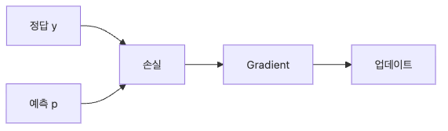

# 손실 함수

모델이 예측을 만들었다고 해서 학습이 자동으로 시작되지는 않습니다. 예측이 얼마나 좋은지, 어떤 방향으로 수정해야 하는지를 숫자로 표현하는 기준이 필요합니다. 손실 함수는 예측과 정답 사이의 차이를 하나의 스칼라 값으로 바꾸고, 그 값의 gradient를 통해 학습 신호를 만들어 냅니다.

중요한 점은 손실 함수가 단순한 평가 점수표가 아니라는 사실입니다. 손실 함수를 어떻게 정의하느냐에 따라 모델이 “무엇을 잘하도록” 학습되는지가 달라집니다. 즉 손실 함수 선택은 최적화 대상 자체를 정하는 일입니다.

이 글은 Calculus for ML 101 시리즈의 여섯 번째 글입니다.

이 글에서는 회귀에서 자주 쓰는 MSE, 분류에서 자주 쓰는 cross entropy, gradient가 만드는 학습 신호라는 관점에서 손실 함수를 설명하겠습니다. 목표는 손실을 숫자 하나로만 보지 않고, 학습 목적을 코드로 명시하는 설계 요소로 이해하는 것입니다.

끝까지 읽고 나면 “왜 이 모델이 이런 방향으로 학습되었는가”를 손실 함수 정의에서부터 설명할 수 있게 됩니다.

## 이 글에서 다룰 문제

- 손실 함수는 단순한 평가 지표와 무엇이 다를까요?
- 회귀에서 MSE를, 분류에서 cross entropy를 자주 쓰는 이유는 무엇일까요?
- 손실 함수의 gradient는 왜 학습 신호라고 불릴까요?
- 평균과 합을 어떻게 두느냐가 optimization scale에 어떤 영향을 줄까요?
- 숫자적으로 불안정한 손실 구현은 학습을 어떻게 망가뜨릴까요?

## 왜 이 글이 중요한가

손실 함수는 모델의 목적 함수를 구체적으로 정의합니다. 같은 데이터와 같은 네트워크를 써도 손실 함수를 다르게 잡으면 모델이 학습하는 방향이 바뀝니다. 그래서 손실 함수 선택은 사소한 구현 세부사항이 아니라 문제 정의의 일부입니다.

실무에서는 loss curve를 모니터링하고, class imbalance를 보정하고, multi-task loss에 가중치를 주는 일이 모두 손실 설계와 연결됩니다. 예를 들어 분류 문제에 부적절한 회귀 손실을 쓰면 예측이 느리게 수렴하거나 calibration이 어색해질 수 있습니다. 반대로 올바른 손실을 선택하면 optimizer가 훨씬 더 일관된 신호를 받습니다.

또한 손실 함수를 이해해야 gradient를 “숫자 변화량”이 아니라 “정답과 예측의 차이가 어느 방향으로 압력을 주는가”로 읽을 수 있습니다. 이 감각은 이후 경사하강법과 최적화 글에서 매우 중요해집니다.

## 손실 함수를 이해하는 가장 좋은 방법: 예측 오차를 학습 가능한 숫자 신호로 변환하는 장치로 보는 것입니다

손실 함수를 가장 실용적으로 이해하는 방법은 예측 오차를 단순한 차이에서 학습 가능한 숫자 신호로 바꾸는 장치로 보는 것입니다. 모델 출력이 얼마나 틀렸는지, 그리고 그 틀림이 어떤 방향 업데이트를 요구하는지를 한꺼번에 담는 구조가 손실 함수입니다.

손실 함수와 평가 지표는 역할이 다릅니다. 평가 지표는 결과를 읽는 데 쓰고, 손실 함수는 그래디언트를 만들어 학습을 진행시키는 데 씁니다. 물론 둘이 비슷할 수도 있지만, 실무에서는 “잘 측정되는 것”과 “잘 학습되는 것”을 구분해서 보는 편이 안전합니다.

> 손실 함수는 예측이 얼마나 틀렸는지 점수만 매기는 도구가 아니라, 모델이 다음 스텝에서 어디로 움직여야 하는지 결정하는 학습 신호 생성기입니다.

## 핵심 개념

손실 함수의 흐름은 다음과 같습니다.



*손실 함수 흐름: 정답과 예측의 차이가 손실과 그래디언트를 거쳐 업데이트 신호가 됩니다.*
### MSE는 회귀 문제의 기본 손실입니다

```python
def mse(y, p):
    return sum((yi - pi) ** 2 for yi, pi in zip(y, p)) / len(y)
```

MSE는 예측과 정답의 차이를 제곱해 평균낸 값입니다. 오차가 클수록 더 큰 벌점을 주므로 큰 오차에 민감합니다. 회귀 문제에서 자주 쓰이는 이유는 구현이 단순하고, 미분도 매끄럽고, 평균적인 제곱 오차를 직접 줄이는 목적과 잘 맞기 때문입니다.

### MSE의 gradient는 예측을 정답 쪽으로 밀어 줍니다

```python
def mse_grad(y, p):
    n = len(y)
    return [-2 * (yi - pi) / n for yi, pi in zip(y, p)]
```

이 gradient는 예측이 정답보다 크면 음의 방향, 작으면 양의 방향으로 업데이트 신호를 만듭니다. 여기서 중요한 것은 손실 함수가 단순히 “틀렸다”를 말하는 데서 끝나지 않고, “어느 쪽으로 얼마나 수정할지”까지 제공한다는 점입니다.

### 분류에서는 binary cross entropy가 더 자연스럽습니다

```python
import math

def bce(y, p, eps=1e-7):
    return -sum(yi * math.log(pi + eps) + (1 - yi) * math.log(1 - pi + eps) for yi, pi in zip(y, p)) / len(y)
```

Binary cross entropy는 확률 예측과 이진 정답의 차이를 측정합니다. 정답 클래스에 높은 확률을 주지 못할수록 큰 손실이 발생합니다. 분류에서는 단순 오차 크기보다 확률 분포의 적합성이 중요하므로 BCE가 더 자연스럽게 문제를 표현합니다.

여기서 `eps`를 더하는 이유는 숫자 안정성 때문입니다. `log(0)`은 정의되지 않으므로, 실제 구현에서는 극단값을 방어해야 합니다. 손실 함수는 수학적으로 맞는 것만으로 충분하지 않고, 수치적으로도 안전해야 합니다.

### 실제 손실값을 비교해 보면 역할 차이가 드러납니다

```python
y = [1, 0, 1]
p = [0.9, 0.2, 0.7]
loss = bce(y, p)
```

같은 예측이라도 어떤 손실을 적용하느냐에 따라 벌점 구조가 달라집니다. 그래서 “모델이 왜 이런 방향으로 업데이트되는가”를 보려면 optimizer만 볼 것이 아니라 손실 정의부터 봐야 합니다.

### 학습 신호는 오차를 움직임으로 바꾸는 감각입니다

```python
def signal(y, p):
    return sum(abs(yi - pi) for yi, pi in zip(y, p)) / len(y)
```

이 함수는 엄밀한 gradient는 아니지만, 예측과 정답의 차이가 어느 정도 남아 있는지를 직관적으로 보여 줍니다. 실무에서는 실제 gradient magnitude, loss slope, update norm 등을 함께 보면서 학습 신호가 충분한지 판단합니다. 중요한 것은 손실이 단순한 보고용 숫자가 아니라 optimizer가 소비하는 신호를 낳는다는 사실입니다.

### 평균과 합의 차이도 무시하면 안 됩니다

배치 크기에 따라 손실을 평균낼지 합할지 결정하면 gradient scale이 달라집니다. 이 차이는 learning rate 해석에도 직접 영향을 줍니다. 그래서 팀마다 reduction 정책을 통일하고, 실험 비교 시 손실 scale이 같은지 먼저 확인하는 습관이 중요합니다.

## 흔히 헷갈리는 지점

- 평가 metric과 학습용 loss를 같은 것으로 취급하면 문제 설계가 흐려질 수 있습니다.
- 회귀 문제에 분류용 손실을, 분류 문제에 부적절한 회귀 손실을 쓰면 optimization 신호가 어긋날 수 있습니다.
- `log(0)` 같은 숫자 안정성 이슈를 무시하면 학습이 NaN으로 무너질 수 있습니다.
- 손실 합과 평균을 혼용하면 실험 간 gradient scale 비교가 왜곡됩니다.
- MSE가 큰 오차에 민감하다는 점을 잊으면 이상치(outlier)에 과도하게 끌리는 모델이 나올 수 있습니다.

## 운영 체크리스트

- [ ] 현재 문제가 회귀인지 분류인지에 맞춰 손실 함수를 선택한다
- [ ] 손실 구현에 `eps` 같은 숫자 안정성 장치를 포함한다
- [ ] reduction이 mean인지 sum인지 실험 설정과 문서에 명시한다
- [ ] class imbalance나 task weighting이 필요한지 손실 설계 단계에서 검토한다
- [ ] loss curve와 gradient scale을 함께 보며 학습 신호 품질을 점검한다

## 정리

손실 함수는 예측과 정답의 차이를 하나의 숫자로 요약하면서, 동시에 그 차이를 gradient를 통해 학습 신호로 바꾸는 장치입니다. 회귀에서는 MSE, 분류에서는 cross entropy처럼 문제 구조와 잘 맞는 손실을 선택해야 optimizer가 올바른 방향을 읽을 수 있습니다.

실무에서는 손실 함수가 곧 문제 정의입니다. 어떤 오차를 더 크게 벌줄지, 평균을 어떻게 낼지, 불균형을 어떻게 보정할지 모두 손실 설계에 담깁니다. 그래서 모델 성능이 어색할 때는 네트워크 구조만이 아니라 손실 정의부터 다시 봐야 합니다.

다음 글에서는 손실 gradient를 실제 업데이트로 바꾸는 경사하강법을 보겠습니다. 그러면 지금까지 쌓은 미분 직관이 처음으로 학습 루프의 움직임으로 연결됩니다.

<!-- toc:begin -->
## 시리즈 목차

- [미분이란 무엇인가](./01-what-is-derivative.md)
- [함수와 기울기](./02-functions-and-slope.md)
- [편미분](./03-partial-derivatives.md)
- [Gradient](./04-gradient.md)
- [연쇄 법칙](./05-chain-rule.md)
- **손실 함수 (현재 글)**
- 경사하강법 (예정)
- 최적화 (예정)
- 역전파 직관 (예정)
- 딥러닝에서의 미분 (예정)

<!-- toc:end -->

## 참고 자료

### 공식 문서
- [Loss Functions - PyTorch](https://pytorch.org/docs/stable/nn.html#loss-functions)
- [Cross Entropy - CS231n](https://cs231n.github.io/linear-classify/)
- [Deep Learning Book - Loss](https://www.deeplearningbook.org/contents/mlp.html)
- [Class Imbalance - scikit-learn](https://scikit-learn.org/stable/modules/svm.html#unbalanced-problems)

### 관련 시리즈
- [Linear Algebra 101](../../linear-algebra-101/ko/)
- [MLOps 101](../../mlops-101/ko/)

Tags: Calculus, ML, LossFunction, MSE, Beginner
