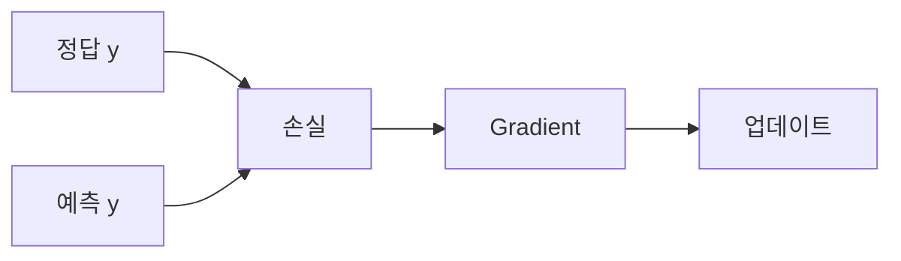

# 손실 함수

## 이 글에서 다룰 문제

- 모델이 얼마나 틀렸는지 숫자로 표현하려면 무엇이 필요할까요?
- 회귀와 분류에서 같은 손실 함수를 써도 될까요?
- 손실 함수의 gradient는 왜 학습 신호가 될까요?
- 수치 안정성은 손실 설계에서 왜 중요할까요?

> 손실 함수는 예측과 정답 사이의 차이를 하나의 숫자로 바꾸는 장치입니다. 학습은 그 숫자를 줄이는 방향으로 진행되고, gradient는 그 방향을 알려 줍니다.

> Calculus for ML 101 시리즈 (6/10)

## 이 글에서 배울 것

- 손실 함수의 역할을 이해합니다.
- MSE와 BCE의 차이를 구분합니다.
- 손실의 gradient가 학습 신호가 되는 이유를 봅니다.
- 손실 선택이 결국 문제 정의라는 점을 이해합니다.

## 왜 중요한가

잘못된 손실을 선택하면 모델은 엉뚱한 목표를 최적화합니다. 회귀 문제에 분류 손실을 붙이거나, 분류 문제에 부적절한 오차 함수를 붙이면 학습 방향 자체가 흐려집니다. 손실을 고른다는 말은 결국 무엇을 잘한 것으로 볼지 결정한다는 뜻입니다.

## 개념 한눈에 보기



## 핵심 용어

- **손실**: 예측 오차를 숫자로 나타낸 값입니다.
- **MSE**: 평균 제곱 오차입니다.
- **BCE**: 이진 교차 엔트로피입니다.
- **학습 신호**: 파라미터를 어느 방향으로 움직일지 알려 주는 정보입니다.
- **목적 함수**: 최적화가 직접 줄이려는 대상입니다.

## Before / After

**Before**: 눈으로 예측을 대충 평가합니다.

**After**: 수치로 오차를 측정하고 비교합니다.

## 단계별 실습: 미니 손실 키트

### Step 1 — MSE

```python
def mse(y, p):
    return sum((yi - pi) ** 2 for yi, pi in zip(y, p)) / len(y)
```

회귀 문제에서 자주 쓰는 손실입니다. 오차를 제곱하기 때문에 큰 오차에 더 민감합니다.

### Step 2 — MSE 기울기

```python
def mse_grad(y, p):
    n = len(y)
    return [-2 * (yi - pi) / n for yi, pi in zip(y, p)]
```

이 gradient가 예측값을 어떤 방향으로 조정해야 하는지 알려 줍니다.

### Step 3 — 이진 교차 엔트로피

```python
import math

def bce(y, p, eps=1e-7):
    return -sum(yi * math.log(pi + eps) + (1 - yi) * math.log(1 - pi + eps) for yi, pi in zip(y, p)) / len(y)
```

분류 문제에서는 확률 예측이 중요하므로 BCE가 더 자연스럽습니다. eps를 더하는 이유는 log(0)을 피하기 위해서입니다.

### Step 4 — 손실 비교

```python
y = [1, 0, 1]
p = [0.9, 0.2, 0.7]
loss = bce(y, p)
```

예측과 정답이 꽤 가깝다면 손실은 작게 나옵니다. 손실 값 자체가 성능을 압축해 보여 주는 셈입니다.

### Step 5 — 학습 신호 점검

```python
def signal(y, p):
    return sum(abs(yi - pi) for yi, pi in zip(y, p)) / len(y)
```

간단한 보조 지표로 예측 차이의 평균 크기를 볼 수 있습니다. 실제 업데이트는 손실 gradient가 담당합니다.

## 이 코드에서 주목할 점

- MSE는 회귀에 잘 맞고, BCE는 분류에 잘 맞습니다.
- 손실이 다르면 gradient도 달라지고 학습 방향도 달라집니다.
- 수치 안정성 처리가 없으면 손실 계산이 바로 깨질 수 있습니다.

## 자주 하는 실수 5가지

1. 회귀 문제에 분류용 손실을 그대로 사용합니다.
2. BCE에서 log(0) 처리를 빼먹습니다.
3. 평균과 합 기준을 섞어 스케일을 헷갈립니다.
4. MSE가 이상치에 민감하다는 점을 잊습니다.
5. 라벨 인코딩 방식과 손실 정의를 맞추지 않습니다.

## 실무에서는 이렇게 생각합니다

실무에서 손실 함수는 단순한 수학 공식이 아니라 제품 요구사항을 반영한 설계 선택입니다. 클래스 불균형이 있으면 가중치를 둘 수 있고, 여러 목표가 있으면 손실을 합쳐야 합니다. 손실 곡선 모니터링, 손실 가중치 조정, 안정성 보강은 모두 모델링의 일부입니다.

## 체크리스트

- [ ] 문제 유형에 맞는 손실 함수를 골랐습니다.
- [ ] 수치 안정성 처리가 들어갔는지 확인했습니다.
- [ ] 평균/합 기준과 스케일을 일관되게 유지했습니다.
- [ ] 학습 곡선을 통해 손실 변화를 추적할 준비가 되었습니다.

## 정리 및 다음 글

손실 함수는 모델이 무엇을 잘하고 못하는지 정의하는 기준입니다. 결국 학습은 이 손실을 줄이는 과정이며, gradient는 그 과정을 움직이는 신호입니다. 다음 글에서는 gradient descent로 이 신호를 실제 업데이트로 바꾸는 법을 이어서 보겠습니다.

<!-- toc:begin -->
- [미분이란 무엇인가](./01-what-is-derivative.md)
- [함수와 기울기](./02-functions-and-slope.md)
- [편미분](./03-partial-derivatives.md)
- [Gradient](./04-gradient.md)
- [연쇄 법칙](./05-chain-rule.md)
- **손실 함수 (현재 글)**
- 경사하강법 (예정)
- 최적화 (예정)
- 역전파 직관 (예정)
- 딥러닝에서의 미분 (예정)
<!-- toc:end -->

## 참고 자료

- [Loss Functions - PyTorch](https://pytorch.org/docs/stable/nn.html#loss-functions)
- [Cross Entropy - CS231n](https://cs231n.github.io/linear-classify/)
- [Deep Learning Book - Loss](https://www.deeplearningbook.org/contents/mlp.html)
- [Class Imbalance - scikit-learn](https://scikit-learn.org/stable/modules/svm.html#unbalanced-problems)

Tags: Calculus, ML, LossFunction, MSE, Beginner
