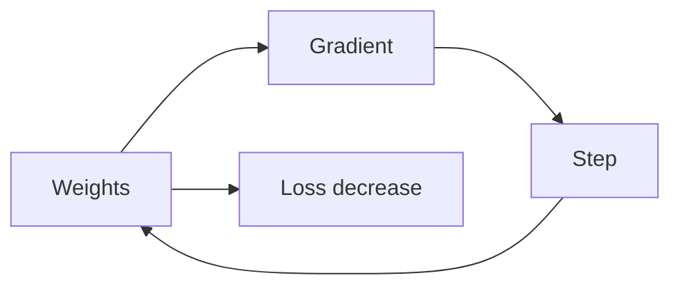

# 경사하강법

> Calculus for ML 101 시리즈 (7/10)


## 이 글에서 다룰 문제

대부분의 ML 학습은 결국 손실을 줄이는 방향으로 조금씩 이동하는 과정이고, 그 기본 형태가 경사하강법입니다.

## 전체 흐름


## Before/After

**Before**: 가능한 조합을 전부 시도해야 할 것처럼 느낍니다.

**After**: 기울기 방향을 따라 훨씬 효율적으로 이동합니다.

## 미니 GD 키트

### 1단계 — 손실과 기울기

```python
def loss(w):
    return (w - 3) ** 2

def grad(w):
    return 2 * (w - 3)
```

### 2단계 — GD 한 스텝

```python
def step(w, lr=0.1):
    return w - lr * grad(w)
```

### 3단계 — 학습 루프

```python
def train(w0, lr=0.1, steps=100):
    w = w0
    for _ in range(steps):
        w = step(w, lr)
    return w
```

### 4단계 — SGD

```python
import random

def sgd(data, w0, lr=0.01, epochs=10):
    w = w0
    for _ in range(epochs):
        random.shuffle(data)
        for x in data:
            w -= lr * 2 * (w - x)
    return w
```

### 5단계 — 학습률 영향

```python
for lr in [0.001, 0.1, 1.5]:
    print(lr, train(0.0, lr, 50))
```

## 이 코드에서 주목할 점

- 경사하강법은 기울기의 반대 방향으로 한 걸음 움직이는 규칙입니다.
- 학습률은 한 번에 얼마나 움직일지 정하므로 결과에 큰 영향을 줍니다.
- SGD는 더 흔들리지만 계산량이 작고 빠르게 반응합니다.

## 자주 하는 실수 5가지

1. 학습률을 너무 크게 잡아 손실이 줄지 않고 튑니다.
2. 스케일이 다른 파라미터에 같은 학습률을 그대로 적용합니다.
3. 아직 수렴하지 않았는데 너무 일찍 학습을 멈춥니다.
4. SGD의 노이즈를 오류로만 보고 장단점을 함께 보지 못합니다.
5. 초기값의 영향을 무시하고 항상 같은 값으로만 시작합니다.

## 실무에서는 이렇게 쓰입니다

Adam, Momentum, RMSProp 같은 최적화 기법도 뿌리는 모두 경사하강법입니다. 기본 원리를 이해해 두면 새로운 옵티마이저를 봐도 무엇이 달라졌는지 빠르게 파악할 수 있습니다.

## 체크리스트

- [ ] 학습률 후보를 비교해 봤습니다.
- [ ] 손실이 실제로 수렴하는지 계속 확인했습니다.
- [ ] 발산 징후가 보이면 바로 중단할 기준을 정했습니다.
- [ ] 초기값을 바꿔도 비슷한 경향이 나오는지 확인했습니다.

## 정리 및 다음 단계

경사하강법은 손실 지형 위에서 가장 가파르게 내려가는 방향을 따라 이동하는 기본 전략입니다. 단순해 보여도 학습률, 초기화, 노이즈 해석처럼 실제 성능을 좌우하는 요소가 많습니다. 다음 글에서는 이런 기본 전략이 더 넓은 최적화 문제와 어떻게 연결되는지 보겠습니다.

<!-- toc:begin -->
- [미분이란 무엇인가](./01-what-is-derivative.md)
- [함수와 기울기](./02-functions-and-slope.md)
- [편미분](./03-partial-derivatives.md)
- [Gradient](./04-gradient.md)
- [연쇄 법칙](./05-chain-rule.md)
- [손실 함수](./06-loss-function.md)
- **경사하강법 (현재 글)**
- 최적화 (예정)
- 역전파 직관 (예정)
- 딥러닝에서의 미분 (예정)
<!-- toc:end -->

## 참고 자료

- [Gradient Descent - CS231n](https://cs231n.github.io/optimization-1/)
- [Adam Optimizer - Kingma and Ba](https://arxiv.org/abs/1412.6980)
- [Deep Learning Book - Optimization](https://www.deeplearningbook.org/contents/optimization.html)
- [PyTorch Optimizers](https://pytorch.org/docs/stable/optim.html)

Tags: Calculus, ML, GradientDescent, Optimization, Beginner
