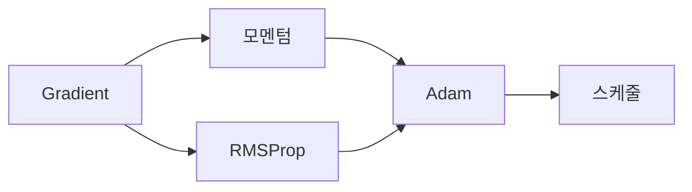

# 최적화

## 이 글에서 다룰 문제

- 기본 경사하강법은 왜 느리거나 불안정할까요?
- 모멘텀, RMSProp, Adam은 각각 어떤 약점을 보완할까요?
- 학습률 스케줄과 워밍업은 왜 자주 같이 등장할까요?
- 정규화는 최적화와 일반화에 어떻게 연결될까요?

> 최적화는 단순히 gradient를 따라 걷는 일이 아닙니다. 더 빠르게, 더 안정적으로, 더 일반화가 잘 되도록 업데이트 규칙을 설계하는 일입니다.

> Calculus for ML 101 시리즈 (8/10)

## 이 글에서 배울 것

- 모멘텀의 직관을 이해합니다.
- RMSProp과 Adam이 왜 등장했는지 봅니다.
- 학습률 스케줄의 역할을 이해합니다.
- 정규화가 업데이트에 주는 효과를 연결합니다.

## 왜 중요한가

현대 모델 학습에서는 그냥 고정 학습률의 gradient descent만으로는 부족한 경우가 많습니다. 지형이 비틀려 있거나, 초반에 불안정하거나, 축마다 스케일이 다르면 학습이 느려지거나 발산합니다. 그래서 업데이트 규칙을 개선한 optimizer가 필요합니다.

## 개념 한눈에 보기



## 핵심 용어

- **모멘텀**: gradient의 이동 평균을 이용해 관성을 주는 방법입니다.
- **RMSProp**: 제곱 gradient의 이동 평균으로 축별 스케일을 조절합니다.
- **Adam**: 모멘텀과 RMSProp을 결합한 방식입니다.
- **스케줄**: 학습률을 시간에 따라 바꾸는 규칙입니다.
- **정규화**: 과적합을 억제하기 위한 제약입니다.

## Before / After

**Before**: 고정 학습률의 단순한 GD만 사용합니다.

**After**: 적응형 업데이트와 스케줄을 함께 설계합니다.

## 단계별 실습: 미니 옵티마이저 키트

### Step 1 — 모멘텀

```python
def momentum_step(w, v, g, lr=0.1, beta=0.9):
    v = beta * v + g
    return w - lr * v, v
```

이전 방향을 조금 기억해 두고 앞으로 더 부드럽게 밀어 주는 방식입니다. 지그재그를 줄이는 데 도움이 됩니다.

### Step 2 — RMSProp

```python
def rms_step(w, s, g, lr=0.01, beta=0.99, eps=1e-8):
    s = beta * s + (1 - beta) * g * g
    return w - lr * g / (s ** 0.5 + eps), s
```

축마다 gradient 크기가 다를 때 자동으로 보폭을 조절해 줍니다.

### Step 3 — Adam (간이)

```python
def adam_step(w, m, v, g, t, lr=0.001, b1=0.9, b2=0.999, eps=1e-8):
    m = b1 * m + (1 - b1) * g
    v = b2 * v + (1 - b2) * g * g
    mh = m / (1 - b1 ** t)
    vh = v / (1 - b2 ** t)
    return w - lr * mh / (vh ** 0.5 + eps), m, v
```

모멘텀과 적응형 스케일링을 함께 쓰기 때문에 실전에서 널리 사용됩니다.

### Step 4 — 스케줄

```python
def cosine_lr(step, total, lr0=0.01):
    import math
    return 0.5 * lr0 * (1 + math.cos(math.pi * step / total))
```

초반에는 크게 움직이고 후반에는 미세 조정하도록 학습률을 줄여 갑니다.

### Step 5 — L2 정규화

```python
def l2_step(w, g, lr=0.1, wd=1e-4):
    return w - lr * (g + wd * w)
```

가중치가 너무 커지지 않도록 제동을 거는 효과가 있습니다.

## 이 코드에서 주목할 점

- 모멘텀은 방향 기억을 추가합니다.
- RMSProp은 축별 스케일 차이를 흡수합니다.
- Adam은 둘을 합쳐 속도와 안정성을 함께 노립니다.
- 스케줄은 후반 미세 조정을 돕습니다.
- 정규화는 업데이트에 제약을 더합니다.

## 자주 하는 실수 5가지

1. Adam 기본값이면 언제나 충분하다고 생각합니다.
2. weight decay와 L2를 같은 구현으로 취급합니다.
3. 스케줄 없이 고정 학습률만 씁니다.
4. 초반 발산이 있는데도 워밍업을 고려하지 않습니다.
5. 재시작 후 모멘텀 상태를 어떻게 다룰지 정하지 않습니다.

## 실무에서는 이렇게 생각합니다

실무에서 optimizer 선택은 모델 종류, 데이터 규모, 배치 크기, 안정성 이슈와 함께 판단합니다. 트랜스포머 계열에서는 Adam 계열에 워밍업과 코사인 스케줄을 붙이는 구성이 자주 쓰입니다. 결국 중요한 것은 이름보다도 왜 이 규칙이 현재 문제의 약점을 보완하는지 이해하는 일입니다.

## 체크리스트

- [ ] 문제 특성에 맞는 optimizer를 골랐습니다.
- [ ] 워밍업 필요성을 점검했습니다.
- [ ] 학습률 스케줄을 설계했습니다.
- [ ] 정규화 강도를 따로 관리할 계획이 있습니다.

## 정리 및 다음 글

최적화는 gradient 자체를 바꾸는 것이 아니라 gradient를 이용하는 방식을 똑똑하게 만드는 일입니다. 모멘텀, 적응형 학습률, 스케줄, 정규화는 모두 그 목적을 위한 도구입니다. 다음 글에서는 이 모든 업데이트의 재료가 되는 역전파를 직관적으로 정리하겠습니다.

<!-- toc:begin -->
- [미분이란 무엇인가](./01-what-is-derivative.md)
- [함수와 기울기](./02-functions-and-slope.md)
- [편미분](./03-partial-derivatives.md)
- [Gradient](./04-gradient.md)
- [연쇄 법칙](./05-chain-rule.md)
- [손실 함수](./06-loss-function.md)
- [경사하강법](./07-gradient-descent.md)
- **최적화 (현재 글)**
- 역전파 직관 (예정)
- 딥러닝에서의 미분 (예정)
<!-- toc:end -->

## 참고 자료

- [Adam - Kingma and Ba](https://arxiv.org/abs/1412.6980)
- [Optimizer Overview - Ruder](https://www.ruder.io/optimizing-gradient-descent/)
- [Cosine LR Schedule - Loshchilov and Hutter](https://arxiv.org/abs/1608.03983)
- [Decoupled Weight Decay - Loshchilov and Hutter](https://arxiv.org/abs/1711.05101)

Tags: Calculus, ML, Optimization, Adam, Beginner
