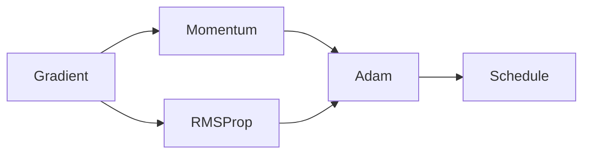

# 최적화

경사하강법은 학습의 기본 뼈대이지만, 실제 딥러닝 학습은 그보다 훨씬 거칠고 복잡한 손실 지형 위에서 일어납니다. 골짜기가 길게 늘어진 영역도 있고, gradient scale이 좌표마다 크게 다를 수도 있으며, 초반에는 불안정하고 후반에는 더 섬세한 업데이트가 필요한 경우도 많습니다. 그래서 plain gradient descent만으로는 속도와 안정성 모두에서 한계가 드러납니다.

현대 optimizer들은 이 한계를 보완하기 위해 만들어졌습니다. momentum은 관성을 더하고, RMSProp은 좌표별 scale 차이를 흡수하고, Adam은 둘을 결합합니다. 여기에 learning-rate schedule과 regularization이 더해져 실제 훈련 루프가 구성됩니다.

이 글은 Calculus for ML 101 시리즈의 여덟 번째 글입니다.

이 글에서는 momentum, RMSProp, Adam, schedule, L2 regularization을 하나의 optimization toolkit으로 묶어 설명하겠습니다. 핵심은 이름을 외우는 것이 아니라 plain GD의 어떤 약점을 각각 보완하는지 이해하는 것입니다.

끝까지 읽고 나면 optimizer 선택을 “유명하니까 Adam” 수준이 아니라, 현재 손실 지형과 학습 단계에 맞는 설계 판단으로 볼 수 있게 됩니다.

## 이 글에서 다룰 문제

- plain gradient descent는 실제 딥러닝 학습에서 어떤 약점을 드러낼까요?
- momentum은 왜 관성이라는 비유로 설명하는 편이 가장 이해가 쉬울까요?
- RMSProp과 Adam은 좌표별 gradient scale 차이를 어떻게 완화할까요?
- learning-rate schedule과 warmup은 왜 optimizer만큼 중요할까요?
- regularization은 단순 벌점이 아니라 일반화 제어 장치로 어떻게 작동할까요?

## 왜 이 글이 중요한가

실무에서 optimizer는 training recipe의 중심입니다. 같은 모델과 데이터라도 optimizer, learning-rate schedule, weight decay 설정이 바뀌면 수렴 속도와 최종 성능이 크게 달라집니다. 그래서 optimization은 “미분 이후의 디테일”이 아니라, 학습을 실제로 성공시키는 운영 계층입니다.

특히 대규모 모델에서는 초반 warmup이 없으면 발산하고, adaptive method가 없으면 좌표별 scale 차이를 다루기 어려우며, schedule이 없으면 후반 미세 조정이 둔해질 수 있습니다. 즉 optimizer는 하나의 함수 호출이 아니라, gradient를 어떻게 해석하고 누적하고 감쇠할지를 정하는 정책 묶음입니다.

또한 regularization을 optimization과 함께 봐야 하는 이유도 중요합니다. 손실만 줄이는 것이 목표라면 과적합된 해답으로 너무 쉽게 흘러갈 수 있기 때문입니다. 좋은 optimizer는 빠르기만 한 것이 아니라, 일반화 가능한 해로 가도록 학습을 제어해야 합니다.

## 최적화를 이해하는 가장 좋은 방법: plain GD의 약점을 하나씩 보완하는 장치들의 조합으로 보는 것입니다

최적화를 가장 실용적으로 이해하는 방법은 plain GD가 어디서 힘들어하는지 먼저 보는 것입니다. 지그재그로 흔들리고, gradient scale 차이에 취약하고, 초반에는 불안정하고, 후반에는 너무 거칠 수 있습니다. momentum, RMSProp, Adam, schedule은 각각 이 약점에 대응합니다.

이렇게 보면 optimizer는 별개의 마법 상자가 아니라 설계 의도가 분명한 수정 패치들입니다. 실제 현업에서 optimizer 튜닝이 가능한 이유도 각 구성 요소가 어떤 문제를 겨냥하는지 비교적 명확하기 때문입니다.

> 현대 optimizer는 경사하강법을 대체하는 것이 아니라, 손실 지형의 거칠기와 gradient scale의 불균형, 학습 단계별 요구를 견디도록 보강한 버전입니다.

## 핵심 개념

최적화 흐름은 다음과 같습니다.



### momentum은 방향의 일관성을 키웁니다

```python
def momentum_step(w, v, g, lr=0.1, beta=0.9):
    v = beta * v + g
    return w - lr * v, v
```

momentum은 과거 gradient의 running mean을 함께 사용해 업데이트를 부드럽게 만듭니다. 지형이 길고 좁은 골짜기일 때 좌우로 흔들리는 대신, 주된 진행 방향으로 더 잘 나아가게 해 줍니다. 관성이라는 비유가 자주 쓰이는 이유가 여기에 있습니다.

### RMSProp은 좌표별 scale 차이를 완화합니다

```python
def rms_step(w, s, g, lr=0.01, beta=0.99, eps=1e-8):
    s = beta * s + (1 - beta) * g * g
    return w - lr * g / (s ** 0.5 + eps), s
```

RMSProp은 squared gradient의 running mean으로 각 좌표의 step size를 적응적으로 조절합니다. 특정 좌표의 gradient가 지속적으로 큰 경우에는 업데이트를 자동으로 줄여 주므로, 서로 다른 스케일의 파라미터를 같은 learning rate로 다루기 쉬워집니다.

### Adam은 momentum과 RMSProp을 결합합니다

```python
def adam_step(w, m, v, g, t, lr=0.001, b1=0.9, b2=0.999, eps=1e-8):
    m = b1 * m + (1 - b1) * g
    v = b2 * v + (1 - b2) * g * g
    mh = m / (1 - b1 ** t)
    vh = v / (1 - b2 ** t)
    return w - lr * mh / (vh ** 0.5 + eps), m, v
```

Adam은 방향 일관성과 scale 적응성을 동시에 취합니다. 그래서 기본값만으로도 꽤 강력한 출발점을 제공하지만, 그렇다고 항상 튜닝이 불필요한 것은 아닙니다. 학습률, betas, weight decay, warmup 정책까지 포함해 recipe 전체로 봐야 합니다.

### schedule은 학습 단계에 따라 스텝 크기를 바꿉니다

```python
def cosine_lr(step, total, lr0=0.01):
    import math
    return 0.5 * lr0 * (1 + math.cos(math.pi * step / total))
```

초반에는 크게 탐색하고, 후반에는 더 작은 스텝으로 세밀하게 조정하는 것이 일반적입니다. cosine schedule은 이런 흐름을 부드럽게 구현합니다. 대규모 학습에서 warmup을 함께 쓰는 이유는 초반 불안정한 gradient에 바로 큰 learning rate를 적용하지 않기 위해서입니다.

### regularization은 generalization을 위한 제동 장치입니다

```python
def l2_step(w, g, lr=0.1, wd=1e-4):
    return w - lr * (g + wd * w)
```

L2 regularization은 파라미터가 과도하게 커지는 것을 억제해 일반화에 도움을 줍니다. 다만 현대 프레임워크에서는 L2 penalty와 decoupled weight decay를 구분해 이해하는 것이 중요합니다. 이름은 비슷해 보여도 optimizer와 결합되는 방식이 다를 수 있기 때문입니다.

### 최적화는 optimizer 하나가 아니라 recipe입니다

실무에서는 “Adam을 쓴다”만으로 끝나지 않습니다. 초기 learning rate, warmup 길이, schedule 모양, weight decay, gradient clipping, batch size가 모두 함께 작동합니다. 따라서 optimization 문제를 볼 때는 단일 knob보다 recipe 전체를 점검하는 편이 정확합니다.

## 흔히 헷갈리는 지점

- Adam 기본값이 강력하다고 해서 언제나 최적이라는 뜻은 아닙니다.
- L2 regularization과 decoupled weight decay를 같은 것으로 취급하면 해석이 틀어질 수 있습니다.
- schedule 없이 고정 learning rate만 유지하면 후반 미세 조정이 거칠 수 있습니다.
- 초반 발산을 optimizer 종류 문제로만 보면 warmup 부재를 놓칠 수 있습니다.
- 체크포인트 재시작 시 momentum state를 어떻게 다룰지 무시하면 학습 궤적이 달라질 수 있습니다.

## 운영 체크리스트

- [ ] optimizer 선택 이유를 손실 지형과 gradient scale 관점에서 설명할 수 있다
- [ ] warmup, main schedule, final decay를 포함한 learning-rate 정책을 정의한다
- [ ] weight decay 또는 regularization 설정을 명시적으로 분리해 관리한다
- [ ] 재시작 시 optimizer state 복원 정책을 실험 설정에 포함한다
- [ ] 성능 문제를 볼 때 모델 구조와 함께 optimization recipe 전체를 점검한다

## 정리

최적화는 plain gradient descent를 더 빠르고 안정적으로 만들기 위한 보강 기법들의 조합입니다. momentum은 방향 일관성을, RMSProp은 좌표별 적응성을, Adam은 둘의 결합을 제공합니다. 여기에 schedule과 regularization이 더해져 실제 훈련 루프가 완성됩니다.

실무에서는 optimizer 이름보다 recipe 전체가 더 중요할 때가 많습니다. learning rate, warmup, weight decay, gradient clipping이 함께 설계되어야 같은 모델도 제대로 학습됩니다. 그래서 optimization은 “어떤 알고리즘을 썼는가”보다 “gradient를 어떻게 다뤘는가”의 문제에 가깝습니다.

다음 글에서는 이 optimization에 들어가는 gradient가 네트워크 전체에서 어떻게 계산되는지, 즉 backpropagation을 계산 그래프 관점에서 다시 보겠습니다.

<!-- toc:begin -->
## 시리즈 목차

- [미분이란 무엇인가](./01-what-is-derivative.md)
- [함수와 기울기](./02-functions-and-slope.md)
- [편미분](./03-partial-derivatives.md)
- [Gradient](./04-gradient.md)
- [연쇄 법칙](./05-chain-rule.md)
- [손실 함수](./06-loss-function.md)
- [경사하강법](./07-gradient-descent.md)
- **최적화 (현재 글)**
- 역전파 직관 (예정)
- 딥러닝에서의 미분 (예정)

<!-- toc:end -->

## 참고 자료

### 공식 문서
- [Adam - Kingma and Ba](https://arxiv.org/abs/1412.6980)
- [Optimizer Overview - Ruder](https://www.ruder.io/optimizing-gradient-descent/)
- [Cosine LR Schedule - Loshchilov and Hutter](https://arxiv.org/abs/1608.03983)
- [Decoupled Weight Decay - Loshchilov and Hutter](https://arxiv.org/abs/1711.05101)

### 관련 시리즈
- [Linear Algebra 101](../../linear-algebra-101/ko/)
- [MLOps 101](../../mlops-101/ko/)

Tags: Calculus, ML, Optimization, Adam, Beginner
