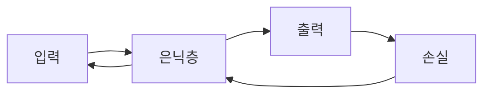

# 역전파 직관

역전파는 연쇄 법칙을 뒤에서부터 적용해 수많은 가중치의 gradient를 효율적으로 구하는 절차입니다.

이 글은 Calculus for ML 101 시리즈의 9번째 글입니다.

## 이 글에서 다룰 문제

- 수천 개 가중치의 gradient를 한 번에 어떻게 계산할까요?
- 계산 그래프와 연쇄 법칙은 어떤 관계일까요?
- 왜 순전파와 역전파를 나눠 생각해야 할까요?
- autograd를 이해하면 디버깅이 왜 쉬워질까요?

> 역전파는 연쇄 법칙을 계산 그래프 위에서 뒤로 적용하는 절차입니다. 값은 앞으로 흐르고, gradient는 뒤로 흐르며 각 파라미터가 결과에 얼마나 기여했는지 빠르게 계산합니다.

> Calculus for ML 101 시리즈 (9/10)

## 이 글에서 배울 것

- 계산 그래프를 간단한 노드 관점에서 이해합니다.
- 순전파와 역전파의 역할을 구분합니다.
- gradient 누적이 왜 필요한지 봅니다.
- autograd가 실제로 무엇을 자동화하는지 이해합니다.

## 왜 중요한가

프레임워크는 gradient를 자동으로 계산해 주지만, 값이 이상하게 나오면 결국 사람이 원리를 이해하고 디버깅해야 합니다. 역전파를 모르면 zero_grad 누락, 그래프 누수, shared node 누적 같은 문제를 감으로만 다루게 됩니다.

## 개념 한눈에 보기



## 핵심 용어

- **계산 그래프**: 연산을 노드와 간선으로 표현한 구조입니다.
- **순전파**: 입력에서 출력으로 값을 계산하는 과정입니다.
- **역전파**: 출력 쪽에서 입력 쪽으로 기울기를 전파하는 과정입니다.
- **autograd**: 자동 미분 시스템입니다.
- **노드**: 하나의 연산 또는 값을 담는 단위입니다.

## Before / After

**Before**: 각 가중치를 수치 미분으로 하나씩 확인해야 할 것 같습니다.

**After**: 한 번의 backward pass로 모든 기울기를 얻는 구조를 이해합니다.

## 단계별 실습: 미니 역전파 키트

### Step 1 — 노드

```python
class Node:
    def __init__(self, val, parents=()):
        self.val = val
        self.parents = parents
        self.grad = 0.0
```

노드는 값과 부모 노드, 그리고 기울기를 저장합니다. 아주 작은 자동 미분 엔진의 출발점입니다.

### Step 2 — 덧셈

```python
def add(a, b):
    n = Node(a.val + b.val, (a, b))
    n.local = (1.0, 1.0)
    return n
```

덧셈의 지역 미분은 각각 1입니다. 역전파는 이런 지역 미분을 따라 기울기를 전달합니다.

### Step 3 — 곱셈

```python
def mul(a, b):
    n = Node(a.val * b.val, (a, b))
    n.local = (b.val, a.val)
    return n
```

곱셈에서는 각 입력에 대한 지역 미분이 상대편 값이 됩니다.

### Step 4 — 역방향 패스

```python
def backward(n):
    n.grad = 1.0
    stack = [n]
    while stack:
        x = stack.pop()
        for p, lg in zip(x.parents, x.local):
            p.grad += x.grad * lg
            stack.append(p)
```

출력 노드에서 기울기 1.0으로 시작해 부모 방향으로 누적합니다. 이것이 연쇄 법칙의 구현입니다.

### Step 5 — 미니 예제

```python
a, b, c = Node(2.0), Node(3.0), Node(4.0)
y = mul(add(a, b), c)
backward(y)
# 결과: a.grad == 4.0, b.grad == 4.0, c.grad == 5.0
```

값을 먼저 계산한 뒤, 뒤로 돌아가며 각 입력이 최종 출력에 얼마나 기여했는지 확인합니다.

## 이 코드에서 주목할 점

- 순전파는 값을 만들고 역전파는 기울기를 만듭니다.
- 각 노드는 지역 미분을 보관해야 합니다.
- shared node에서는 기울기를 더해 누적해야 합니다.

## 자주 하는 실수 5가지

1. 기울기가 누적된다는 사실을 잊고 zero_grad를 하지 않습니다.
2. 순전파에서 필요한 값을 저장하지 않아 역전파가 불가능해집니다.
3. shared node에서 기울기 합산을 빠뜨립니다.
4. detach를 안 해서 불필요한 그래프가 계속 남습니다.
5. 수치 검증 없이 autograd 결과를 무조건 믿습니다.

## 실무에서는 이렇게 생각합니다

PyTorch, TensorFlow, JAX는 모두 역전파를 자동으로 수행합니다. 하지만 메모리 사용량, gradient accumulation, mixed precision, graph retention 같은 실전 이슈는 역전파 원리를 알아야 제대로 다룰 수 있습니다. 프레임워크가 해 주는 일은 많지만, 사고 과정까지 대신해 주지는 않습니다.

## 체크리스트

- [ ] 학습 스텝마다 zero_grad 호출 위치를 알고 있습니다.
- [ ] forward와 backward의 역할을 구분했습니다.
- [ ] shared node에서 기울기가 누적된다는 점을 이해했습니다.
- [ ] 필요할 때 수치 미분으로 기울기를 검증할 수 있습니다.

## 정리 및 다음 글

역전파는 연쇄 법칙을 효율적으로 실행하는 계산 절차입니다. 값은 앞으로 계산하고, 기울기는 뒤로 흘려 보내며 각 파라미터의 책임을 얻습니다. 다음 글에서는 지금까지 배운 미분 개념이 딥러닝 학습 루프 전체에서 어떻게 합쳐지는지 정리하겠습니다.

<!-- toc:begin -->
- [미분이란 무엇인가](./01-what-is-derivative.md)
- [함수와 기울기](./02-functions-and-slope.md)
- [편미분](./03-partial-derivatives.md)
- [Gradient](./04-gradient.md)
- [연쇄 법칙](./05-chain-rule.md)
- [손실 함수](./06-loss-function.md)
- [경사하강법](./07-gradient-descent.md)
- [최적화](./08-optimization.md)
- **역전파 직관 (현재 글)**
- 딥러닝에서의 미분 (예정)
<!-- toc:end -->

## 참고 자료

- [Backpropagation - CS231n](https://cs231n.github.io/optimization-2/)
- [Calculus on Computational Graphs - Olah](https://colah.github.io/posts/2015-08-Backprop/)
- [PyTorch Autograd](https://pytorch.org/tutorials/beginner/blitz/autograd_tutorial.html)
- [JAX Autograd Cookbook](https://jax.readthedocs.io/en/latest/notebooks/autodiff_cookbook.html)

Tags: Calculus, ML, Backprop, NeuralNetwork, Beginner
