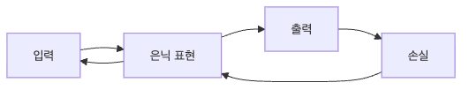

# 역전파 직관

지금까지 이 시리즈에서는 미분, 편미분, gradient, chain rule, 손실, optimizer를 차례로 보았습니다. 이제 남은 핵심 질문은 하나입니다. 수천 개, 수백만 개의 파라미터에 대한 gradient를 실제로 어떻게 한 번에 계산할까요? 모든 weight를 수치 미분으로 하나씩 검사하는 방식은 너무 느리고 비현실적입니다.

역전파는 이 문제에 대한 계산적 해법입니다. 계산 그래프를 따라 순전파에서 값을 만들고, 역방향으로 chain rule을 적용해 각 파라미터의 gradient를 효율적으로 누적합니다. 즉 역전파는 새로운 수학이 아니라, 이미 본 연쇄 법칙을 대규모 계산 그래프에 맞게 실행하는 절차입니다.

이 글은 Calculus for ML 101 시리즈의 아홉 번째 글입니다.

이 글에서는 계산 그래프, forward pass, backward pass, gradient accumulation, autograd 직관을 중심으로 설명하겠습니다. 목표는 프레임워크 내부 동작을 완전히 구현하는 것이 아니라, backward가 왜 한 번의 패스로 전체 gradient를 만들 수 있는지 이해하는 것입니다.

끝까지 읽고 나면 `zero_grad`, gradient accumulation, graph retention 같은 실무 용어가 더 이상 API 암기가 아니라 자연스러운 운영 개념으로 보이게 됩니다.

## 이 글에서 다룰 문제

- 역전파는 수많은 weight의 gradient를 왜 한 번에 계산할 수 있을까요?
- 계산 그래프 관점에서 순전파와 역전파는 각각 무엇을 남길까요?
- local derivative를 저장한다는 말은 실제로 어떤 의미일까요?
- gradient accumulation은 왜 필요하고, 왜 `zero_grad`가 중요할까요?
- autograd를 이해하면 학습 버그를 어떻게 더 빨리 찾을 수 있을까요?

## 왜 이 글이 중요한가

PyTorch, TensorFlow, JAX는 모두 gradient를 자동으로 계산해 줍니다. 그래서 역전파를 몰라도 모델은 학습됩니다. 하지만 학습이 이상하게 흔들리거나, gradient가 누적되거나, 메모리가 계속 늘어나거나, 특정 branch가 detach되어 학습이 끊기는 순간부터는 원리를 이해하는 사람이 문제를 더 빨리 좁힐 수 있습니다.

역전파를 이해하면 gradient를 “모델이 somehow 계산해 주는 값”으로 보지 않게 됩니다. 값은 순전파에서 만들어지고, backward에서는 각 연산의 local derivative와 위에서 내려온 gradient를 곱해 부모로 전달한다는 사실이 선명해집니다. 그러면 shared node에서 왜 gradient를 더해야 하는지, 왜 그래프를 보존하면 메모리를 더 쓰는지도 자연스럽게 설명됩니다.

또한 이 글은 시리즈의 마지막 글을 위한 직접적인 준비입니다. 딥러닝 학습 루프 전체를 보려면 forward, loss, backward, update가 하나의 닫힌 고리라는 점을 이해해야 하고, 역전파는 그중 backward 단계를 담당합니다.

## 역전파를 이해하는 가장 좋은 방법: 각 노드가 자기 local derivative를 들고 있는 계산 그래프를 뒤로 훑는 것으로 보는 것입니다

역전파를 가장 직관적으로 이해하는 방법은 계산 그래프를 생각하는 것입니다. 각 노드는 값을 계산하고, 자신의 부모 노드에 대한 local derivative를 알고 있습니다. 최종 출력에서 시작해 이 local derivative를 곱해 뒤로 전달하면 각 입력이 결과에 얼마나 기여했는지 계산할 수 있습니다.

이 구조에서는 순전파와 역전파의 역할이 명확히 나뉩니다. 순전파는 값을 만들고 캐시하며, 역전파는 그 값을 바탕으로 gradient를 전파합니다. 그래서 backward만 따로 존재할 수 없고, forward에서 저장한 정보가 반드시 필요합니다.

> 역전파는 chain rule을 뒤로 적용하는 절차이며, 계산 그래프의 각 노드가 자기 local derivative를 제공하기 때문에 전체 gradient를 효율적으로 누적할 수 있습니다.

## 핵심 개념

역전파의 전체 흐름은 아래처럼 볼 수 있습니다.



*역전파 흐름: 손실에서 시작한 gradient가 계산 그래프를 따라 입력 방향으로 누적됩니다.*
### 가장 작은 계산 그래프 노드부터 시작합니다

```python
class Node:
    def __init__(self, val, parents=()):
        self.val = val
        self.parents = parents
        self.grad = 0.0
```

노드는 현재 값과 부모 노드들, 그리고 역전파 과정에서 채워질 gradient 저장 공간을 가집니다. 실제 프레임워크는 훨씬 복잡하지만, 핵심은 각 연산 결과가 자신의 계산 이력을 알고 있다는 점입니다.

### 덧셈 노드는 local derivative가 단순합니다

```python
def add(a, b):
    n = Node(a.val + b.val, (a, b))
    n.local = (1.0, 1.0)
    return n
```

덧셈의 경우 출력이 각 입력에 대해 갖는 local derivative는 1입니다. 중요한 것은 노드가 forward에서 결과값만 만드는 것이 아니라, backward 때 쓸 local derivative도 함께 기록한다는 점입니다.

### 곱셈 노드는 상대편 값을 local derivative로 가집니다

```python
def mul(a, b):
    n = Node(a.val * b.val, (a, b))
    n.local = (b.val, a.val)
    return n
```

곱셈에서는 각 입력에 대한 local derivative가 상대편 값이 됩니다. 이 예제는 왜 forward에서 중간값을 캐시해야 하는지 잘 보여 줍니다. backward 때 local derivative를 계산하려면 forward에서의 값이 필요하기 때문입니다.

### backward는 출력에서 입력 방향으로 gradient를 누적합니다

```python
def backward(n):
    n.grad = 1.0
    stack = [n]
    while stack:
        x = stack.pop()
        for p, lg in zip(x.parents, x.local):
            p.grad += x.grad * lg
            stack.append(p)
```

출력 노드의 gradient를 1로 두는 이유는 자기 자신을 자기 자신으로 미분한 값이 1이기 때문입니다. 그다음 각 부모 노드로 `현재 gradient × local derivative`를 누적하며 전달합니다. shared node라면 여러 경로에서 gradient가 합쳐질 수 있으므로 `+=`가 중요합니다.

### 작은 예제 하나로 전체 흐름을 볼 수 있습니다

```python
a, b, c = Node(2.0), Node(3.0), Node(4.0)
y = mul(add(a, b), c)
backward(y)
# a.grad == 4.0, b.grad == 4.0, c.grad == 5.0
```

순전파에서 `add(a, b)`가 먼저 계산되고, 그 결과가 `c`와 곱해집니다. 역전파에서는 출력에서 시작해 곱셈 노드의 local derivative를 적용하고, 다시 덧셈 노드의 local derivative를 따라 `a`, `b`, `c` 각각의 gradient를 얻습니다. 작은 예제지만 연쇄 법칙과 gradient accumulation의 핵심이 모두 들어 있습니다.

### shared node를 보면 gradient accumulation이 왜 필요한지 더 분명해집니다

```python
a = Node(2.0)
b = add(a, a)
y = mul(b, a)
backward(y)

# y = (a + a) * a = 2a^2
# dy/da = 4a, so at a=2 the gradient is 8
print(a.grad)
```

**Expected output:** `8.0`

이 예제는 하나의 노드가 그래프에서 여러 번 재사용될 수 있다는 사실을 보여 줍니다. `a`는 `add(a, a)` 안에서 두 번 등장하고, 그 결과가 다시 `a`와 곱해집니다. 그래서 backward에서는 한 경로의 미분만 저장하면 안 되고, 여러 경로에서 내려온 기여도를 모두 더해야 합니다. 프레임워크에서 gradient가 누적되는 기본 동작도 바로 이 구조와 연결됩니다.

### autograd를 이해할 때 기억할 점

프레임워크는 이 과정을 자동으로 해 줍니다. 하지만 `zero_grad`를 호출하지 않으면 gradient가 누적되고, 필요 없는 그래프를 유지하면 메모리가 늘어나며, detach를 잘못 쓰면 학습 경로가 끊깁니다. 즉 autograd를 안다는 것은 내부 수학을 아는 것뿐 아니라, 그래프 수명과 gradient 버퍼를 운영 관점에서 이해하는 것이기도 합니다.

```python
optimizer.zero_grad()
pred = model(x)
loss = criterion(pred, y)
loss.backward()
optimizer.step()
```

이 순서를 지키는 이유는 backward가 보통 gradient를 덮어쓰지 않고 누적하기 때문입니다. 따라서 이전 step의 흔적을 지우지 않으면 현재 batch의 신호만 반영되는 것이 아니라 과거 gradient까지 섞여 들어갑니다. 작은 실습 코드에서는 티가 덜 나도, 실제 학습에서는 loss curve 해석과 디버깅을 어렵게 만드는 흔한 원인입니다.

## 흔히 헷갈리는 지점

- gradient는 자동으로 덮어써진다고 생각하기 쉽지만, 많은 프레임워크에서 기본 동작은 누적입니다.
- backward 전에 forward에서 필요한 값이 저장되지 않으면 local derivative 계산이 불가능합니다.
- shared node에서는 여러 경로의 gradient를 더해야 한다는 점을 놓치기 쉽습니다.
- 그래프를 불필요하게 유지하면 메모리 사용량이 빠르게 커질 수 있습니다.
- detach나 no-grad 문맥을 잘못 쓰면 gradient가 전혀 흐르지 않는 branch가 생길 수 있습니다.

## 운영 체크리스트

- [ ] 학습 스텝마다 `zero_grad` 위치를 명확히 관리한다
- [ ] forward에서 어떤 값이 backward에 필요한지 이해한다
- [ ] shared node에서 gradient accumulation이 일어난다는 점을 염두에 둔다
- [ ] 메모리 문제를 볼 때 graph retention과 detach 사용을 함께 점검한다
- [ ] 작은 예제에서는 numerical check로 autograd 결과를 검증해 본다

## 정리

역전파는 chain rule을 계산 그래프 위에서 뒤로 실행하는 절차입니다. 순전파가 값과 중간 상태를 만들면, 역전파는 각 노드의 local derivative를 사용해 출력의 gradient를 입력 쪽으로 전파합니다. 이 구조 덕분에 모델 전체 gradient를 한 번의 backward pass로 효율적으로 계산할 수 있습니다.

실무적으로 중요한 포인트는 gradient accumulation과 그래프 수명입니다. `zero_grad`, detach, cached activations, 메모리 사용량은 모두 역전파 구조에서 직접 나온 운영 주제입니다. 프레임워크가 자동으로 해 주는 일이 많아도, 원리를 알면 버그를 훨씬 더 빠르게 좁힐 수 있습니다.

다음 글에서는 이 시리즈 전체를 하나의 학습 루프로 묶겠습니다. forward, loss, backward, optimizer step이 어떻게 하나의 사이클을 이루는지, 그리고 왜 이것이 딥러닝 학습의 표준 골격인지 정리하겠습니다.

<!-- toc:begin -->
## 시리즈 목차

- [미분이란 무엇인가](./01-what-is-derivative.md)
- [함수와 기울기](./02-functions-and-slope.md)
- [편미분](./03-partial-derivatives.md)
- [Gradient](./04-gradient.md)
- [연쇄 법칙](./05-chain-rule.md)
- [손실 함수](./06-loss-function.md)
- [경사하강법](./07-gradient-descent.md)
- [최적화](./08-optimization.md)
- **역전파 직관 (현재 글)**
- 딥러닝에서의 미분 (예정)

<!-- toc:end -->

## 참고 자료

### 공식 문서
- [Backpropagation - CS231n](https://cs231n.github.io/optimization-2/)
- [Calculus on Computational Graphs - Olah](https://colah.github.io/posts/2015-08-Backprop/)
- [PyTorch Autograd](https://pytorch.org/tutorials/beginner/blitz/autograd_tutorial.html)
- [JAX Autograd Cookbook](https://jax.readthedocs.io/en/latest/notebooks/autodiff_cookbook.html)
- [Zeroing out gradients in PyTorch](https://pytorch.org/tutorials/recipes/recipes/zeroing_out_gradients.html)

### 관련 시리즈
- [Linear Algebra 101](../../linear-algebra-101/ko/)
- [MLOps 101](../../mlops-101/ko/)

Tags: Calculus, ML, Backprop, NeuralNetwork, Beginner
