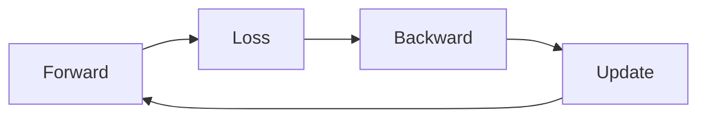

# 딥러닝에서의 미분

이 시리즈에서 지금까지 본 개념들은 각각 따로 존재하지 않습니다. 함수와 기울기, 편미분, gradient, chain rule, 손실 함수, 경사하강법, optimizer, 역전파는 모두 딥러닝 학습 루프 안에서 하나의 사이클로 묶여 움직입니다. 마지막 글의 목표는 그 조각들을 하나의 운영 모델로 합치는 것입니다.

딥러닝 학습은 겉으로 보면 반복문 한 줄처럼 보일 수 있습니다. 하지만 그 안에서는 예측을 만들고, 오차를 수치화하고, chain rule로 gradient를 계산하고, optimizer가 파라미터를 조정하는 과정이 정밀하게 이어집니다. 이 전체 고리를 이해해야 프레임워크 사용법을 넘어서 학습 자체를 설명할 수 있습니다.

이 글은 Calculus for ML 101 시리즈의 마지막 글입니다.

이 글에서는 forward pass, loss computation, backward pass, optimizer update, 반복 학습을 하나의 training loop로 묶어 설명하겠습니다. 목표는 “딥러닝이 학습한다”는 문장을 추상적으로 두지 않고, 미분이 실제로 어디에서 어떤 역할을 하는지 단계별로 복원하는 것입니다.

끝까지 읽고 나면 딥러닝 훈련 코드를 볼 때 각 줄이 어떤 수학적 의미를 갖는지, 그리고 왜 미분이 그 전체 루프의 중심인지 선명하게 보이게 됩니다.

## 이 글에서 다룰 문제

- 딥러닝 학습 루프는 어떤 단계로 구성되고 각 단계에서 미분은 어디에 등장할까요?
- forward pass와 loss computation은 backward를 위해 무엇을 준비할까요?
- gradient 계산과 optimizer update는 어떻게 연결될까요?
- `zero_grad`, eval/train mode, reproducibility 같은 실무 요소는 왜 이 루프 안에 들어올까요?
- 이 시리즈의 모든 미분 개념은 최종적으로 어떤 하나의 그림으로 합쳐질까요?

## 왜 이 글이 중요한가

딥러닝 프레임워크는 training loop를 매우 간결하게 감춰 줍니다. 그래서 코드는 짧아지지만, 각 단계의 의미가 흐려지기 쉽습니다. forward가 무엇을 만들고, loss가 무엇을 수치화하고, backward가 무엇을 전파하며, optimizer가 무엇을 바꾸는지 이해해야 학습 버그를 제대로 읽을 수 있습니다.

실무에서는 같은 모델 구조라도 data pipeline, loss reduction, gradient zeroing, optimizer scheduling, eval/train mode 관리에 따라 결과가 크게 달라집니다. 이 모두를 관통하는 공통 골격이 training loop입니다. 마지막 글에서 이 골격을 잡아 두면 이후 어떤 프레임워크를 보더라도 본질을 잃지 않게 됩니다.

또한 이 글은 시리즈 전체의 요약이기도 합니다. 미분은 더 이상 별도의 수학 단원이 아니라, 예측을 오차로 바꾸고 그 오차를 다시 파라미터 변화로 환원하는 전 과정을 움직이는 중심 메커니즘으로 보이게 됩니다.

## 딥러닝에서의 미분을 이해하는 가장 좋은 방법: forward, loss, backward, update가 닫힌 순환을 이루는 것으로 보는 것입니다

딥러닝 학습을 가장 실용적으로 이해하는 방법은 하나의 루프를 떠올리는 것입니다. 모델이 입력으로부터 예측을 만들고, 손실 함수가 오차를 계산하고, 역전파가 gradient를 만들고, optimizer가 파라미터를 갱신합니다. 그리고 이 과정이 반복됩니다.

이 루프를 이해하면 미분은 코드 한 줄이 아니라 루프 전체를 관통하는 공통 언어가 됩니다. forward는 함수 합성이고, loss는 목적 함수이며, backward는 chain rule의 실행이고, optimizer step은 gradient를 이동으로 바꾸는 절차입니다.

> 딥러닝에서 미분은 특정 레이어의 공식이 아니라, 예측 오차를 파라미터 업데이트로 변환하는 학습 루프 전체의 공통 인터페이스입니다.

## 핵심 개념

training loop의 핵심 흐름은 아래와 같습니다.



### 모델은 입력을 예측으로 바꾸는 함수입니다

```python
import math

def model(x, w, b):
    return sigmoid(w * x + b)

def sigmoid(z):
    return 1 / (1 + math.exp(-z))
```

이 작은 모델은 선형 결합 뒤에 sigmoid를 붙인 가장 단순한 형태입니다. 하지만 여기에 이미 함수 합성과 비선형성이 모두 들어 있습니다. 복잡한 딥러닝 모델도 본질적으로는 이런 함수들의 긴 합성입니다.

### 손실은 예측과 정답의 차이를 숫자로 만듭니다

```python
def bce(y, p, eps=1e-7):
    return -(y * math.log(p + eps) + (1 - y) * math.log(1 - p + eps))
```

forward만으로는 학습이 일어나지 않습니다. 예측이 얼마나 틀렸는지를 loss로 수치화해야 하고, 이 loss가 gradient의 출발점이 됩니다. 여기서 숫자 안정성을 위해 `eps`를 더하는 습관은 실제 training code에서도 매우 중요합니다.

### gradient는 analytic form으로도 볼 수 있습니다

```python
def grads(x, y, w, b):
    p = model(x, w, b)
    err = p - y
    return err * x, err
```

이 함수는 BCE와 sigmoid 조합에서 나오는 단순화된 gradient 직관을 보여 줍니다. 핵심은 error가 각 파라미터의 책임으로 분해된다는 점입니다. 입력 쪽 weight는 `err * x`, bias는 `err` 형태로 영향을 받습니다. 즉 편미분과 chain rule이 실제 코드 결과로 나타난 것입니다.

### optimizer step은 gradient를 이동으로 바꿉니다

```python
def step(x, y, w, b, lr=0.1):
    dw, db = grads(x, y, w, b)
    return w - lr * dw, b - lr * db
```

이 한 줄이 optimizer의 본질입니다. backward가 준 gradient를 learning rate만큼 스케일해 반대 방향으로 이동합니다. 대형 프레임워크에서는 Adam, momentum, weight decay 등이 추가되지만, 핵심 구조는 그대로입니다.

### 반복문이 곧 학습 루프입니다

```python
def train(data, epochs=100, lr=0.1):
    w, b = 0.0, 0.0
    for _ in range(epochs):
        for x, y in data:
            w, b = step(x, y, w, b, lr)
    return w, b
```

학습은 거창한 것이 아니라 이 반복입니다. 데이터가 들어오고, 예측이 만들어지고, 손실이 계산되고, gradient가 업데이트로 바뀌며, 그 결과 새로운 파라미터가 다음 forward에 사용됩니다. 이 닫힌 고리가 학습의 전부라고 해도 과언이 아닙니다.

### 실무에서는 루프 주변의 운영 규칙도 함께 봐야 합니다

실제 코드에서는 `zero_grad`, `model.train()`, `model.eval()`, seed 고정, mixed precision, gradient clipping, scheduler step 같은 규칙이 이 루프 주변에 붙습니다. 하지만 이런 운영 요소들도 결국 forward-loss-backward-update 구조를 안정적으로 실행하기 위한 보조 장치입니다.

## 흔히 헷갈리는 지점

- loss를 계산했다고 해서 자동으로 업데이트가 되는 것은 아닙니다. backward와 optimizer step이 이어져야 합니다.
- `zero_grad`를 빼먹으면 이전 step의 gradient가 누적될 수 있습니다.
- evaluation 중에도 gradient를 계산하면 불필요한 메모리와 계산을 사용하게 됩니다.
- train/eval mode를 혼동하면 Dropout, BatchNorm 동작이 달라져 결과 해석이 틀어질 수 있습니다.
- reproducibility를 무시하면 실험 차이가 모델 구조 때문인지 학습 루프 설정 때문인지 구분하기 어려워집니다.

## 운영 체크리스트

- [ ] forward, loss, backward, update의 순서를 팀 공통 학습 루프로 명확히 정리한다
- [ ] `zero_grad`와 optimizer step의 위치를 코드 리뷰 기준에 포함한다
- [ ] train/eval mode 전환 규칙을 실험 코드와 추론 코드에서 분리한다
- [ ] learning rate, seed, scheduler, weight decay를 함께 기록해 재현성을 확보한다
- [ ] 학습 문제를 볼 때 모델 구조뿐 아니라 training loop 전체를 한 번에 점검한다

## 정리

딥러닝에서 미분은 특정 수식의 일부가 아니라 학습 루프 전체를 움직이는 중심 메커니즘입니다. forward는 함수 합성으로 예측을 만들고, loss는 오차를 숫자로 바꾸고, backward는 chain rule로 gradient를 계산하고, optimizer는 그 gradient를 파라미터 업데이트로 바꿉니다.

이 시리즈에서 본 미분, 편미분, gradient, 연쇄 법칙, 손실 함수, 경사하강법, 최적화, 역전파는 모두 이 하나의 루프 안에서 각자 자리를 갖습니다. 그래서 딥러닝을 이해한다는 것은 결국 이 루프의 각 단계가 어떤 수학적 역할을 맡는지 설명할 수 있다는 뜻입니다.

이 글로 Calculus for ML 101 시리즈를 마칩니다. 이제 이후 어떤 모델이나 프레임워크를 보더라도, 그 안에서 학습이 실제로 어떻게 일어나는지 미분의 언어로 다시 읽어 낼 수 있을 것입니다.

<!-- toc:begin -->
## 시리즈 목차

- [미분이란 무엇인가](./01-what-is-derivative.md)
- [함수와 기울기](./02-functions-and-slope.md)
- [편미분](./03-partial-derivatives.md)
- [Gradient](./04-gradient.md)
- [연쇄 법칙](./05-chain-rule.md)
- [손실 함수](./06-loss-function.md)
- [경사하강법](./07-gradient-descent.md)
- [최적화](./08-optimization.md)
- [역전파 직관](./09-backpropagation-intuition.md)
- **딥러닝에서의 미분 (현재 글)**

<!-- toc:end -->

## 참고 자료

### 공식 문서
- [Deep Learning Book - Goodfellow et al.](https://www.deeplearningbook.org/)
- [PyTorch Tutorials](https://pytorch.org/tutorials/)
- [CS231n - Convolutional Neural Networks](https://cs231n.stanford.edu/)
- [Reproducibility - PyTorch](https://pytorch.org/docs/stable/notes/randomness.html)

### 관련 시리즈
- [Linear Algebra 101](../../linear-algebra-101/ko/)
- [MLOps 101](../../mlops-101/ko/)

Tags: Calculus, ML, DeepLearning, Capstone, Beginner
