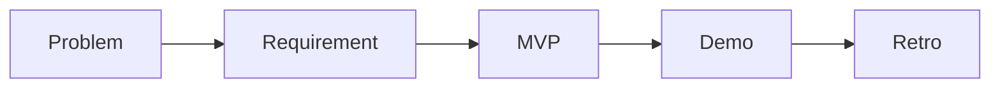

# What is a Capstone Project

> Capstone Project 101 series (1/10)

<!-- a-grade-intro:begin -->

**Core question**: *How* does a *capstone* differ from a *regular class assignment*?

> Students *own* the *whole flow* — from *problem definition* to *demo*.

This is post 1 in the Capstone Project 101 series.

<!-- a-grade-intro:end -->

## What You Will Learn

- Definition of *capstone*
- *Goals* and *evaluation*
- Difference from *assignments*
- *Team* roles
- Series *flow*

## Why It Matters

The capstone is the *final bridge* between *school* and *industry*.

## Concept at a Glance



## Key Terms

- **capstone**: *graduation* project.
- **stakeholder**: *interested party*.
- **MVP**: *minimum* product.
- **demo**: *live show*.
- **retro**: *post review*.

## Before/After

**Before**: You see it as a *big assignment*.

**After**: You see it as a *small product*.

## Hands-on: Capstone Definition Card

### Step 1 — One-line title

```python
title = "course schedule conflict checker"
```

### Step 2 — Users

```python
users = ["student", "advisor"]
```

### Step 3 — Value

```python
value = "cuts time spent on registration"
```

### Step 4 — Metric

```python
metric = "users confirm conflicts in 30 seconds"
```

### Step 5 — Demo

```python
demo = "demo.mp4 + readme.md"
```

## What to Notice in This Code

- The *title* is one line.
- *Users* and *value* are a pair.
- The goal is *measurable*.

## Five Common Mistakes

1. **Picking a *topic too big*.**
2. **Vague *users*.**
3. **No *measurement* criteria.**
4. **Building the *demo last*.**
5. **Skipping the *retrospective*.**

## How This Shows Up in Production

A new hire's *onboarding project* looks *almost the same* as a capstone.

## How a Senior Engineer Thinks

- *Problem* first.
- Start *small*.
- Make it *measurable*.
- *Publish* it.
- Run a *retro*.

## Checklist

- [ ] One-line *definition*.
- [ ] *User* listed.
- [ ] *Metric* set.
- [ ] *Demo* shape.

## Practice Problems

1. Define *capstone* in one line.
2. Define *MVP* in one line.
3. State the meaning of *measurement* in one line.

## Wrap-up and Next Steps

Next post: *Choosing a Topic*.

<!-- toc:begin -->
- **What is a Capstone Project (current)**
- Choosing a Topic (upcoming)
- Defining the Problem (upcoming)
- Organizing Requirements (upcoming)
- Splitting Team Roles (upcoming)
- Designing the MVP (upcoming)
- Choosing the Tech Stack (upcoming)
- Schedule Management (upcoming)
- Building Presentation Materials (upcoming)
- Project Retrospective (upcoming)
<!-- toc:end -->

## References

- [The Pragmatic Programmer](https://pragprog.com/titles/tpp20/the-pragmatic-programmer-20th-anniversary-edition/)
- [Inspired - Marty Cagan](https://svpg.com/inspired-how-to-create-products-customers-love/)
- [Lean Startup](http://theleanstartup.com/)
- [Atlassian Project Management Guide](https://www.atlassian.com/agile/project-management)

Tags: Capstone, Project, Graduation, Career, Beginner
