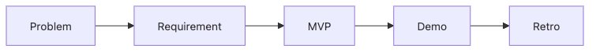

# What is a Capstone Project

Many teams introduce a capstone project as 'the big final team assignment.' That description is not wrong, but it does not explain why some teams finish with a coherent demo while others spend the semester chasing loosely connected features.

A capstone is better understood as a small product-delivery exercise. The team defines a problem, narrows scope, ships a demoable flow, and explains what it learned. Without that frame, the project keeps changing its own success criteria.

This is the first post in the Capstone Project 101 series. It defines what separates a capstone from ordinary coursework and establishes the delivery flow used throughout the series.

## Questions this chapter answers

- How is a capstone project different from a regular class assignment?
- Why do some teams build features but still finish with a weak project story?
- What should you evaluate besides feature count?
- Why must topic, requirements, MVP, and demo stay connected?
- How does the rest of this series build on this definition?

> A capstone is not a feature-collection exercise. It is a small product-delivery loop that connects problem definition, scope, MVP, demo, and retrospective.


## What You Will Learn

- Definition of *capstone*
- *Goals* and *evaluation*
- Difference from *assignments*
- *Team* roles
- Series *flow*

## Why It Matters

The framing in this post affects every later project document. Once a team treats the capstone as a delivery exercise, topic selection becomes a scope decision, requirements become a contract, and the MVP becomes a deliberate learning step instead of a random subset of features.

The same pattern appears in real product work. Teams define the problem, commit to a narrow flow, prepare a demo, and capture lessons for the next iteration. Treating the capstone this way makes the bridge from school to delivery much shorter.

## The flow at a glance


*The core capstone flow from problem definition to retrospective*

## Practical artifact: a one-page project brief

One simple way to separate a capstone from a generic assignment is to ask whether the team can produce a short brief like the one below before building features.

```text
Project title: Course schedule conflict checker
Primary users: freshmen and double-major students
Problem statement: students spend too long manually checking schedule conflicts before registration
Core value: confirm conflicts within 30 seconds
Demo bar: enter a sample timetable, show conflicts, and suggest alternatives
Success signal: a first-time user completes the main flow without explanation
```

## What to validate first

- Check whether the problem statement describes a user situation rather than a feature list.
- Confirm that the value is expressed as a measurable change such as time, confidence, or effort.
- Make sure the demo bar is realistic enough to reproduce during presentation week.
- Prefer observable success signals over vague team confidence.

## Key Terms

- **capstone**: *graduation* project.
- **stakeholder**: *interested party*.
- **MVP**: *minimum* product.
- **demo**: *live show*.
- **retro**: *post review*.

## Before/After

**Before**: You see it as a *big assignment*.

**After**: You see it as a *small product*.

## Hands-on: Capstone Definition Card

### Step 1 — One-line title

```python
title = "course schedule conflict checker"
```

### Step 2 — Users

```python
users = ["student", "advisor"]
```

### Step 3 — Value

```python
value = "cuts time spent on registration"
```

### Step 4 — Metric

```python
metric = "users confirm conflicts in 30 seconds"
```

### Step 5 — Demo

```python
demo = "demo.mp4 + readme.md"
```

## What to Notice in This Code

- The *title* is one line.
- *Users* and *value* are a pair.
- The goal is *measurable*.

## Five Common Mistakes

1. **Picking a *topic too big*.**
2. **Vague *users*.**
3. **No *measurement* criteria.**
4. **Building the *demo last*.**
5. **Skipping the *retrospective*.**

## How This Shows Up in Production

A new hire's *onboarding project* looks *almost the same* as a capstone.

## How a Senior Engineer Thinks

- *Problem* first.
- Start *small*.
- Make it *measurable*.
- *Publish* it.
- Run a *retro*.

## Checklist

- [ ] One-line *definition*.
- [ ] *User* listed.
- [ ] *Metric* set.
- [ ] *Demo* shape.

## Practice Problems

1. Define *capstone* in one line.
2. Define *MVP* in one line.
3. State the meaning of *measurement* in one line.

## Wrap-up and Next Steps

A capstone starts with a delivery frame, not a feature list. When problem definition, requirements, MVP, demo, and retrospective stay connected, the rest of the project becomes easier to steer. The next post focuses on choosing a topic that can survive that full flow.

<!-- toc:begin -->
- **What is a Capstone Project (current)**
- Choosing a Topic (upcoming)
- Defining the Problem (upcoming)
- Organizing Requirements (upcoming)
- Splitting Team Roles (upcoming)
- Designing the MVP (upcoming)
- Choosing the Tech Stack (upcoming)
- Schedule Management (upcoming)
- Building Presentation Materials (upcoming)
- Project Retrospective (upcoming)
<!-- toc:end -->

## References

### Official docs and practical guides

- [Atlassian Project Management Guide](https://www.atlassian.com/agile/project-management)
- [Scrum Guide](https://scrumguides.org/scrum-guide.html)
- [The Lean Startup](http://theleanstartup.com/)
- [Inspired — Marty Cagan](https://svpg.com/inspired-how-to-create-products-customers-love/)

Tags: Capstone, Project, Graduation, Career, Beginner
