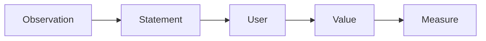

# Defining the Problem

> Capstone Project 101 series (3/10)

<!-- a-grade-intro:begin -->

**Core question**: *Why* does an *unclear problem* make the *solution shake*?

> If the *problem* becomes a *moving target*, *progress* gets *redefined* too.

<!-- a-grade-intro:end -->

## What You Will Learn

- Writing a problem *statement*
- *User* hypothesis
- *Value* specification
- *Metric* baseline
- Problem *restatement*

## Why It Matters

*Problem definition* decides *half* of *project quality*.

## Concept at a Glance



## Key Terms

- **statement**: *problem* sentence.
- **persona**: *user* profile.
- **value**: *benefit* of solving.
- **assumption**: a *premise*.
- **metric**: *measurement*.

## Before/After

**Before**: A *feature* equals the *problem*.

**After**: The *problem* justifies the *feature*.

## Hands-on: Problem Card

### Step 1 — Observation

```python
obs = "schedule conflicts during course registration"
```

### Step 2 — User

```python
user = "freshmen plus double-major students"
```

### Step 3 — Value

```python
value = "spot conflicts fast"
```

### Step 4 — Assumption

```python
assume = "users can paste timetables as text"
```

### Step 5 — Metric

```python
metric = "conflict found within 30s"
```

## What to Notice in This Code

- *Observation* comes before *statement*.
- *Assumptions* are *explicit*.
- The *metric* defines the *solution*.

## Five Common Mistakes

1. **Writing the *solution* as the *problem*.**
2. **Writing *everyone* as the *user*.**
3. **Hiding *assumptions*.**
4. **Vague *metrics*.**
5. **Fearing *restatement*.**

## How This Shows Up in Production

The *first section* of a PRD is the *problem statement*.

## How a Senior Engineer Thinks

- Keep the *problem short*.
- Make *assumptions explicit*.
- *Metrics* are *numbers*.
- *Restatement* is *healthy*.
- *Users* are *concrete*.

## Checklist

- [ ] *Statement* in one paragraph.
- [ ] *User* named.
- [ ] *Assumption* table.
- [ ] *Metric* number.

## Practice Problems

1. Define *problem statement* in one line.
2. Define *assumption* in one line.
3. State the meaning of *metric* in one line.

## Wrap-up and Next Steps

Next post: *Organizing Requirements*.

<!-- toc:begin -->
- [What is a Capstone Project](./01-what-is-capstone.md)
- [Choosing a Topic](./02-choosing-a-topic.md)
- **Defining the Problem (current)**
- Organizing Requirements (upcoming)
- Splitting Team Roles (upcoming)
- Designing the MVP (upcoming)
- Choosing the Tech Stack (upcoming)
- Schedule Management (upcoming)
- Building Presentation Materials (upcoming)
- Project Retrospective (upcoming)
<!-- toc:end -->

## References

- [The Mom Test](http://momtestbook.com/)
- [Working Backwards - Amazon](https://www.workingbackwards.com/)
- [PRD Template - Atlassian](https://www.atlassian.com/agile/product-management/requirements)
- [Inspired - Marty Cagan](https://svpg.com/inspired-how-to-create-products-customers-love/)

Tags: Capstone, Problem, Definition, Scope, Beginner
