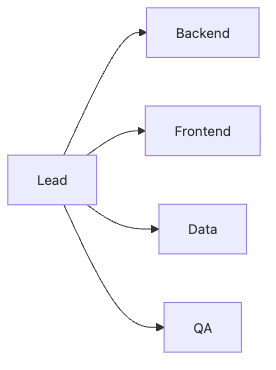

# Splitting Team Roles

Teams with fuzzy roles often look busy while moving slowly. Work circulates because nobody is sure who owns the final decision or who can safely take over when someone gets blocked.

In a capstone, role splitting is not about drawing boxes around people. It is about preventing decision bottlenecks and making sure the project can keep moving under schedule pressure.

This is post 5 in the Capstone Project 101 series. It outlines a simple role model that uses primary owners, backups, and explicit decision rights to keep collaboration moving.

## Questions this chapter answers

- Why do overlapping roles slow decisions down?
- How should teams assign primary owners and backups?
- How is a lead different from a code owner?
- Why should QA and deployment ownership be visible from the start?
- How should role changes be recorded?

> Role splitting is not about categorizing people. It is about deciding in advance who makes the call and who can continue the work when delivery stalls.


## What You Will Learn

- Five core *roles*
- A *responsibility matrix*
- *Code ownership*
- *Decision* flow
- *Backups*

## Why It Matters

Clear primary ownership speeds up decisions because the team knows exactly where questions and approvals should go.

Backup ownership matters just as much. Student teams are vulnerable to exams, interviews, and conflicting schedules, so a single absent owner can quickly turn into a project-wide slowdown.

## The flow at a glance


*A simple structure that connects the lead with domain owners*

## Practical artifact: a responsibility matrix

Even a small team benefits from writing responsibility lines like these before implementation starts.

```text
Workstream | Primary owner | Backup | Decision right
Requirement changes | Team lead | Frontend owner | Lead approval
API design | Backend owner | Data owner | Backend proposes, lead approves
Demo scenario | QA owner | Team lead | QA proposes, team agrees
Deployment check | Backend owner | Frontend owner | Must follow deployment checklist
```

## What to validate first

- Check that each workstream has one clear primary owner.
- Look for critical areas with no backup owner.
- Mark ambiguous decision rights early instead of discovering them mid-sprint.
- Leave room to record when and why role assignments change.

## Key Terms

- **lead**: *overall coordinator*.
- **backend**: *server and API*.
- **frontend**: *UI*.
- **data**: *DB and analysis*.
- **QA**: *quality verifier*.

## Before/After

**Before**: *Everyone* watches *everything*.

**After**: A *primary* and a *backup* are set.

## Hands-on: Role Table

### Step 1 — List members

```python
members = ["A", "B", "C", "D"]
```

### Step 2 — Map primary roles

```python
primary = {"A": "lead", "B": "backend", "C": "frontend", "D": "data"}
```

### Step 3 — Map backups

```python
backup = {"backend": "C", "frontend": "B", "data": "A"}
```

### Step 4 — Responsibility table

```python
raci = {"deploy": ("A", "B"), "test": ("D", "C")}
```

### Step 5 — Review cadence

```python
review = "weekly"
```

## What to Notice in This Code

- A *primary* is *one person*.
- A *backup* is *always* defined.
- *RACI* is *concise*.

## Five Common Mistakes

1. **Marking *everyone* as *co-owner*.**
2. **No *backup*.**
3. **The *lead* decides *everything*.**
4. **Assigning *QA* at the *end*.**
5. **Not *recording* role changes.**

## How This Shows Up in Production

Company teams use *RACI* to clarify decision rights every week.

## How a Senior Engineer Thinks

- *Roles* are *written down*.
- *Backups* are *required*.
- *Decision rights* are *explicit*.
- *Overlap* is *minimal*.
- *Changes* are *announced*.

## Checklist

- [ ] *Primary* mapping.
- [ ] *Backup* defined.
- [ ] *RACI* table.
- [ ] *Weekly* review.

## Practice Problems

1. State what *RACI* means in one line.
2. State the purpose of a *backup* in one line.
3. State the *lead* responsibility in one line.

## Wrap-up and Next Steps

Role splitting is a bottleneck-reduction design, not an org-chart exercise. Primary ownership, backup coverage, and explicit decision rights make the team far more resilient under capstone pressure. The next post shows how that structure supports MVP scoping.

<!-- toc:begin -->
- [What is a Capstone Project](./01-what-is-capstone.md)
- [Choosing a Topic](./02-choosing-a-topic.md)
- [Defining the Problem](./03-defining-the-problem.md)
- [Organizing Requirements](./04-organizing-requirements.md)
- **Splitting Team Roles (current)**
- Designing the MVP (upcoming)
- Choosing the Tech Stack (upcoming)
- Schedule Management (upcoming)
- Building Presentation Materials (upcoming)
- Project Retrospective (upcoming)
<!-- toc:end -->

## References

### Official docs and practical guides

- [RACI Matrix — PMI](https://www.pmi.org/learning/library/raci-responsibility-matrix-9410)
- [Team Topologies](https://teamtopologies.com/)
- [Code Ownership — Martin Fowler](https://martinfowler.com/bliki/CodeOwnership.html)
- [The Mythical Man-Month](https://en.wikipedia.org/wiki/The_Mythical_Man-Month)

Tags: Capstone, Team, Roles, Collaboration, Beginner
