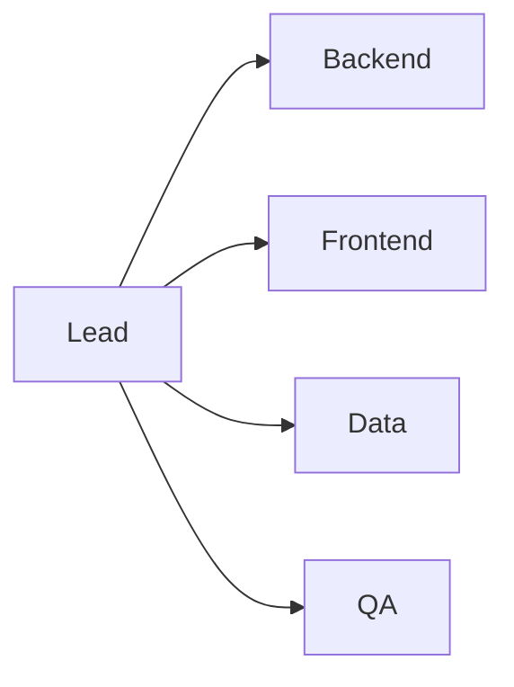

# Splitting Team Roles

> Capstone Project 101 series (5/10)

<!-- a-grade-intro:begin -->

**Core question**: *Why* does *overlapping* roles slow a team down?

> When *responsibility* is *diffused*, *decisions* are *delayed*.

This is post 5 in the Capstone Project 101 series.

<!-- a-grade-intro:end -->

## What You Will Learn

- Five core *roles*
- A *responsibility matrix*
- *Code ownership*
- *Decision* flow
- *Backups*

## Why It Matters

*Clear roles* create *responsibility* and *speed*.

## Concept at a Glance



## Key Terms

- **lead**: *overall coordinator*.
- **backend**: *server and API*.
- **frontend**: *UI*.
- **data**: *DB and analysis*.
- **QA**: *quality verifier*.

## Before/After

**Before**: *Everyone* watches *everything*.

**After**: A *primary* and a *backup* are set.

## Hands-on: Role Table

### Step 1 — List members

```python
members = ["A", "B", "C", "D"]
```

### Step 2 — Map primary roles

```python
primary = {"A": "lead", "B": "backend", "C": "frontend", "D": "data"}
```

### Step 3 — Map backups

```python
backup = {"backend": "C", "frontend": "B", "data": "A"}
```

### Step 4 — Responsibility table

```python
raci = {"deploy": ("A", "B"), "test": ("D", "C")}
```

### Step 5 — Review cadence

```python
review = "weekly"
```

## What to Notice in This Code

- A *primary* is *one person*.
- A *backup* is *always* defined.
- *RACI* is *concise*.

## Five Common Mistakes

1. **Marking *everyone* as *co-owner*.**
2. **No *backup*.**
3. **The *lead* decides *everything*.**
4. **Assigning *QA* at the *end*.**
5. **Not *recording* role changes.**

## How This Shows Up in Production

Company teams use *RACI* to clarify decision rights every week.

## How a Senior Engineer Thinks

- *Roles* are *written down*.
- *Backups* are *required*.
- *Decision rights* are *explicit*.
- *Overlap* is *minimal*.
- *Changes* are *announced*.

## Checklist

- [ ] *Primary* mapping.
- [ ] *Backup* defined.
- [ ] *RACI* table.
- [ ] *Weekly* review.

## Practice Problems

1. State what *RACI* means in one line.
2. State the purpose of a *backup* in one line.
3. State the *lead* responsibility in one line.

## Wrap-up and Next Steps

Next post: *Designing the MVP*.

<!-- toc:begin -->
- [What is a Capstone Project](./01-what-is-capstone.md)
- [Choosing a Topic](./02-choosing-a-topic.md)
- [Defining the Problem](./03-defining-the-problem.md)
- [Organizing Requirements](./04-organizing-requirements.md)
- **Splitting Team Roles (current)**
- Designing the MVP (upcoming)
- Choosing the Tech Stack (upcoming)
- Schedule Management (upcoming)
- Building Presentation Materials (upcoming)
- Project Retrospective (upcoming)
<!-- toc:end -->

## References

- [RACI Matrix - PMI](https://www.pmi.org/learning/library/raci-responsibility-matrix-9410)
- [Team Topologies](https://teamtopologies.com/)
- [The Mythical Man-Month](https://en.wikipedia.org/wiki/The_Mythical_Man-Month)
- [Code Ownership - Martin Fowler](https://martinfowler.com/bliki/CodeOwnership.html)

Tags: Capstone, Team, Roles, Collaboration, Beginner
