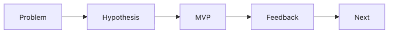

# Designing the MVP

Many teams describe an MVP as building fewer features. That usually leads to half-finished surfaces everywhere and no fully working core flow.

An MVP is better understood as the cheapest meaningful test of the project's main hypothesis. That means the cut list is often more important than the feature list.

This is post 6 in the Capstone Project 101 series. It designs the MVP as a package of one core flow, an explicit out-of-scope list, a demo bar, and a feedback loop.

## Questions this chapter answers

- Why is an MVP closer to a learning tool than a small product?
- What does picking one core flow force the team to remove?
- Why must the out-of-scope list be documented?
- How do demo criteria connect to success criteria?
- Why should feedback collection be part of the MVP itself?

> The goal of an MVP is not to shrink feature count for its own sake. It is to complete one critical user flow deeply enough that the team can actually learn from it.


## What You Will Learn

- *MVP* definition
- One *core flow*
- *Out-of-scope* decisions
- A *demo scenario*
- Collecting *feedback*

## Why It Matters

An MVP with one complete flow is also stronger on demo day. A user who can sign in, act, and see a result tells a much better story than a project that exposes many shallow screens.

The out-of-scope list protects that flow. Naming postponed items such as payments, admin tools, or internationalization keeps the team from quietly rebuilding the project every week.

## The flow at a glance


*An MVP structure that links hypothesis, demo bar, and feedback*

## Practical artifact: an MVP contract

One of the best tools for protecting scope is a short MVP contract that states the current boundary in plain language.

```text
Core flow: sign in → enter timetable → calculate conflicts → view results
Out of scope: payments, admin dashboard, internationalization, advanced recommendation logic
Demo bar: show the full flow with sample data in under 60 seconds
Success signal: at least 2 of 3 first-time users reach the result screen without explanation
Feedback prompts: was the flow clear, was it fast enough, would you use it in real life
```

## What to validate first

- Confirm that the core flow fits into one readable sentence.
- Check whether the out-of-scope list is aggressive enough to protect the flow.
- Make sure the demo bar is realistic in the actual presentation environment.
- Use feedback questions that can influence the next iteration.

## Key Terms

- **MVP**: *Minimum Viable Product*.
- **happy path**: the *normal flow*.
- **out of scope**: outside the *scope*.
- **demo**: a *live walkthrough*.
- **feedback**: structured *responses*.

## Before/After

**Before**: Build *every feature*.

**After**: *Finish one flow*.

## Hands-on: MVP Table

### Step 1 — Pick the core flow

```python
flow = "register -> upload -> share"
```

### Step 2 — Out of scope list

```python
out = ["payment", "i18n", "admin"]
```

### Step 3 — Demo scenario

```python
demo = ["login_demo_user", "upload_sample", "show_share_link"]
```

### Step 4 — Success criteria

```python
success = {"happy_path": "<= 60s", "errors": 0}
```

### Step 5 — Feedback form

```python
form = ["clarity", "speed", "value"]
```

## What to Notice in This Code

- The *flow* is one *sentence*.
- *Out of scope* is *explicit*.
- *Criteria* are *numbers*.

## Five Common Mistakes

1. **Measuring *progress* by *feature count*.**
2. **Trying to handle *every* exception.**
3. **No *demo scenario*.**
4. **No *feedback* form.**
5. **Adding *external dependencies* that grow risk.**

## How This Shows Up in Production

Startups also start with a *one-line happy path*.

## How a Senior Engineer Thinks

- An *MVP* is a *learning tool*.
- The *flow* is *single*.
- *Cutting* scope is *bold*.
- The *demo* is *scripted*.
- *Feedback* is *structured*.

## Checklist

- [ ] *Core flow* defined.
- [ ] *Out-of-scope* list.
- [ ] *Demo* scenario.
- [ ] *Feedback* form.

## Practice Problems

1. State what *MVP* means in one line.
2. Define *happy path* in one line.
3. State the meaning of *out of scope* in one line.

## Wrap-up and Next Steps

An MVP is a small experiment, not a small product. When the core flow, cut list, demo bar, and feedback prompts live together, the team can protect what matters even when the semester gets noisy. The next post chooses a tech stack that fits that MVP.

<!-- toc:begin -->
- [What is a Capstone Project](./01-what-is-capstone.md)
- [Choosing a Topic](./02-choosing-a-topic.md)
- [Defining the Problem](./03-defining-the-problem.md)
- [Organizing Requirements](./04-organizing-requirements.md)
- [Splitting Team Roles](./05-splitting-team-roles.md)
- **Designing the MVP (current)**
- Choosing the Tech Stack (upcoming)
- Schedule Management (upcoming)
- Building Presentation Materials (upcoming)
- Project Retrospective (upcoming)
<!-- toc:end -->

## References

### Official docs and practical guides

- [Minimum Viable Product guide](https://www.atlassian.com/agile/product-management/minimum-viable-product)
- [The Lean Startup](http://theleanstartup.com/)
- [Continuous Discovery Habits](https://www.producttalk.org/continuous-discovery/)
- [Inspired — Marty Cagan](https://svpg.com/inspired-how-to-create-products-customers-love/)

Tags: Capstone, MVP, Scope, Product, Beginner
