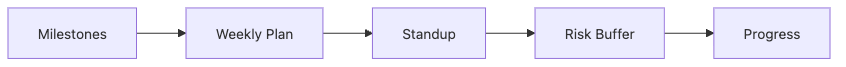

# Schedule Management

Most capstone schedules do not collapse in the final week without warning. They drift gradually, and the team notices too late because nothing made the gap visible early enough.

A good schedule is not a beautiful timeline. It is a system that repeatedly exposes the difference between plan and reality through milestones, weekly commitments, blockers, and explicit buffer.

This is post 8 in the Capstone Project 101 series. It explains how to combine milestones, weekly planning, standups, and risk buffer into a realistic execution rhythm.

## Questions this chapter answers

- Why do polished-looking plans still fail in practice?
- How do milestones differ from weekly plans?
- Why should blockers be exposed as early as possible?
- How much risk buffer is reasonable?
- Why should progress be measured numerically?

> A good schedule is not perfect prediction. It is an operating rhythm that reveals drift quickly enough to allow correction.


## What You Will Learn

- Defining *milestones*
- A *weekly plan*
- A *daily standup*
- A *risk buffer*
- Measuring *progress*

## Why It Matters

Milestones without weekly plans stay abstract, while weekly plans without milestones easily turn into busy work with no visible destination.

Buffer matters because student projects absorb many external shocks at once: exams, conflicting calendars, and surprise bugs. Without spare capacity, small slips turn into schedule-wide failure very quickly.

## The flow at a glance


*A scheduling loop from milestones to buffer adjustment*

## Practical artifact: a weekly execution board

A board like this often shows reality faster than a polished Gantt chart.

```text
Week | Goal | Done condition | Blocker | Buffer used
Week 1 | freeze requirements | Must stories approved | none | 0 days
Week 2 | implement core flow | input and result view connected | CSV cleanup delay | 1 day
Week 3 | rehearse demo | 60-second run succeeds | login bug reproduced | 2 days
Week 4 | finalize deck | Q&A ready | none | 0.5 day
```

## What to validate first

- Keep each weekly goal readable in one line.
- Define done conditions as outcomes, not activities.
- Record blockers explicitly instead of hiding them in chat.
- Track buffer consumption separately so schedule health stays visible.

## Key Terms

- **milestone**: a *major step*.
- **weekly plan**: a *7-day plan*.
- **standup**: a *short sync*.
- **buffer**: *spare time*.
- **progress**: *measured advance*.

## Before/After

**Before**: Only a *deadline* is written.

**After**: *Milestones + weekly + buffer* exist.

## Hands-on: Schedule Table

### Step 1 — Milestones

```python
milestones = ["MVP", "Demo", "Final"]
```

### Step 2 — Weekly plan

```python
weeks = {1: "setup", 2: "core", 3: "polish"}
```

### Step 3 — Standup format

```python
standup = ["yesterday", "today", "blockers"]
```

### Step 4 — Risk buffer

```python
buffer_days = 0.2 * 21
```

### Step 5 — Progress snapshot

```python
progress = {"done": 12, "todo": 8, "blocked": 2}
```

## What to Notice in This Code

- *Milestones* are *three to five*.
- The *weekly plan* is *one line*.
- The *buffer* is *twenty percent*.

## Five Common Mistakes

1. **No *buffer*.**
2. ***Standups* run *long*.**
3. **Measuring *progress* by *feel*.**
4. **The *weekly plan* is *fixed*.**
5. **Hiding *blockers*.**

## How This Shows Up in Production

Company teams use *two-week sprints* and *burndown* charts.

## How a Senior Engineer Thinks

- *Milestones* are *outcomes*.
- *Plans* are *adjustable*.
- *Buffer* is *standard*.
- *Blockers* are *visible*.
- *Progress* is *measured*.

## Checklist

- [ ] *Milestones* table.
- [ ] *Weekly* plan.
- [ ] *Daily* standup.
- [ ] *Twenty percent* buffer.

## Practice Problems

1. Define *milestone* in one line.
2. State the purpose of *buffer* in one line.
3. State the *three* standup items in one line.

## Wrap-up and Next Steps

Schedule management is about surfacing drift, not documenting busyness. When milestones, weekly plans, blockers, and buffer are managed together, late-semester uncertainty becomes far easier to absorb. The next post shows how to turn that work into presentation materials.

<!-- toc:begin -->
- [What is a Capstone Project](./01-what-is-capstone.md)
- [Choosing a Topic](./02-choosing-a-topic.md)
- [Defining the Problem](./03-defining-the-problem.md)
- [Organizing Requirements](./04-organizing-requirements.md)
- [Splitting Team Roles](./05-splitting-team-roles.md)
- [Designing the MVP](./06-designing-the-mvp.md)
- [Choosing the Tech Stack](./07-choosing-the-tech-stack.md)
- **Schedule Management (current)**
- Building Presentation Materials (upcoming)
- Project Retrospective (upcoming)
<!-- toc:end -->

## References

### Official docs and practical guides

- [Scrum Guide](https://scrumguides.org/scrum-guide.html)
- [Burndown chart tutorial](https://www.atlassian.com/agile/tutorials/burndown-charts)
- [Critical Path Method](https://en.wikipedia.org/wiki/Critical_path_method)
- [Software Estimation resources — Steve McConnell](https://stevemcconnell.com/sea/)

Tags: Capstone, Schedule, Planning, Project, Beginner
