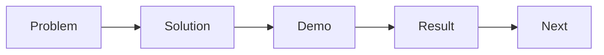

# Building Presentation Materials

> Capstone Project 101 series (9/10)

<!-- a-grade-intro:begin -->

**Core question**: *Why* are *feature list* presentations *boring*?

> They lack the *problem solution result* *narrative*.

This is post 9 in the Capstone Project 101 series.

<!-- a-grade-intro:end -->

## What You Will Learn

- A *narrative* structure
- *Slide* composition
- A *demo script*
- *Q&A* preparation
- *Time* allocation

## Why It Matters

*Delivery* matters as much as *results*.

## Concept at a Glance



## Key Terms

- **narrative**: a *story arc*.
- **slide**: *one* slide, *one* message.
- **demo**: a *scripted* walkthrough.
- **QnA**: *expected* questions.
- **timing**: *time allocation*.

## Before/After

**Before**: A *feature list* slide deck.

**After**: A *problem solution result* deck.

## Hands-on: Slide Table

### Step 1 — Build the narrative

```python
story = ["problem", "solution", "demo", "result", "next"]
```

### Step 2 — Slide counts

```python
slides = {"problem": 2, "solution": 3, "demo": 1, "result": 2, "next": 1}
```

### Step 3 — Demo script

```python
demo_steps = ["login", "core_action", "result_view"]
```

### Step 4 — Q&A prep

```python
qna = ["why_this_stack", "how_we_tested", "what_we_cut"]
```

### Step 5 — Time allocation

```python
minutes = {"talk": 8, "demo": 5, "qna": 7}
```

## What to Notice in This Code

- *One slide* equals *one message*.
- The *demo* is *three steps* or fewer.
- *Q&A* answers are *prepared*.

## Five Common Mistakes

1. **Too much *text*.**
2. **A *feature list*.**
3. **No *demo failure* fallback.**
4. **No *Q&A* preparation.**
5. **Going *over time*.**

## How This Shows Up in Production

Investor pitches also use the *problem solution result* arc.

## How a Senior Engineer Thinks

- *Narrative* outranks *features*.
- *Slides* are *visual*.
- *Demos* are *rehearsed*.
- *Q&A* is *scripted*.
- *Time* is *kept*.

## Checklist

- [ ] *Narrative* in five steps.
- [ ] *Demo* script.
- [ ] *Q&A* answers.
- [ ] *Time* allocation table.

## Practice Problems

1. State the *narrative* structure in one line.
2. State *demo failure* fallback in one line.
3. State a *Q&A* prep method in one line.

## Wrap-up and Next Steps

Next post: *Project Retrospective*.

<!-- toc:begin -->
- [What is a Capstone Project](./01-what-is-capstone.md)
- [Choosing a Topic](./02-choosing-a-topic.md)
- [Defining the Problem](./03-defining-the-problem.md)
- [Organizing Requirements](./04-organizing-requirements.md)
- [Splitting Team Roles](./05-splitting-team-roles.md)
- [Designing the MVP](./06-designing-the-mvp.md)
- [Choosing the Tech Stack](./07-choosing-the-tech-stack.md)
- [Schedule Management](./08-schedule-management.md)
- **Building Presentation Materials (current)**
- Project Retrospective (upcoming)
<!-- toc:end -->

## References

- [Presentation Zen - Garr Reynolds](https://www.presentationzen.com/)
- [The Cognitive Style of PowerPoint - Edward Tufte](https://www.edwardtufte.com/tufte/powerpoint)
- [TED Talks - Chris Anderson](https://www.ted.com/playlists/574/how_to_make_a_great_presentation)
- [Pyramid Principle - Barbara Minto](https://en.wikipedia.org/wiki/Pyramid_principle)

Tags: Capstone, Presentation, Demo, Storytelling, Beginner
