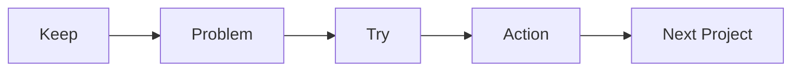

# Project Retrospective

> Capstone Project 101 series (10/10)

<!-- a-grade-intro:begin -->

**Core question**: *How* do you keep a *retrospective* from becoming a *blame meeting*?

> Record only *facts* and *actions*.

This is post 10 in the Capstone Project 101 series.

<!-- a-grade-intro:end -->

## What You Will Learn

- The *KPT* format
- *Data-driven* retrospectives
- *Five Whys* root cause
- *Next actions*
- *Learning* summary

## Why It Matters

A *retrospective* shapes the *next project*.

## Concept at a Glance



## Key Terms

- **KPT**: *Keep / Problem / Try*.
- **5 Whys**: a *root-cause* method.
- **action**: a *next step*.
- **data**: *numerical* evidence.
- **learning**: *captured* lesson.

## Before/After

**Before**: Only *feelings* are aired.

**After**: *Facts and actions* are recorded.

## Hands-on: Retro Table

### Step 1 — KPT

```python
kpt = {"keep": [], "problem": [], "try": []}
```

### Step 2 — Data

```python
metrics = {"velocity": 12, "bugs": 5, "review_time": 1.5}
```

### Step 3 — Five Whys

```python
whys = ["bug_at_demo", "missed_test", "no_ci", "no_template", "first_time"]
```

### Step 4 — Next actions

```python
actions = [{"who": "A", "what": "add_ci", "by": "next_sprint"}]
```

### Step 5 — Learning summary

```python
lessons = ["scope_first", "ci_early", "demo_dryrun"]
```

## What to Notice in This Code

- *KPT* has *three* columns.
- *Data* is *numeric*.
- *Actions* have an *owner* and *deadline*.

## Five Common Mistakes

1. **Asking *who* is at fault.**
2. **Recording only *feelings*.**
3. **No *actions*.**
4. **No *data*.**
5. **Not *linking* to the *next project*.**

## How This Shows Up in Production

Companies run *sprint retrospectives* and *postmortems*.

## How a Senior Engineer Thinks

- Start from *facts*.
- *Causes* are *systemic*.
- *Actions* are *small*.
- *Responsibility* is *shared*.
- *Learning* is *documented*.

## Checklist

- [ ] *KPT* table.
- [ ] *Data* gathered.
- [ ] *Five Whys*.
- [ ] *Three* next actions.

## Practice Problems

1. State the meaning of *KPT* in one line.
2. State what *Five Whys* is in one line.
3. State the *next-action* format in one line.

## Wrap-up and Next Steps

This concludes the *Capstone Project 101* series. The next series is *Portfolio Project 101*.

<!-- toc:begin -->
- [What is a Capstone Project](./01-what-is-capstone.md)
- [Choosing a Topic](./02-choosing-a-topic.md)
- [Defining the Problem](./03-defining-the-problem.md)
- [Organizing Requirements](./04-organizing-requirements.md)
- [Splitting Team Roles](./05-splitting-team-roles.md)
- [Designing the MVP](./06-designing-the-mvp.md)
- [Choosing the Tech Stack](./07-choosing-the-tech-stack.md)
- [Schedule Management](./08-schedule-management.md)
- [Building Presentation Materials](./09-presentation-materials.md)
- **Project Retrospective (current)**
<!-- toc:end -->

## References

- [Agile Retrospectives - Esther Derby](https://pragprog.com/titles/dlret/agile-retrospectives/)
- [The Five Whys - Toyota Production System](https://en.wikipedia.org/wiki/Five_whys)
- [Postmortem Culture - Google SRE](https://sre.google/sre-book/postmortem-culture/)
- [Project Retrospectives - Norman Kerth](https://retrospectives.com/)

Tags: Capstone, Retrospective, Learning, Reflection, Beginner
