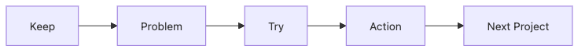

# Project Retrospective

When the project ends, relief arrives before reflection. If the team disperses at that moment, most of the semester's learning stays trapped in individual memory.

A retrospective is valuable because it converts feelings into facts, causes, and next actions. That conversion is what allows the next project to start from a higher baseline.

This is the final post in the Capstone Project 101 series. It shows how to combine KPT, data, cause analysis, and next actions into a retrospective that the next project can actually use.

## Questions this chapter answers

- What keeps a retrospective from turning into blame allocation?
- Why does the KPT format work well for beginner teams?
- How does data make retrospective discussion more stable?
- When does cause analysis support system improvement rather than personal blame?
- What makes next actions likely to be executed later?

> A strong retrospective is not a blame document. It is the first document of the next project because it records facts, causes, and changes worth carrying forward.


## What You Will Learn

- The *KPT* format
- *Data-driven* retrospectives
- *Five Whys* root cause
- *Next actions*
- *Learning* summary

## Why It Matters

A simple format such as KPT keeps the conversation grounded. Separating what to keep, what was problematic, and what to try next lowers the chance that the meeting dissolves into vague frustration.

Data and next actions strengthen the discussion further. Metrics such as bug counts, review latency, or rehearsal attempts make the team's pain points concrete, while owned actions turn insight into change.

## The flow at a glance


*Turning a retrospective into input for the next project*

## Practical artifact: a retrospective action log

Retrospectives lead to change only when next actions are small and explicit enough to survive after the meeting.

```text
Type | Item | Owner | Due date
Keep | preserve a written log of requirement changes | team lead | before next project kickoff
Problem | the team found demo-breaking bugs too late because rehearsal was weak | team | recorded during retro
Try | reserve a 20-minute rehearsal slot every Friday | QA owner | week 1 of the next project
Action | add a deployment checklist template to the repository | backend owner | week 1 of the next project
```

## What to validate first

- Separate keeps, problems, and tries instead of mixing them.
- Gather evidence for claims that currently rely on memory alone.
- Attach an owner and due date to each next action.
- Store the retro where the next project can reopen it easily.

## Key Terms

- **KPT**: *Keep / Problem / Try*.
- **5 Whys**: a *root-cause* method.
- **action**: a *next step*.
- **data**: *numerical* evidence.
- **learning**: *captured* lesson.

## Before/After

**Before**: Only *feelings* are aired.

**After**: *Facts and actions* are recorded.

## Hands-on: Retro Table

### Step 1 — KPT

```python
kpt = {"keep": [], "problem": [], "try": []}
```

### Step 2 — Data

```python
metrics = {"velocity": 12, "bugs": 5, "review_time": 1.5}
```

### Step 3 — Five Whys

```python
whys = ["bug_at_demo", "missed_test", "no_ci", "no_template", "first_time"]
```

### Step 4 — Next actions

```python
actions = [{"who": "A", "what": "add_ci", "by": "next_sprint"}]
```

### Step 5 — Learning summary

```python
lessons = ["scope_first", "ci_early", "demo_dryrun"]
```

## What to Notice in This Code

- *KPT* has *three* columns.
- *Data* is *numeric*.
- *Actions* have an *owner* and *deadline*.

## Five Common Mistakes

1. **Asking *who* is at fault.**
2. **Recording only *feelings*.**
3. **No *actions*.**
4. **No *data*.**
5. **Not *linking* to the *next project*.**

## How This Shows Up in Production

Companies run *sprint retrospectives* and *postmortems*.

## How a Senior Engineer Thinks

- Start from *facts*.
- *Causes* are *systemic*.
- *Actions* are *small*.
- *Responsibility* is *shared*.
- *Learning* is *documented*.

## Checklist

- [ ] *KPT* table.
- [ ] *Data* gathered.
- [ ] *Five Whys*.
- [ ] *Three* next actions.

## Practice Problems

1. State the meaning of *KPT* in one line.
2. State what *Five Whys* is in one line.
3. State the *next-action* format in one line.

## Wrap-up and Next Steps

A retrospective is both the final document of this project and the first document of the next one. When KPT, data, cause analysis, and next actions are captured together, the semester's failures and wins become durable project memory. This concludes the Capstone Project 101 series.

<!-- toc:begin -->
- [What is a Capstone Project](./01-what-is-capstone.md)
- [Choosing a Topic](./02-choosing-a-topic.md)
- [Defining the Problem](./03-defining-the-problem.md)
- [Organizing Requirements](./04-organizing-requirements.md)
- [Splitting Team Roles](./05-splitting-team-roles.md)
- [Designing the MVP](./06-designing-the-mvp.md)
- [Choosing the Tech Stack](./07-choosing-the-tech-stack.md)
- [Schedule Management](./08-schedule-management.md)
- [Building Presentation Materials](./09-presentation-materials.md)
- **Project Retrospective (current)**
<!-- toc:end -->

## References

### Official docs and practical guides

- [Agile Retrospectives](https://pragprog.com/titles/dlret/agile-retrospectives/)
- [The Five Whys](https://en.wikipedia.org/wiki/Five_whys)
- [Google SRE — Postmortem Culture](https://sre.google/sre-book/postmortem-culture/)
- [Project Retrospectives](https://retrospectives.com/)

Tags: Capstone, Retrospective, Learning, Reflection, Beginner
