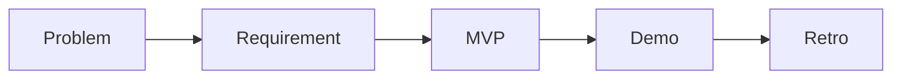

# 캡스톤 프로젝트란 무엇인가

캡스톤 프로젝트를 처음 들으면 보통 졸업 전 큰 팀 과제라고 이해합니다. 틀린 설명은 아니지만 충분한 설명도 아닙니다. 이 글은 Capstone Project 101 시리즈의 첫 번째 글입니다. 여기서는 캡스톤을 단순히 제출용 과제가 아니라, 문제 정의부터 데모와 회고까지 한 번 끝까지 밀어 보는 작은 제품 개발 연습으로 이해해 보겠습니다.

> 멘탈 모델: 캡스톤은 기능을 많이 만드는 수업이 아니라, 문제·요구사항·MVP·데모·회고를 하나의 흐름으로 연결하는 작은 제품 개발 연습입니다.

## 이 글에서 다룰 문제

- 캡스톤 프로젝트는 일반 과제와 무엇이 다를까요?
- 왜 많은 학교가 졸업 직전 과목으로 캡스톤을 운영할까요?
- 좋은 캡스톤은 기능 수보다 무엇으로 평가해야 할까요?
- 팀 역할과 데모는 왜 초반부터 함께 생각해야 할까요?
- 이 시리즈는 어떤 순서로 이어질까요?

## 이 글에서 배우는 내용

- 캡스톤의 기본 정의
- 목표와 평가 관점
- 일반 과제와의 차이
- 팀 기반 프로젝트 감각
- 시리즈 전체 흐름

## 왜 중요한가

캡스톤은 학교와 현장 사이를 잇는 마지막 다리에 가깝습니다. 일반 과제는 보통 정답과 채점 기준이 비교적 분명하지만, 캡스톤은 문제를 어떻게 정의할지, 누구를 사용자로 볼지, 어디까지 만들지, 무엇을 데모로 보여 줄지까지 스스로 정해야 합니다. 그래서 결과물뿐 아니라 판단 과정 자체가 훈련 대상이 됩니다.

현업에서도 첫 프로젝트의 구조는 비슷합니다. 문제를 설명하고, 사용자 가치를 정리하고, 제한된 시간 안에 설득력 있는 결과를 만들어야 합니다. 캡스톤을 잘 이해한 팀은 초반부터 기능 목록보다 문제와 데모를 먼저 붙잡습니다.

## 한눈에 보는 개념



## 핵심 용어

- **capstone**: 졸업 직전 수행하는 종합 프로젝트입니다.
- **stakeholder**: 결과물에 관심을 갖거나 영향을 받는 이해관계자입니다.
- **MVP**: 가장 작은 검증 가능한 제품입니다.
- **demo**: 핵심 흐름을 보여 주는 시연입니다.
- **retro**: 프로젝트를 돌아보며 학습을 정리하는 회고입니다.

## Before / After

**Before**: 캡스톤을 큰 과제라고만 봅니다.

**After**: 캡스톤을 작은 제품 개발 연습으로 봅니다.

## 실습: 캡스톤 정의 카드

### 1단계 — 한 줄 제목

```python
title = "course schedule conflict checker"
```

프로젝트 제목은 화려할수록 좋은 것이 아니라, 무엇을 하는지 바로 이해될수록 좋습니다. 한 줄 제목이 선명해야 팀의 대화도 선명해집니다.

### 2단계 — 사용자

```python
users = ["student", "advisor"]
```

사용자를 좁히면 요구사항도 함께 좁혀집니다. 반대로 모두를 사용자로 잡으면 프로젝트는 빠르게 커집니다.

### 3단계 — 가치

```python
value = "cuts time spent on registration"
```

가치는 기능 설명이 아니라 변화 설명이어야 합니다. 무엇을 만들었는지가 아니라, 무엇이 더 쉬워지는지를 적는 편이 좋습니다.

### 4단계 — 지표

```python
metric = "users confirm conflicts in 30 seconds"
```

지표가 들어가면 프로젝트의 성공 기준이 명확해집니다. 막연히 편하다는 표현보다, 얼마 안에 무엇을 할 수 있는지가 더 강한 기준입니다.

### 5단계 — 데모

```python
demo = "demo.mp4 + readme.md"
```

데모 형식을 미리 적어 두면 어떤 흐름을 반드시 완성해야 하는지가 자연스럽게 드러납니다. 발표 직전 급히 정리하는 팀일수록 핵심 흐름이 흔들리기 쉽습니다.

## 이 코드에서 먼저 볼 점

- 제목은 한 줄로 끝납니다.
- 사용자와 가치는 짝으로 움직입니다.
- 지표는 측정 가능해야 합니다.
- 데모 형식이 정해져야 우선순위가 분명해집니다.

## 자주 하는 실수 5가지

1. 주제를 너무 크게 잡습니다.
2. 사용자를 모호하게 적습니다.
3. 측정 기준 없이 감각적인 표현만 남깁니다.
4. 데모를 마지막 작업으로 미룹니다.
5. 회고를 형식적인 문서라고만 생각합니다.

## 실무에서는 이렇게 이어집니다

신입 온보딩 프로젝트나 사내 파일럿도 구조는 거의 같습니다. 문제를 한 줄로 설명하고, 누가 쓸지 정하고, 작은 데모를 만들고, 피드백을 통해 다음 단계를 정합니다. 캡스톤을 제대로 경험한 사람은 주어진 기능만 구현하는 사람보다, 무엇을 왜 만드는지 설명할 수 있는 사람에 더 가깝습니다.

## 시니어 엔지니어는 이렇게 생각합니다

- 문제를 먼저 봅니다.
- 처음부터 작게 시작합니다.
- 성공 기준을 숫자로 둡니다.
- 결과를 보여 줄 데모를 초반부터 상상합니다.
- 회고를 다음 프로젝트의 자산으로 남깁니다.

## 체크리스트

- [ ] 프로젝트를 한 줄로 설명할 수 있습니다.
- [ ] 첫 사용자 집단이 정해져 있습니다.
- [ ] 가치가 변화 중심으로 적혀 있습니다.
- [ ] 성공 기준에 숫자가 들어 있습니다.
- [ ] 발표용 데모 형식이 정해져 있습니다.

## 연습 문제

1. capstone을 한 줄로 정의해 보세요.
2. MVP를 한 줄로 정의해 보세요.
3. 측정 가능성의 의미를 한 줄로 설명해 보세요.

## 정리와 다음 글

캡스톤은 큰 과제가 아니라 작은 제품 개발 연습입니다. 문제를 정의하고, 요구사항을 정리하고, MVP를 만들고, 데모와 회고까지 이어 보는 경험이 핵심입니다. 다음 글에서는 좋은 캡스톤 주제를 어떻게 고를지 이어서 살펴보겠습니다.

<!-- toc:begin -->
- **캡스톤 프로젝트란 무엇인가 (현재 글)**
- 주제 선정 (예정)
- 문제 정의 (예정)
- 요구사항 정리 (예정)
- 팀 역할 나누기 (예정)
- MVP 설계 (예정)
- 기술 스택 선택 (예정)
- 일정 관리 (예정)
- 발표 자료 만들기 (예정)
- 프로젝트 회고 (예정)
<!-- toc:end -->

## 참고 자료

- [The Pragmatic Programmer](https://pragprog.com/titles/tpp20/the-pragmatic-programmer-20th-anniversary-edition/)
- [Inspired - Marty Cagan](https://svpg.com/inspired-how-to-create-products-customers-love/)
- [Lean Startup](http://theleanstartup.com/)
- [Atlassian Project Management Guide](https://www.atlassian.com/agile/project-management)

Tags: Capstone, Project, Graduation, Career, Beginner
