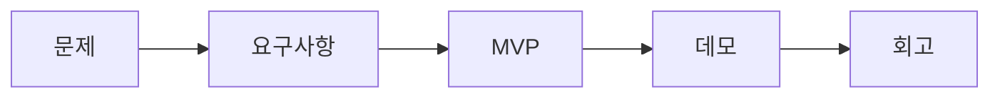

# 캡스톤 프로젝트란 무엇인가

## 이 글에서 다룰 문제

- 캡스톤 프로젝트는 일반 과제와 무엇이 다를까요?
- 왜 많은 학교가 졸업 직전 과목으로 캡스톤을 두고 있을까요?
- 좋은 캡스톤은 기능 개수보다 어떤 기준으로 평가해야 할까요?
- 작은 제품 관점으로 캡스톤을 보면 무엇이 달라질까요?
- 이 시리즈 전체는 어떤 흐름으로 이어질까요?

캡스톤 프로젝트를 처음 들으면 대개 “졸업 전에 하는 큰 팀 과제” 정도로 이해합니다. 틀린 말은 아니지만, 그 설명만으로는 왜 어떤 팀은 한 학기 내내 바쁘기만 하고 결과가 남지 않는지 설명하기 어렵습니다. 캡스톤은 단순히 과제를 크게 만든 형태가 아니라, 문제를 정의하고 사용자를 정하고 데모까지 연결하는 작은 제품 개발 연습에 가깝습니다.

현업 관점에서 보면 더 분명합니다. 회사에서 맡는 첫 프로젝트도 구조는 비슷합니다. 누가 겪는 문제인지 정하고, 어떤 가치를 줄지 정리하고, 짧은 시간 안에 보여 줄 수 있는 결과물을 만들어야 합니다. 캡스톤은 그 흐름을 학교 안에서 한 번 압축해서 연습하는 장이라고 보는 편이 훨씬 실용적입니다.

> 캡스톤 프로젝트 101 시리즈 (1/10)

## 왜 중요한가

캡스톤은 학교와 현장 사이의 마지막 다리입니다. 수업 과제는 보통 정답이 어느 정도 정해져 있고 평가 기준도 비교적 분명합니다. 반면 캡스톤은 문제 정의부터 범위 조정, 역할 분담, 발표, 회고까지 학생이 스스로 결정해야 하는 항목이 많습니다. 그래서 결과물만이 아니라 판단 과정 자체가 훈련 대상이 됩니다.

이 차이를 빨리 이해한 팀은 초반부터 움직임이 다릅니다. 주제를 넓게 잡지 않고, 사용자와 데모를 먼저 생각하고, “무엇을 만들까”보다 “무슨 문제를 풀까”를 먼저 묻습니다. 한 학기짜리 프로젝트에서 가장 부족한 자원은 시간인데, 캡스톤의 본질을 놓치면 그 시간을 기능 목록 채우는 데 써 버리기 쉽습니다.

## 한눈에 보는 전체 흐름

캡스톤은 아래 흐름으로 이해하면 편합니다. 프로젝트는 보통 여기서 앞 단계가 흔들리면 뒤 단계도 같이 흔들립니다.



이 그림이 중요한 이유는 캡스톤을 선형 작업으로만 보지 않게 해 주기 때문입니다. 문제를 잘못 잡으면 요구사항이 늘어나고, 요구사항이 흐리면 MVP가 커지고, MVP가 커지면 데모가 늦어지고, 결국 회고는 형식적인 문서가 됩니다. 반대로 초반 정의가 선명하면 뒤 단계는 오히려 가벼워집니다.

## 캡스톤을 보는 관점이 어떻게 바뀌어야 할까

처음에는 대부분 이렇게 생각합니다.

- Before: 큰 과제를 끝내는 일
- After: 작은 제품 하나를 끝까지 밀어 보는 일

이 전환이 중요합니다. 과제 관점은 제출물 중심으로 움직이기 쉽고, 제품 관점은 사용자·가치·데모 중심으로 움직이기 쉽습니다. 캡스톤에서 필요한 것은 완벽한 상용 서비스가 아니라, 문제와 해결이 일관되게 이어지는 작지만 설득력 있는 결과물입니다.

## 캡스톤 정의 카드를 먼저 써 보기

주제가 아직 없어도 괜찮습니다. 먼저 프로젝트를 한 장짜리 카드로 적어 보면 팀이 같은 그림을 보게 됩니다.

### 1단계 — 한 줄 정의

```python
title = "강의 시간표 충돌 검사기"
```

제목은 길수록 좋은 것이 아니라, 누가 봐도 무엇을 하는지 바로 떠오를수록 좋습니다. 화려한 이름보다 기능과 문제를 함께 떠올리게 하는 이름이 낫습니다.

### 2단계 — 사용자

```python
users = ["student", "advisor"]
```

사용자가 두루뭉술하면 요구사항이 끝없이 늘어납니다. 학생인지, 조교인지, 지도교수인지에 따라 필요한 기능이 달라지기 때문입니다. 캡스톤 초반에는 “모든 사용자”보다 “가장 먼저 만족시킬 사용자”를 적는 편이 훨씬 낫습니다.

### 3단계 — 가치

```python
value = "수강 신청 시간을 줄인다"
```

가치는 기능 설명이 아니라 변화 설명에 가깝습니다. 무엇을 보여 주는지가 아니라, 사용자가 무엇을 덜 힘들게 하는지로 적어야 합니다.

### 4단계 — 측정

```python
metric = "사용자가 충돌을 30초 안에 확인"
```

측정 기준이 없으면 프로젝트는 열심히 했는데 잘했는지 설명하기 어려워집니다. 숫자는 작아 보여도 팀의 판단을 많이 정리해 줍니다. “빠르게”보다 “30초 안에”가 훨씬 강한 기준입니다.

### 5단계 — 데모

```python
demo = "demo.mp4 + readme.md"
```

데모 형태를 미리 적는 습관도 중요합니다. 발표 직전에 영상을 급히 만들거나 README를 뒤늦게 정리하는 팀은 많습니다. 하지만 데모를 먼저 상상하면 어떤 흐름이 반드시 완성되어야 하는지 자연스럽게 드러납니다.

## 이 코드에서 봐야 할 포인트

- 제목은 한 줄로 끝나야 합니다.
- 사용자와 가치는 짝으로 움직입니다.
- 측정 가능성이 들어가야 팀이 같은 기준으로 판단할 수 있습니다.
- 데모 형식이 정해져야 개발 우선순위가 분명해집니다.

이 다섯 줄은 작아 보여도 실무 감각을 그대로 담고 있습니다. 현업에서도 프로젝트를 설명할 때 결국 제목, 대상 사용자, 기대 효과, 성공 기준, 시연 방법으로 귀결되는 경우가 많습니다.

## 자주 하는 실수

1. 주제를 너무 크게 잡습니다.
2. 사용자를 모호하게 적습니다.
3. 측정 기준을 빼고 감각적인 표현으로만 설명합니다.
4. 데모를 마지막 작업으로 미룹니다.
5. 회고를 형식적인 제출 문서로만 생각합니다.

특히 많이 보는 실수는 기능 수로 완성도를 증명하려는 태도입니다. 로그인, 추천, 관리자 페이지, 알림, 통계 화면을 모두 넣었는데도 프로젝트가 설득력 없을 수 있습니다. 반대로 기능은 적어도 문제와 해결이 선명하면 발표에서 훨씬 강합니다.

## 실무에서는 이렇게 연결됩니다

신입 온보딩 프로젝트나 사내 파일럿도 구조가 거의 같습니다. 문제를 한 줄로 설명하고, 누가 쓸지 정하고, 작은 데모를 만들고, 피드백을 받아 다음 단계를 정합니다. 캡스톤을 제대로 해 본 경험은 “주어진 일만 구현하는 사람”이 아니라 “무엇을 왜 만드는지 설명할 수 있는 사람”으로 보이게 해 줍니다.

## 체크리스트

- [ ] 프로젝트를 한 줄로 설명할 수 있습니다.
- [ ] 첫 사용자 집단이 정해져 있습니다.
- [ ] 가치가 기능이 아니라 변화로 적혀 있습니다.
- [ ] 성공 기준에 숫자가 들어 있습니다.
- [ ] 발표용 데모 형태가 미리 정해져 있습니다.

## 정리와 다음 글

캡스톤은 큰 과제가 아니라 작은 제품 개발 연습입니다. 문제에서 출발해 요구사항, MVP, 데모, 회고까지 이어지는 흐름을 한 번 끝까지 경험하는 것이 핵심입니다. 그래서 첫 단추는 기능 목록이 아니라 프로젝트를 어떻게 정의할지 정하는 일입니다.

다음 글에서는 좋은 캡스톤 주제를 어떻게 고르는지, 멋있어 보이는 아이디어와 실제로 해낼 수 있는 주제를 어떻게 구분하는지 이어서 보겠습니다.

<!-- toc:begin -->
- **캡스톤 프로젝트란 무엇인가 (현재 글)**
- 주제 선정 (예정)
- 문제 정의 (예정)
- 요구사항 정리 (예정)
- 팀 역할 나누기 (예정)
- MVP 설계 (예정)
- 기술 스택 선택 (예정)
- 일정 관리 (예정)
- 발표 자료 만들기 (예정)
- 프로젝트 회고 (예정)
<!-- toc:end -->

## 참고 자료

- [The Pragmatic Programmer](https://pragprog.com/titles/tpp20/the-pragmatic-programmer-20th-anniversary-edition/)
- [Inspired - Marty Cagan](https://svpg.com/inspired-how-to-create-products-customers-love/)
- [Lean Startup](http://theleanstartup.com/)
- [Atlassian Project Management Guide](https://www.atlassian.com/agile/project-management)

Tags: Capstone, Project, Graduation, Career, Beginner
