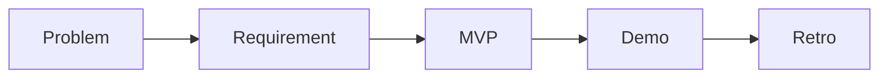

# 캡스톤 프로젝트란 무엇인가

> 캡스톤 프로젝트 101 시리즈 (1/10)


## 이 글에서 다룰 문제

캡스톤은 *학교* 와 *현장* 을 잇는 *마지막* 다리입니다.

## 전체 흐름


## Before/After

**Before**: *큰 과제* 로 본다.

**After**: *작은 제품* 으로 본다.

## 캡스톤 정의 카드

### 1단계 — 한 줄 정의

```python
title = "강의 시간표 충돌 검사기"
```

### 2단계 — 사용자

```python
users = ["student", "advisor"]
```

### 3단계 — 가치

```python
value = "수강 신청 시간을 줄인다"
```

### 4단계 — 측정

```python
metric = "사용자가 충돌을 30초 안에 확인"
```

### 5단계 — 데모

```python
demo = "demo.mp4 + readme.md"
```

## 이 코드에서 주목할 점

- *제목* 은 한 줄.
- *사용자* 와 *가치* 는 짝.
- *측정 가능* 한 목표.

## 자주 하는 실수 5가지

1. ***주제* 를 *너무 크게* 잡는다.**
2. ***사용자* 가 *모호* 하다.**
3. ***측정* 기준이 없다.**
4. ***데모* 를 *마지막* 에 만든다.**
5. ***회고* 를 생략한다.**

## 실무에서는 이렇게 쓰입니다

신입 *온보딩 과제* 가 캡스톤과 *거의 같은 모양* 으로 주어집니다.

## 체크리스트

- [ ] 한 줄 *정의*.
- [ ] *사용자* 명시.
- [ ] *측정* 기준.
- [ ] *데모* 형태.

## 정리 및 다음 단계

다음 글은 *주제 선정* 입니다.

<!-- toc:begin -->
- **캡스톤 프로젝트란 무엇인가 (현재 글)**
- 주제 선정 (예정)
- 문제 정의 (예정)
- 요구사항 정리 (예정)
- 팀 역할 나누기 (예정)
- MVP 설계 (예정)
- 기술 스택 선택 (예정)
- 일정 관리 (예정)
- 발표 자료 만들기 (예정)
- 프로젝트 회고 (예정)
<!-- toc:end -->

## 참고 자료

- [The Pragmatic Programmer](https://pragprog.com/titles/tpp20/the-pragmatic-programmer-20th-anniversary-edition/)
- [Inspired - Marty Cagan](https://svpg.com/inspired-how-to-create-products-customers-love/)
- [Lean Startup](http://theleanstartup.com/)
- [Atlassian Project Management Guide](https://www.atlassian.com/agile/project-management)

Tags: Capstone, Project, Graduation, Career, Beginner
