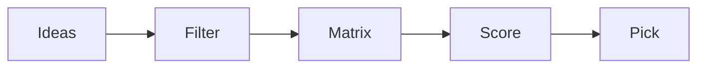

# 주제 선정

주제 선정은 흥미로운 아이디어를 뽑는 과정이 아니라, 한 학기 안에 끝까지 책임질 수 있는 문제를 고르는 과정입니다. 이 글은 Capstone Project 101 시리즈의 2번째 글입니다. 여기서는 좋은 주제가 어떤 조건을 갖춰야 하는지, 그리고 후보를 어떻게 비교해야 하는지 차분히 정리해 보겠습니다.

> 멘탈 모델: 좋은 주제는 멋있어 보이는 주제가 아니라, 작고 측정 가능하며 팀이 실제로 끝까지 가져갈 수 있는 주제입니다.

## 이 글에서 다룰 문제

- 좋은 캡스톤 주제는 어떤 조건을 갖춰야 할까요?
- 흥미로운 아이디어와 실제로 해낼 수 있는 아이디어는 어떻게 구분할까요?
- 후보를 비교할 때 팀이 함께 볼 기준은 무엇일까요?
- 범위가 큰 아이디어를 학기 안에 맞는 주제로 줄이려면 어떻게 해야 할까요?
- 최종 선택 뒤에 어떤 근거를 남겨야 할까요?

## 이 글에서 배우는 내용

- 좋은 주제의 판단 기준
- 후보 목록 만드는 방법
- 비교 매트릭스 구성
- 범위 조정 감각
- 최종 선택 기록법

## 왜 중요한가

주제가 흔들리면 남은 학기도 같이 흔들립니다. 초반에 잘 고른 주제는 이후 요구사항 정리, MVP 설계, 발표 준비까지 계속 팀을 도와줍니다. 반대로 멋있어 보인다는 이유만으로 주제를 정하면 구현을 시작하기도 전에 범위와 난도가 팀을 압도하기 쉽습니다.

좋은 팀은 유행보다 완주 가능성을 먼저 봅니다. 캡스톤은 아이디어 경연이 아니라, 제한된 시간 안에 작지만 설득력 있는 결과물을 만드는 과정이기 때문입니다.

## 한눈에 보는 개념



## 핵심 용어

- **idea**: 검토할 수 있는 주제 후보입니다.
- **filter**: 먼저 탈락시킬 기준입니다.
- **matrix**: 후보를 나란히 비교하는 표입니다.
- **score**: 각 기준에 대한 점수입니다.
- **pick**: 최종 선택입니다.

## Before / After

**Before**: 멋진 주제만 찾으면 된다고 생각합니다.

**After**: 우리 팀에 맞는 주제를 고르는 일이 더 중요하다고 봅니다.

## 실습: 주제 비교 매트릭스

### 1단계 — 후보 정리

```python
ideas = ["schedule_checker", "mood_diary", "campus_map"]
```

후보는 적어도 세 개는 두는 편이 좋습니다. 둘만 놓으면 찬반 구도가 되기 쉽고, 세 개 이상이면 비교가 시작됩니다.

### 2단계 — 점수 축

```python
axes = ["impact", "feasibility", "interest"]
```

축은 팀의 기준을 드러냅니다. 사용자 가치, 실현 가능성, 팀의 흥미처럼 성격이 다른 항목을 두면 균형을 보기 좋습니다.

### 3단계 — 점수표

```python
score = {"schedule_checker": [4, 5, 4], "mood_diary": [3, 4, 5], "campus_map": [4, 3, 3]}
```

숫자는 완벽해서 쓰는 것이 아니라, 판단 이유를 드러내기 위해 씁니다. 누군가 실현 가능성을 5점으로 준 이유를 설명하는 순간 팀의 가정이 보입니다.

### 4단계 — 합계

```python
total = {k: sum(v) for k, v in score.items()}
```

합계는 빠른 비교에는 유용하지만 절대 기준은 아닙니다. 점수 분포의 균형도 함께 봐야 합니다.

### 5단계 — 선택

```python
pick = max(total, key=total.get)
```

최종 선택은 숫자가 대신해 주는 일이 아니라, 숫자를 근거로 팀 대화를 마무리하는 단계입니다. 왜 이 후보를 골랐는지 한두 문장으로 남겨 두면 이후 범위 조정이 쉬워집니다.

## 이 코드에서 먼저 볼 점

- 비교 구조가 있어야 감정 대신 기준으로 말할 수 있습니다.
- 축은 곧 팀의 판단 기준입니다.
- 합계뿐 아니라 균형도 함께 봐야 합니다.
- 선택 이유를 문장으로 남겨야 나중에 되돌아볼 수 있습니다.

## 자주 하는 실수 5가지

1. 트렌드만 따라갑니다.
2. 팀 역량을 실제보다 높게 잡습니다.
3. 비교표 없이 감으로 결정합니다.
4. 평가 축이 모호하거나 서로 겹칩니다.
5. 대안을 남기지 않고 첫 아이디어에 바로 묶입니다.

## 실무에서는 이렇게 이어집니다

제품 우선순위 회의도 본질은 비슷합니다. 후보를 모으고, 사용자 가치와 구현 비용을 비교하고, 지금 밀어야 할 하나를 고릅니다. 캡스톤에서 주제 비교 매트릭스를 써 보는 경험은 작은 제품 판단 연습으로 그대로 이어집니다.

## 시니어 엔지니어는 이렇게 생각합니다

- 처음부터 작게 봅니다.
- 비교 가능한 기준을 둡니다.
- 선택 이유를 문서화합니다.
- 대안을 남겨 둡니다.
- 필요하면 다시 검토할 수 있게 만듭니다.

## 체크리스트

- [ ] 후보가 세 개 이상 있습니다.
- [ ] 세 가지 이상 기준이 정리되어 있습니다.
- [ ] 점수표가 있습니다.
- [ ] 최종 선택 이유가 적혀 있습니다.

## 연습 문제

1. impact를 한 줄로 정의해 보세요.
2. feasibility를 한 줄로 정의해 보세요.
3. 주제 선정의 의미를 한 줄로 설명해 보세요.

## 정리와 다음 글

좋은 주제는 화려한 주제가 아니라, 팀이 끝까지 책임질 수 있는 주제입니다. 사용자 문제를 설명할 수 있어야 하고, 범위를 줄일 수 있어야 하며, 비교 가능한 기준 위에서 선택되어야 합니다. 다음 글에서는 선택한 주제를 실제 문제 문장으로 바꾸는 과정을 살펴보겠습니다.

<!-- toc:begin -->
- [캡스톤 프로젝트란 무엇인가](./01-what-is-capstone.md)
- **주제 선정 (현재 글)**
- 문제 정의 (예정)
- 요구사항 정리 (예정)
- 팀 역할 나누기 (예정)
- MVP 설계 (예정)
- 기술 스택 선택 (예정)
- 일정 관리 (예정)
- 발표 자료 만들기 (예정)
- 프로젝트 회고 (예정)
<!-- toc:end -->

## 참고 자료

- [The Mom Test](http://momtestbook.com/)
- [Jobs to be Done](https://strategyn.com/jobs-to-be-done/)
- [How to Get Startup Ideas - Paul Graham](http://paulgraham.com/startupideas.html)
- [Atlassian Decision Matrix](https://www.atlassian.com/work-management/project-management/decision-matrix)

Tags: Capstone, Topic, Ideation, Scope, Beginner
