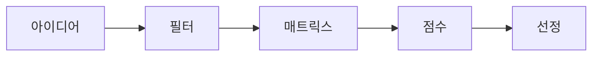

# 주제 선정

좋은 주제는 단지 흥미로운 아이디어가 아니라 팀이 실제로 끝까지 책임질 수 있는 범위여야 합니다.

이 글은 측스톤 프로젝트 101 시리즈의 2번째 글입니다.

## 이 글에서 다룰 문제

- 좋은 캡스톤 주제는 어떤 조건을 갖춰야 할까요?
- 흥미로운 아이디어와 실제로 해낼 수 있는 아이디어는 어떻게 구분할까요?
- 후보를 비교할 때 팀이 같이 볼 수 있는 기준은 무엇일까요?
- 범위가 큰 아이디어를 학기 안에 맞는 주제로 줄이려면 어떻게 해야 할까요?
- 최종 선택 뒤에 어떤 근거를 남겨야 할까요?

주제 선정 단계에서 프로젝트의 분위기가 거의 정해집니다. 초반에 잘 고른 주제는 이후 요구사항 정리, MVP 설계, 발표 준비까지 계속 팀을 도와줍니다. 반대로 주제가 흔들리면 남은 한 학기도 같이 흔들립니다. 구현을 시작하기도 전에 “이걸 정말 끝낼 수 있을까”라는 불안이 생기고, 그 불안은 대개 현실이 됩니다.

많은 팀이 주제 선정에서 가장 먼저 놓치는 점은 멋있어 보이는 것과 해낼 수 있는 것이 다르다는 사실입니다. 캡스톤은 아이디어 경연이 아니라 제한된 시간 안에 작지만 완성된 결과물을 만드는 과정입니다. 그래서 좋은 주제는 새롭기만 한 주제가 아니라, 범위를 설명할 수 있고 측정할 수 있으며 팀이 책임질 수 있는 주제여야 합니다.

> 캡스톤 프로젝트 101 시리즈 (2/10)

## 왜 주제 선정이 프로젝트를 좌우할까

주제는 프로젝트의 나침반 역할을 합니다. 주제가 선명하면 어떤 기능을 빼야 하는지 결정하기 쉽고, 사용자 인터뷰나 요구사항 정리도 한 방향으로 모입니다. 반면 주제가 추상적이면 회의 때마다 논의가 바뀝니다. 어떤 날은 커뮤니티 서비스처럼 이야기하다가, 어떤 날은 AI 추천 시스템처럼 이야기하는 식입니다.

현업에서도 비슷합니다. 제품 우선순위를 정할 때 “시장성이 있어 보인다”만으로 밀어붙이면 뒤에서 구현 난이도와 운영 비용이 문제로 돌아옵니다. 캡스톤은 그 축소판입니다. 좋은 팀은 초기에 흥분을 조금 눌러 두고, 실제로 한 학기 안에 증명할 수 있는 문제인지 먼저 점검합니다.

## 주제를 고를 때 머릿속에 둘 흐름

아이디어를 고를 때는 감이 아니라 흐름으로 봐야 합니다.



이 구조는 단순해 보이지만 의사결정을 많이 정리해 줍니다. 떠오른 아이디어를 바로 채택하지 않고, 먼저 탈락 기준을 세운 뒤, 비교표로 놓고, 점수와 균형을 함께 보는 순서입니다. 이 과정을 거치면 나중에 “왜 이 주제를 골랐지?”라는 질문에도 팀이 같은 답을 할 수 있습니다.

## 좋은 주제는 무엇이 다를까

좋은 주제는 대개 세 가지를 만족합니다. 첫째, 누가 겪는 문제인지 분명합니다. 둘째, 학기 안에 데모 가능한 범위로 줄일 수 있습니다. 셋째, 팀이 흥미를 느끼면서도 감당 가능한 기술 난도를 가집니다.

이 세 기준은 서로 충돌할 때가 많습니다. 재미있는 주제인데 구현이 너무 어렵거나, 구현은 쉬운데 사용자 가치가 약할 수 있습니다. 그래서 한 항목만 보고 결정하면 보통 후반에 대가를 치릅니다. 주제 선정은 가장 높은 점수를 찾는 일이 아니라, 팀에 맞는 균형점을 찾는 일에 가깝습니다.

## Before / After로 보면 더 분명하다

- Before: 멋진 주제 하나만 찾으면 된다고 생각합니다.
- After: 우리 팀이 끝까지 책임질 수 있는 주제를 고르는 일이 더 중요합니다.

이 시점부터 팀 대화도 바뀌어야 합니다. “이거 유행인데?”보다 “이걸 8주 안에 데모할 수 있나?”가 더 좋은 질문입니다. “기술적으로 화려한가?”보다 “사용자가 얻는 변화가 분명한가?”가 더 좋은 질문입니다.

## 주제 비교 매트릭스를 만들어 보기

회의에서 말로만 비교하면 분위기에 끌려가기 쉽습니다. 간단한 매트릭스를 하나 만들면 팀 판단이 훨씬 또렷해집니다.

### 1단계 — 후보

```python
ideas = ["schedule_checker", "mood_diary", "campus_map"]
```

후보는 적어도 세 개는 두는 편이 좋습니다. 둘만 놓으면 찬반 구도가 되고, 세 개 이상이면 비교가 됩니다. 이 단계에서는 아이디어를 빨리 닫지 않는 것이 중요합니다.

### 2단계 — 점수 축

```python
axes = ["impact", "feasibility", "interest"]
```

축은 팀의 기준을 드러냅니다. 영향도, 실현 가능성, 팀의 흥미처럼 서로 다른 성격의 항목을 두면 균형을 보기 좋습니다. 축이 모호하면 점수표도 모호해집니다.

### 3단계 — 점수표

```python
score = {"schedule_checker": [4, 5, 4], "mood_diary": [3, 4, 5], "campus_map": [4, 3, 3]}
```

숫자는 완벽해서 쓰는 것이 아니라, 대화를 명확하게 하려고 씁니다. 누군가 실현 가능성을 5점으로 준 이유를 설명하는 순간 팀의 가정이 드러납니다. 그 과정이 점수 자체보다 중요합니다.

### 4단계 — 합계

```python
total = {k: sum(v) for k, v in score.items()}
```

합계는 빠른 비교에 유용하지만 절대값으로 보면 안 됩니다. 실현 가능성이 매우 낮은데 흥미 점수가 높아서 총점이 올라가는 경우도 있기 때문입니다.

### 5단계 — 선택

```python
pick = max(total, key=total.get)
```

최종 선택은 숫자가 끝내 주는 일이 아니라, 숫자를 근거로 대화를 마무리하는 단계입니다. 점수와 함께 왜 이 후보를 택했는지 한두 문장으로 남겨 두면 이후 범위 조정이 쉬워집니다.

## 이 코드에서 확인할 포인트

- 비교 구조가 있어야 감정 대신 기준으로 말할 수 있습니다.
- 축은 곧 팀의 판단 기준입니다.
- 합계뿐 아니라 점수 분포의 균형도 함께 봐야 합니다.
- 선택 이유를 문장으로 남겨야 나중에 되돌아볼 수 있습니다.

## 자주 하는 실수

1. 트렌드만 따라갑니다.
2. 팀 역량을 실제보다 높게 잡습니다.
3. 비교표 없이 감으로 결정합니다.
4. 평가 축을 중복되거나 모호하게 만듭니다.
5. 대안을 남기지 않고 첫 아이디어에 바로 묶입니다.

특히 “요즘 AI가 인기니까 AI를 넣자” 같은 접근은 자주 보이지만, 문제 정의 없이 기술부터 주제로 삼으면 나중에 제품이 아니라 기술 시연으로 흐르기 쉽습니다. 기술은 문제를 푸는 수단으로 붙는 편이 안정적입니다.

## 실무에서는 어떻게 비슷하게 움직일까

제품 우선순위 회의도 본질은 같습니다. 후보를 모으고, 사용자 가치와 구현 비용을 비교하고, 지금 밀어야 할 하나를 고릅니다. 캡스톤에서 주제 비교 매트릭스를 써 보는 경험은 작은 제품 판단 연습으로 그대로 이어집니다.

## 체크리스트

- [ ] 후보가 세 개 이상 있습니다.
- [ ] 영향도, 실현 가능성, 흥미 같은 기준이 정리되어 있습니다.
- [ ] 점수표와 간단한 이유가 함께 남아 있습니다.
- [ ] 가장 유력한 주제의 범위를 한 학기 기준으로 줄여 보았습니다.
- [ ] 탈락한 대안도 기록해 두었습니다.

## 정리와 다음 글

좋은 주제는 화려한 주제가 아니라, 팀이 끝까지 책임질 수 있는 주제입니다. 사용자 문제를 설명할 수 있어야 하고, 범위를 줄일 수 있어야 하며, 비교 가능한 기준 위에서 선택되어야 합니다. 주제 선정이 끝나면 이제 “무엇을 만들까”보다 “정확히 어떤 문제를 풀까”를 더 좁혀야 합니다.

다음 글에서는 선택한 주제를 실제 문제 문장으로 바꾸는 과정을 다룹니다. 같은 아이디어라도 문제 정의가 흐리면 프로젝트 전체가 흔들리기 때문에, 그 연결부를 차분히 정리해 보겠습니다.

<!-- toc:begin -->
- [캡스톤 프로젝트란 무엇인가](./01-what-is-capstone.md)
- **주제 선정 (현재 글)**
- 문제 정의 (예정)
- 요구사항 정리 (예정)
- 팀 역할 나누기 (예정)
- MVP 설계 (예정)
- 기술 스택 선택 (예정)
- 일정 관리 (예정)
- 발표 자료 만들기 (예정)
- 프로젝트 회고 (예정)
<!-- toc:end -->

## 참고 자료

- [The Mom Test](http://momtestbook.com/)
- [Jobs to be Done](https://strategyn.com/jobs-to-be-done/)
- [How to Get Startup Ideas - Paul Graham](http://paulgraham.com/startupideas.html)
- [Atlassian Decision Matrix](https://www.atlassian.com/work-management/project-management/decision-matrix)

Tags: Capstone, Topic, Ideation, Scope, Beginner
