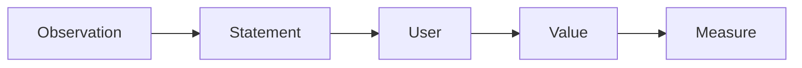

# 문제 정의

문제 정의가 흐리면 해결책도 함께 흔들립니다. 무엇을 만들 것인지보다 먼저, 누구의 어떤 문제를 왜 풀어야 하는지 붙잡아야 합니다. 이 글은 Capstone Project 101 시리즈의 3번째 글입니다. 여기서는 기능 설명과 문제 정의를 구분하고, 문제 문장을 어떻게 선명하게 만들지 살펴보겠습니다.

> 멘탈 모델: 기능은 문제를 푸는 수단일 뿐입니다. 문제 문장이 흔들리면 요구사항, MVP, 데모 기준도 함께 흔들립니다.

## 이 글에서 다룰 문제

- 왜 문제 문장이 흐리면 해결책도 같이 흔들릴까요?
- 기능 설명과 문제 정의는 어떻게 다를까요?
- 사용자, 가치, 가정, 측정 기준을 한 장에 담으려면 무엇을 적어야 할까요?
- 좋은 문제 정의는 어떤 팀 대화를 가능하게 할까요?
- 중간에 문제 문장을 다시 쓰는 일은 왜 자연스러운 과정일까요?

## 이 글에서 배우는 내용

- 문제 진술 작성법
- 사용자 가설 정리
- 가치 명세
- 기준선 지표 설정
- 문제 재정의 감각

## 왜 중요한가

문제 정의는 프로젝트 품질의 절반을 좌우합니다. 문제가 선명하면 어떤 요구사항을 넣어야 하는지, 어떤 기능을 빼야 하는지, 데모에서 무엇을 보여 줘야 하는지가 자연스럽게 정리됩니다. 반대로 문제 문장이 흐리면 새 기능 제안이 나올 때마다 다 중요해 보이고, 진행 상황도 계속 다시 정의됩니다.

좋은 팀은 문제 정의를 한 번에 완성하려 하지 않습니다. 다만 관찰, 사용자, 가치, 가정, 지표를 분리해서 적어 두기 때문에 중간 조정이 와도 기준이 무너지지 않습니다.

## 한눈에 보는 개념



## 핵심 용어

- **statement**: 문제를 설명하는 문장입니다.
- **persona**: 핵심 사용자 집단입니다.
- **value**: 문제를 풀었을 때 생기는 변화입니다.
- **assumption**: 아직 검증되지 않은 전제입니다.
- **metric**: 성공 여부를 판단하는 측정 기준입니다.

## Before / After

**Before**: 기능이 곧 문제라고 생각합니다.

**After**: 문제가 기능의 근거라고 생각합니다.

## 실습: 문제 카드

### 1단계 — 관찰

```python
obs = "schedule conflicts during course registration"
```

관찰은 추상적 주장보다 실제 상황에 가까워야 합니다. 출발점이 구체적일수록 뒤 문장도 구체적으로 이어집니다.

### 2단계 — 사용자

```python
user = "freshmen plus double-major students"
```

사용자를 좁히는 이유는 배제가 아니라 집중입니다. 모두를 사용자로 잡는 순간 맥락이 사라집니다.

### 3단계 — 가치

```python
value = "spot conflicts fast"
```

가치는 기능 설명과 다릅니다. 달력 화면이 아니라 충돌을 빨리 찾게 해 주는 변화가 가치입니다.

### 4단계 — 가정

```python
assume = "users can paste timetables as text"
```

가정을 숨기면 구현 단계에서 갑자기 복잡도가 커집니다. 입력 방식, 데이터 출처, 사용자 행동처럼 숨어 있는 전제를 문서에 올려야 합니다.

### 5단계 — 지표

```python
metric = "conflict found within 30s"
```

지표는 잘 만들었는지 판단하는 최소 기준입니다. 숫자가 들어가야 데모와 테스트가 쉬워집니다.

## 이 코드에서 먼저 볼 점

- 관찰이 문제 진술보다 먼저 나옵니다.
- 사용자 범위는 구체적일수록 좋습니다.
- 가정은 숨기지 않고 드러내야 합니다.
- 지표가 들어가야 해결 여부를 설명할 수 있습니다.

## 자주 하는 실수 5가지

1. 해결책을 문제처럼 적습니다.
2. 사용자를 모두라고 적습니다.
3. 중요한 가정을 문서 밖에 둡니다.
4. 지표를 모호한 표현으로 남깁니다.
5. 문제 재정의를 실패라고 생각합니다.

## 실무에서는 이렇게 이어집니다

PRD의 첫머리나 프로젝트 제안서의 초반에는 거의 항상 문제 진술이 들어갑니다. 구현 전에 이 문장을 맞춰 두어야 뒤에서 요구사항과 설계가 흔들리지 않습니다. 캡스톤에서 문제 정의를 제대로 해 본 경험은 제품 문서를 읽고 쓰는 기초 체력으로 이어집니다.

## 시니어 엔지니어는 이렇게 생각합니다

- 문제 문장은 짧게 씁니다.
- 가정을 숨기지 않습니다.
- 지표는 숫자로 적습니다.
- 문제 재정의는 건강한 조정이라고 봅니다.
- 사용자는 가능한 한 구체적으로 잡습니다.

## 체크리스트

- [ ] 문제를 한 문단 안에서 설명할 수 있습니다.
- [ ] 첫 사용자 집단이 구체적으로 적혀 있습니다.
- [ ] 가치가 변화 중심으로 서술되어 있습니다.
- [ ] 핵심 가정이 문서에 드러나 있습니다.
- [ ] 성공 지표에 숫자가 들어 있습니다.

## 연습 문제

1. problem statement를 한 줄로 정의해 보세요.
2. assumption을 한 줄로 정의해 보세요.
3. metric의 의미를 한 줄로 설명해 보세요.

## 정리와 다음 글

문제 정의는 기능 목록의 앞페이지가 아니라, 프로젝트 전체 판단을 붙잡는 기준점입니다. 관찰, 사용자, 가치, 가정, 지표를 분리해서 적으면 해결책과 문제를 헷갈릴 가능성이 크게 줄어듭니다. 다음 글에서는 이렇게 정리한 문제를 실제 요구사항 목록으로 바꾸는 과정을 살펴보겠습니다.

<!-- toc:begin -->
- [캡스톤 프로젝트란 무엇인가](./01-what-is-capstone.md)
- [주제 선정](./02-choosing-a-topic.md)
- **문제 정의 (현재 글)**
- 요구사항 정리 (예정)
- 팀 역할 나누기 (예정)
- MVP 설계 (예정)
- 기술 스택 선택 (예정)
- 일정 관리 (예정)
- 발표 자료 만들기 (예정)
- 프로젝트 회고 (예정)
<!-- toc:end -->

## 참고 자료

- [The Mom Test](http://momtestbook.com/)
- [Working Backwards - Amazon](https://www.workingbackwards.com/)
- [PRD Template - Atlassian](https://www.atlassian.com/agile/product-management/requirements)
- [Inspired - Marty Cagan](https://svpg.com/inspired-how-to-create-products-customers-love/)

Tags: Capstone, Problem, Definition, Scope, Beginner
