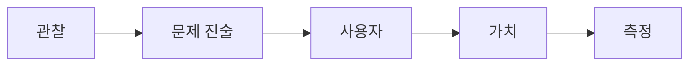

# 문제 정의

문제 정의가 흐리면 해결책도 함께 흔들립니다. 사용자, 가치, 가정을 한 문장으로 붙드는 일이 먼저입니다.

이 글은 측스톤 프로젝트 101 시리즈의 3번째 글입니다.

## 이 글에서 다룰 문제

- 왜 문제 문장이 흐리면 해결책도 같이 흔들릴까요?
- 기능 설명과 문제 정의는 어떻게 다를까요?
- 사용자, 가치, 가정, 측정 기준을 한 장에 담으려면 무엇을 적어야 할까요?
- 좋은 문제 정의는 어떤 팀 대화를 가능하게 할까요?
- 중간에 문제 문장을 다시 쓰는 일은 왜 자연스러운 과정일까요?

캡스톤에서 자주 보는 장면이 있습니다. 팀은 열심히 기능을 이야기하는데, 정작 어떤 문제를 푸는지 한 문장으로는 설명하지 못합니다. 이 상태에서는 개발을 해도 방향이 계속 바뀝니다. 새 기능 제안이 나올 때마다 다 필요해 보이고, 데모를 준비할 때도 무엇을 보여 줘야 하는지 선명하지 않습니다.

문제 정의는 프로젝트 초반 문서 작업 정도로 보이기 쉽지만 실제로는 설계의 기준점입니다. 문제가 움직이는 표적이 되면 진행 상황도 같이 재정의됩니다. 그래서 같은 시간을 써도 어떤 팀은 빠르게 수렴하고, 어떤 팀은 끝까지 헤맵니다. 차이는 코드 양보다 문제 문장의 선명도에서 먼저 갈리는 경우가 많습니다.

> 캡스톤 프로젝트 101 시리즈 (3/10)

## 왜 문제 정의가 절반의 품질을 좌우할까

문제 정의가 잘 된 프로젝트는 이후 판단이 쉬워집니다. 요구사항을 정리할 때 어떤 항목을 넣을지 명확해지고, MVP를 자를 때도 무엇을 남겨야 하는지 기준이 생깁니다. 발표할 때는 “우리는 이 문제를 이렇게 풀었다”라고 말할 수 있어서 설득력도 높아집니다.

반대로 문제 정의가 기능 설명으로 대체되면 프로젝트는 금방 커집니다. 예를 들어 “시간표 앱을 만든다”는 설명만으로는 부족합니다. 시간표를 왜 다루는지, 누구의 어떤 불편을 줄이는지, 성공을 어떻게 판단할지 빠져 있기 때문입니다. 문제를 제대로 적는다는 것은 구현 목록을 줄이는 일이 아니라, 구현의 근거를 만드는 일입니다.

## 문제 정의 흐름을 먼저 잡기

문제는 관찰에서 출발해 사용자와 가치, 측정으로 이어져야 합니다.



이 순서를 지키면 해결책이 너무 빨리 앞으로 튀어나오는 일을 막을 수 있습니다. 먼저 실제로 관찰한 불편이 무엇인지 적고, 그다음 누가 겪는지 좁히고, 왜 해결할 가치가 있는지 설명하고, 마지막으로 어떻게 측정할지 붙입니다. 문제 정의는 아이디어를 포장하는 문장이 아니라 팀의 가정을 드러내는 문장입니다.

## Before / After로 보는 차이

- Before: 기능이 곧 문제라고 생각합니다.
- After: 문제는 기능의 근거가 되고, 기능은 그 문제를 푸는 수단이 됩니다.

이 관점이 자리 잡으면 회의에서 질문도 달라집니다. “이 기능도 넣을까?”보다 “이 기능이 현재 문제 정의를 더 잘 풀어 주나?”가 먼저 나와야 합니다.

## 문제 카드를 작성해 보기

간단한 문제 카드 하나만 제대로 써도 팀의 대화가 훨씬 정돈됩니다.

### 1단계 — 관찰

```python
obs = "수강 신청 시 시간표 충돌이 잦다"
```

관찰은 추상적 주장보다 실제 상황에 가까워야 합니다. “학생들이 불편하다”보다 “수강 신청 시 시간표 충돌이 잦다”가 훨씬 좋은 출발점입니다. 관찰이 구체적일수록 뒤 문장도 구체적으로 이어집니다.

### 2단계 — 사용자

```python
user = "신입생 + 복수 전공 학생"
```

사용자를 좁히는 이유는 차별이 아니라 집중입니다. 모든 학생을 대상으로 잡는 순간 맥락이 사라집니다. 처음에는 가장 불편이 큰 집단을 택하는 편이 낫습니다.

### 3단계 — 가치

```python
value = "충돌을 빠르게 발견"
```

가치는 기능 설명과 다릅니다. 달력 화면을 보여 주는 것이 가치가 아니라, 충돌을 빠르게 찾게 해 주는 것이 가치입니다. 이 표현이 선명할수록 요구사항 우선순위도 분명해집니다.

### 4단계 — 가정

```python
assume = "사용자가 시간표를 텍스트로 입력 가능"
```

대부분의 학생 프로젝트는 가정을 너무 늦게 드러냅니다. 입력 형식, 데이터 출처, 사용자 행동 패턴 같은 전제가 숨어 있으면 구현 단계에서 갑자기 복잡도가 커집니다. 가정을 미리 적어 두면 위험도 빨리 보입니다.

### 5단계 — 지표

```python
metric = "충돌 발견 시간 30s 이내"
```

지표는 잘 만들었는지 판단하는 최소 기준입니다. 숫자가 들어가면 데모와 테스트가 훨씬 쉬워집니다. 막연한 만족도보다, 핵심 흐름에서 얼마 만에 성공하는지가 초반에는 더 강한 기준이 됩니다.

## 이 코드에서 봐야 할 포인트

- 관찰이 문제 진술보다 먼저 나와야 합니다.
- 사용자 범위는 구체적일수록 좋습니다.
- 가정은 숨기지 말고 문서에 올려야 합니다.
- 지표가 들어가야 해결 여부를 설명할 수 있습니다.

이 네 가지를 적어 두면 중간에 문제 문장을 다시 써도 기준이 무너지지 않습니다. 실제로 좋은 팀은 문제를 한 번에 완성하지 않습니다. 인터뷰나 구현 경험을 거치며 다시 쓰고 더 좁힙니다. 그 과정은 방향 상실이 아니라 학습의 결과입니다.

## 자주 하는 실수

1. 해결책을 문제처럼 적습니다.
2. 사용자를 모두라고 적습니다.
3. 중요한 가정을 문서 밖에 둡니다.
4. 지표를 모호한 표현으로 남깁니다.
5. 문제 재정의를 실패라고 생각합니다.

특히 “우리는 AI 챗봇을 만든다” 같은 문장은 기술 선택일 뿐 문제 정의가 아닙니다. 누가, 어떤 상황에서, 무엇 때문에 불편한지 빠진 상태에서는 기능이 계속 늘어나도 설득력은 생기지 않습니다.

## 실무에서는 어떻게 쓰일까

PRD의 첫머리나 프로젝트 제안서의 초반에는 거의 항상 문제 진술이 들어갑니다. 좋은 팀은 구현 전에 이 문장을 먼저 맞춥니다. 캡스톤에서 문제 정의를 제대로 해 본 경험은 나중에 요구사항 문서나 제품 문서를 읽고 쓰는 데 바로 도움이 됩니다.

## 체크리스트

- [ ] 문제를 한 문단 안에서 설명할 수 있습니다.
- [ ] 첫 사용자 집단이 구체적으로 적혀 있습니다.
- [ ] 가치가 기능이 아니라 변화로 서술되어 있습니다.
- [ ] 핵심 가정이 문서에 드러나 있습니다.
- [ ] 성공 지표에 숫자가 들어 있습니다.

## 정리와 다음 글

문제 정의는 기능 목록의 앞페이지가 아닙니다. 프로젝트 전체 판단을 붙잡아 주는 기준점입니다. 관찰, 사용자, 가치, 가정, 지표를 분리해서 적으면 해결책과 문제를 헷갈릴 가능성이 크게 줄어듭니다. 그리고 중간에 다시 쓰는 일도 더 건강한 조정으로 받아들일 수 있습니다.

다음 글에서는 이렇게 정리한 문제를 실제 요구사항 목록으로 바꾸는 과정을 다룹니다. 문제를 잘 적는 것과 구현 가능한 요구사항을 만드는 일 사이에는 또 다른 정리가 필요합니다.

<!-- toc:begin -->
- [캡스톤 프로젝트란 무엇인가](./01-what-is-capstone.md)
- [주제 선정](./02-choosing-a-topic.md)
- **문제 정의 (현재 글)**
- 요구사항 정리 (예정)
- 팀 역할 나누기 (예정)
- MVP 설계 (예정)
- 기술 스택 선택 (예정)
- 일정 관리 (예정)
- 발표 자료 만들기 (예정)
- 프로젝트 회고 (예정)
<!-- toc:end -->

## 참고 자료

- [The Mom Test](http://momtestbook.com/)
- [Working Backwards - Amazon](https://www.workingbackwards.com/)
- [PRD Template - Atlassian](https://www.atlassian.com/agile/product-management/requirements)
- [Inspired - Marty Cagan](https://svpg.com/inspired-how-to-create-products-customers-love/)

Tags: Capstone, Problem, Definition, Scope, Beginner
