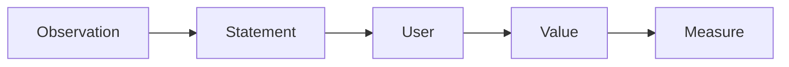

# 문제 정의

> 캡스톤 프로젝트 101 시리즈 (3/10)


## 이 글에서 다룰 문제

*문제 정의* 가 *프로젝트 절반* 의 *완성도* 를 결정합니다.

## 전체 흐름


## Before/After

**Before**: *기능* 이 곧 *문제*.

**After**: *문제* 가 곧 *기능* 의 *근거*.

## 문제 카드 작성

### 1단계 — 관찰

```python
obs = "수강 신청 시 시간표 충돌이 잦다"
```

### 2단계 — 사용자

```python
user = "신입생 + 복수 전공 학생"
```

### 3단계 — 가치

```python
value = "충돌을 빠르게 발견"
```

### 4단계 — 가정

```python
assume = "사용자가 시간표를 텍스트로 입력 가능"
```

### 5단계 — 지표

```python
metric = "충돌 발견 시간 30s 이내"
```

## 이 코드에서 주목할 점

- *관찰* 이 *진술* 보다 먼저.
- *가정* 을 *명시*.
- *지표* 가 *해결* 을 정의.

## 자주 하는 실수 5가지

1. ***해결책* 을 *문제* 로 적는다.**
2. ***사용자* 를 *모두* 라고 적는다.**
3. ***가정* 을 적지 않는다.**
4. ***지표* 가 *모호* 하다.**
5. ***재진술* 을 두려워한다.**

## 실무에서는 이렇게 쓰입니다

PRD(Product Requirements Document)의 *첫 섹션* 이 *문제 진술* 입니다.

## 체크리스트

- [ ] *진술* 1문단.
- [ ] *사용자* 명시.
- [ ] *가정* 표.
- [ ] *지표* 숫자.

## 정리 및 다음 단계

다음 글은 *요구사항 정리* 입니다.

<!-- toc:begin -->
- [캡스톤 프로젝트란 무엇인가](./01-what-is-capstone.md)
- [주제 선정](./02-choosing-a-topic.md)
- **문제 정의 (현재 글)**
- 요구사항 정리 (예정)
- 팀 역할 나누기 (예정)
- MVP 설계 (예정)
- 기술 스택 선택 (예정)
- 일정 관리 (예정)
- 발표 자료 만들기 (예정)
- 프로젝트 회고 (예정)
<!-- toc:end -->

## 참고 자료

- [The Mom Test](http://momtestbook.com/)
- [Working Backwards - Amazon](https://www.workingbackwards.com/)
- [PRD Template - Atlassian](https://www.atlassian.com/agile/product-management/requirements)
- [Inspired - Marty Cagan](https://svpg.com/inspired-how-to-create-products-customers-love/)

Tags: Capstone, Problem, Definition, Scope, Beginner
