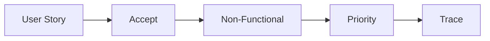

# 요구사항 정리

> 캡스톤 프로젝트 101 시리즈 (4/10)


## 이 글에서 다룰 문제

요구사항을 단순한 기능 목록으로만 두면 범위가 계속 흔들립니다. 사용자 스토리, 수용 기준, 비기능 요건, 우선순위까지 정리해야 변경이 생겨도 무엇이 달라졌는지 추적할 수 있습니다.

## 전체 흐름


## Before/After

**Before**: 기능만 나열합니다.

**After**: 사용자 스토리, 수용 기준, 우선순위를 함께 기록합니다.

## 요구사항 표

### 1단계 — 사용자 스토리

```python
story = "학생으로서 시간표 충돌을 즉시 보고 싶다"
```

### 2단계 — 수용 기준

```python
accept = ["입력 5초", "결과 1초", "에러 명확"]
```

### 3단계 — 비기능

```python
nf = ["mobile", "no_signup", "korean_first"]
```

### 4단계 — 우선순위

```python
prio = {"core": "Must", "share": "Should", "ai": "Could"}
```

### 5단계 — 추적

```python
trace = {"ST-1": ["F-1", "F-2"]}
```

## 이 코드에서 주목할 점

- 사용자 스토리는 사용자가 원하는 행동이 드러나도록 쓰는 편이 좋습니다.
- 수용 기준은 애매한 표현보다 시간, 결과, 오류 처리처럼 확인 가능한 기준으로 적어야 합니다.
- 추적은 문장보다 ID 기반으로 연결해야 나중에 기능 변경과 테스트 범위를 따라가기 쉽습니다.

## 자주 하는 실수 5가지

1. 사용자 스토리가 사용자 관점이 아니라 기능 설명으로 바뀝니다.
2. 응답 속도나 가입 절차 같은 비기능 요건을 빼먹습니다.
3. 우선순위를 전부 Must로 잡아서 실제 선택이 불가능해집니다.
4. 수용 기준을 "충분히 빠름"처럼 주관적으로 적습니다.
5. 요구사항 ID와 구현 항목을 연결하지 않아 추적성이 사라집니다.

## 실무에서는 이렇게 쓰입니다

실무에서도 Must, Should, Could 같은 라벨을 자주 사용합니다. 모든 요구사항이 항상 중요해 보이더라도, 우선순위를 나눠 두어야 일정이 밀릴 때 무엇을 남기고 무엇을 줄일지 빠르게 결정할 수 있습니다.

## 체크리스트

- [ ] 사용자 스토리 5개 이상을 적었습니다.
- [ ] 각 스토리에 수용 기준을 붙였습니다.
- [ ] 비기능 요건 표를 따로 정리했습니다.
- [ ] 우선순위 라벨을 붙였습니다.

## 정리 및 다음 단계

요구사항 정리는 프로젝트 초반의 문서 작업이 아니라, 이후 설계와 일정 판단의 기준을 세우는 일입니다. 다음 글에서는 이렇게 정리한 일을 팀 안에서 어떻게 나눌지 살펴보겠습니다.

<!-- toc:begin -->
- [캡스톤 프로젝트란 무엇인가](./01-what-is-capstone.md)
- [주제 선정](./02-choosing-a-topic.md)
- [문제 정의](./03-defining-the-problem.md)
- **요구사항 정리 (현재 글)**
- 팀 역할 나누기 (예정)
- MVP 설계 (예정)
- 기술 스택 선택 (예정)
- 일정 관리 (예정)
- 발표 자료 만들기 (예정)
- 프로젝트 회고 (예정)
<!-- toc:end -->

## 참고 자료

- [User Stories Applied - Mike Cohn](https://www.mountaingoatsoftware.com/books/user-stories-applied)
- [MoSCoW Method - Atlassian](https://www.atlassian.com/agile/product-management/requirements)
- [Specification by Example](https://gojko.net/books/specification-by-example/)
- [INVEST in Good Stories](https://www.agilealliance.org/glossary/invest/)

Tags: Capstone, Requirements, Spec, Scope, Beginner
