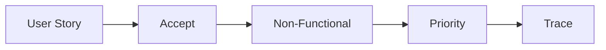

# 요구사항 정리

요구사항은 기능 목록을 길게 적는 일로 끝나지 않습니다. 사용자 관점, 수용 기준, 비기능 조건, 우선순위까지 정리되어야 팀이 같은 문서를 보고 같은 결정을 할 수 있습니다. 이 글은 Capstone Project 101 시리즈의 4번째 글입니다. 여기서는 문제 정의를 실제 구현 가능한 요구사항으로 바꾸는 방법을 살펴보겠습니다.

> 멘탈 모델: 요구사항 문서는 기능 나열이 아니라, 무엇을 왜 만들고 어디까지 할지 추적 가능하게 만드는 작은 명세서입니다.

## 이 글에서 다룰 문제

- 왜 기능 목록만으로는 요구사항이 충분하지 않을까요?
- 사용자 스토리와 기능 설명은 무엇이 다를까요?
- 수용 기준은 어느 정도까지 구체적이어야 할까요?
- 비기능 요건과 우선순위는 왜 따로 적어야 할까요?
- 요구사항 추적성은 실제로 어떤 도움을 줄까요?

## 이 글에서 배우는 내용

- 사용자 스토리 작성법
- 비기능 요건 분리
- 우선순위 정하는 방법
- 수용 기준 쓰는 법
- 요구사항 추적성 기초

## 왜 중요한가

요구사항은 바뀔 수 있습니다. 중요한 점은 바뀌더라도 무엇이, 왜 바뀌었는지 따라갈 수 있어야 한다는 점입니다. 기능 이름만 적혀 있으면 변경이 생길 때 우선순위를 다시 정하기 어렵고, 테스트 범위도 흐려집니다.

좋은 팀은 요구사항을 스토리, 기준, 우선순위, 비기능 조건으로 분리해 둡니다. 그렇게 해야 일정이 밀릴 때 무엇을 남기고 무엇을 줄일지 빠르게 결정할 수 있습니다.

## 한눈에 보는 개념



## 핵심 용어

- **user story**: 사용자 관점에서 쓴 요구입니다.
- **acceptance**: 완료 여부를 판단하는 기준입니다.
- **non-functional**: 속도, 접근성, 가입 절차 같은 비기능 요건입니다.
- **MoSCoW**: Must, Should, Could 같은 우선순위 라벨입니다.
- **traceability**: 요구사항과 기능을 연결해 추적하는 성질입니다.

## Before / After

**Before**: 기능만 나열합니다.

**After**: 스토리, 기준, 우선순위를 함께 기록합니다.

## 실습: 요구사항 표

### 1단계 — 사용자 스토리

```python
story = "as a student I want instant conflict detection"
```

스토리는 기능 이름보다 사용자 행동이 드러나야 합니다. 누가 무엇을 원하고 왜 필요한지 읽혀야 합니다.

### 2단계 — 수용 기준

```python
accept = ["input 5s", "result 1s", "error clear"]
```

수용 기준은 애매한 표현보다 시간, 결과, 오류 처리처럼 확인 가능한 문장으로 적는 편이 좋습니다.

### 3단계 — 비기능

```python
nf = ["mobile", "no_signup", "korean_first"]
```

비기능 요건은 기능 설명에 섞지 말고 따로 분리해야 합니다. 그래야 구현 범위와 품질 기준을 함께 볼 수 있습니다.

### 4단계 — 우선순위

```python
prio = {"core": "Must", "share": "Should", "ai": "Could"}
```

우선순위는 일정이 흔들릴 때 가장 큰 힘을 발휘합니다. 모든 항목이 중요해 보이더라도 반드시 나눠 두어야 합니다.

### 5단계 — 추적

```python
trace = {"ST-1": ["F-1", "F-2"]}
```

요구사항 ID와 구현 항목을 연결해 두면 나중에 변경 영향 범위를 빠르게 파악할 수 있습니다.

## 이 코드에서 먼저 볼 점

- 스토리는 동작 중심으로 씁니다.
- 수용 기준은 측정 가능해야 합니다.
- 비기능 요건은 분리해 둡니다.
- 추적은 ID 기반으로 연결합니다.

## 자주 하는 실수 5가지

1. 사용자 스토리가 기능 설명으로 바뀝니다.
2. 비기능 요건을 빼먹습니다.
3. 모든 항목을 Must로 적습니다.
4. 수용 기준을 주관적으로 씁니다.
5. 추적성을 남기지 않습니다.

## 실무에서는 이렇게 이어집니다

실무에서도 Must, Should, Could 같은 라벨을 자주 사용합니다. 제품이든 내부 도구든, 우선순위를 나눠 두지 않으면 일정이 밀릴 때 무엇을 남겨야 할지 결정하기 어렵습니다. 캡스톤에서 요구사항을 이렇게 정리해 보는 경험은 작은 명세 문서를 다루는 연습이 됩니다.

## 시니어 엔지니어는 이렇게 생각합니다

- 스토리는 짧게 씁니다.
- 기준은 숫자와 가독성으로 적습니다.
- 우선순위는 몇 개의 버킷으로 단순화합니다.
- 비기능 요건은 따로 관리합니다.
- 추적 가능한 문서를 남깁니다.

## 체크리스트

- [ ] 다섯 개 이상의 스토리가 있습니다.
- [ ] 각 스토리에 수용 기준이 붙어 있습니다.
- [ ] 비기능 요건 표가 있습니다.
- [ ] 우선순위 라벨이 있습니다.

## 연습 문제

1. user story를 한 줄로 정의해 보세요.
2. acceptance criteria를 한 줄로 정의해 보세요.
3. MoSCoW의 의미를 한 줄로 설명해 보세요.

## 정리와 다음 글

요구사항 정리는 프로젝트 초반의 문서 작업이 아니라, 이후 설계와 일정 판단의 기준을 세우는 일입니다. 스토리, 수용 기준, 비기능 요건, 우선순위를 분리해 두면 변경이 와도 무엇을 지켜야 하는지 선명해집니다. 다음 글에서는 이렇게 정리한 일을 팀 안에서 어떻게 나눌지 살펴보겠습니다.

<!-- toc:begin -->
- [캡스톤 프로젝트란 무엇인가](./01-what-is-capstone.md)
- [주제 선정](./02-choosing-a-topic.md)
- [문제 정의](./03-defining-the-problem.md)
- **요구사항 정리 (현재 글)**
- 팀 역할 나누기 (예정)
- MVP 설계 (예정)
- 기술 스택 선택 (예정)
- 일정 관리 (예정)
- 발표 자료 만들기 (예정)
- 프로젝트 회고 (예정)
<!-- toc:end -->

## 참고 자료

- [User Stories Applied - Mike Cohn](https://www.mountaingoatsoftware.com/books/user-stories-applied)
- [MoSCoW Method - Atlassian](https://www.atlassian.com/agile/product-management/requirements)
- [Specification by Example](https://gojko.net/books/specification-by-example/)
- [INVEST in Good Stories](https://www.agilealliance.org/glossary/invest/)

Tags: Capstone, Requirements, Spec, Scope, Beginner
