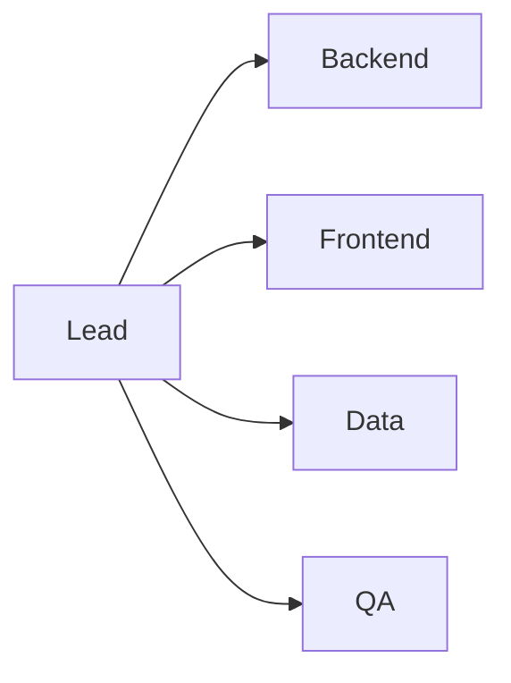

# 팀 역할 나누기

팀 역할은 작업 분배표가 아니라 의사결정 구조입니다. 누가 주도하고 누가 백업하는지 분명해야 속도가 붙습니다.

이 글은 측스톤 프로젝트 101 시리즈의 5번째 글입니다.

> 캡스톤 프로젝트 101 시리즈 (5/10)


## 이 글에서 다룰 문제

역할이 겹치면 다 같이 바빠 보여도 실제 결정은 늦어집니다. 누가 주도하고 누가 백업하는지 분명히 정해야 책임도 살아나고 협업 속도도 안정됩니다.

## 전체 흐름


## Before/After

**Before**: 모두가 모든 일을 조금씩 맡습니다.

**After**: 각 영역마다 주 책임자와 백업 담당자가 정해져 있습니다.

## 역할 표

### 1단계 — 인원 정리

```python
members = ["A", "B", "C", "D"]
```

### 2단계 — 주 역할 매핑

```python
primary = {"A": "lead", "B": "backend", "C": "frontend", "D": "data"}
```

### 3단계 — 백업 매핑

```python
backup = {"backend": "C", "frontend": "B", "data": "A"}
```

### 4단계 — 책임 표

```python
raci = {"deploy": ("A", "B"), "test": ("D", "C")}
```

### 5단계 — 검토 주기

```python
review = "weekly"
```

## 이 코드에서 주목할 점

- 주 역할은 한 사람에게 분명히 연결하는 편이 좋습니다.
- 백업 담당자를 미리 정해 두어야 결원이나 일정 충돌이 생겨도 작업이 멈추지 않습니다.
- RACI 표는 복잡하게 늘리기보다 꼭 필요한 결정과 작업만 담아야 실전에 도움이 됩니다.

## 자주 하는 실수 5가지

1. 공동 책임이라는 이름으로 모두를 적어 두고 실제 책임자를 비워 둡니다.
2. 백업 담당자가 없어 한 사람이 막히면 해당 영역 전체가 같이 멈춥니다.
3. 리드가 모든 결정을 끌어안아 병목이 생깁니다.
4. QA를 마지막에만 붙여서 테스트가 항상 뒤로 밀립니다.
5. 역할 변경이 생겨도 기록하지 않아 팀이 서로 다른 기준으로 일합니다.

## 실무에서는 이렇게 쓰입니다

실무 팀도 RACI 같은 방식으로 의사결정 권한과 실행 책임을 구분합니다. 역할을 적어 두는 목적은 조직도를 꾸미는 것이 아니라, 일이 막혔을 때 누구에게 바로 물어봐야 하는지 분명히 만드는 데 있습니다.

## 체크리스트

- [ ] 주 역할 매핑을 적었습니다.
- [ ] 백업 담당자를 지정했습니다.
- [ ] RACI 표를 만들었습니다.
- [ ] 주간 검토 시간을 정했습니다.

## 정리 및 다음 단계

팀 역할을 나눈다는 것은 사람을 칸에 넣는 일이 아니라 책임 경계를 정하는 일입니다. 다음 글에서는 이렇게 정리한 역할을 바탕으로 MVP 범위를 어떻게 설계할지 살펴보겠습니다.

<!-- toc:begin -->
- [캡스톤 프로젝트란 무엇인가](./01-what-is-capstone.md)
- [주제 선정](./02-choosing-a-topic.md)
- [문제 정의](./03-defining-the-problem.md)
- [요구사항 정리](./04-organizing-requirements.md)
- **팀 역할 나누기 (현재 글)**
- MVP 설계 (예정)
- 기술 스택 선택 (예정)
- 일정 관리 (예정)
- 발표 자료 만들기 (예정)
- 프로젝트 회고 (예정)
<!-- toc:end -->

## 참고 자료

- [RACI Matrix - PMI](https://www.pmi.org/learning/library/raci-responsibility-matrix-9410)
- [Team Topologies](https://teamtopologies.com/)
- [The Mythical Man-Month](https://en.wikipedia.org/wiki/The_Mythical_Man-Month)
- [Code Ownership - Martin Fowler](https://martinfowler.com/bliki/CodeOwnership.html)

Tags: Capstone, Team, Roles, Collaboration, Beginner
