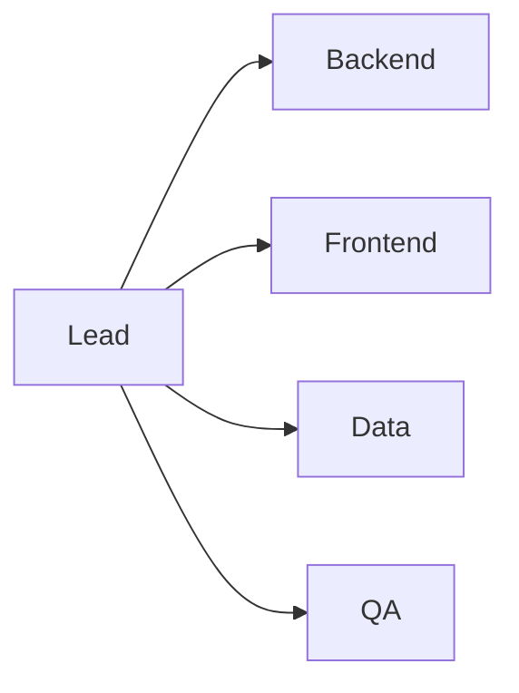

# 팀 역할 나누기

팀 역할은 작업 분배표가 아니라 의사결정 구조입니다. 누가 주도하고 누가 백업하는지 분명해야 속도도 나고 책임도 살아납니다. 이 글은 Capstone Project 101 시리즈의 5번째 글입니다. 여기서는 역할이 겹칠 때 왜 팀이 느려지는지, 그리고 주 책임자와 백업을 어떻게 나눠야 하는지 살펴보겠습니다.

> 멘탈 모델: 역할 분담의 목적은 사람을 칸에 넣는 일이 아니라, 일이 막혔을 때 누가 결정하고 누가 이어받을지 명확하게 만드는 것입니다.

## 이 글에서 다룰 문제

- 역할이 겹치면 왜 결정이 느려질까요?
- 팀에서 자주 쓰는 핵심 역할은 무엇일까요?
- 주 책임자와 백업은 어떻게 정하는 편이 좋을까요?
- 코드 오너십과 의사결정 권한은 왜 분리해서 봐야 할까요?
- 역할 변경은 왜 기록으로 남겨야 할까요?

## 이 글에서 배우는 내용

- 다섯 가지 핵심 역할
- 책임 매트릭스 구성
- 코드 오너십 감각
- 의사결정 흐름
- 백업 담당자 지정법

## 왜 중요한가

역할이 모호한 팀은 모두가 바빠 보여도 실제 결정은 늦어집니다. 누가 먼저 판단해야 하는지, 누가 최종 책임을 지는지 불분명하기 때문입니다. 반대로 역할이 분명한 팀은 회의가 짧아지고, 변경이 생겨도 누구와 바로 조율해야 하는지 명확합니다.

특히 캡스톤처럼 일정이 짧은 프로젝트에서는 한 사람이 빠지거나 막히는 순간 전체 속도가 흔들릴 수 있습니다. 그래서 주 책임자만큼 백업 지정도 중요합니다.

## 한눈에 보는 개념



## 핵심 용어

- **lead**: 전체 흐름과 우선순위를 조율하는 역할입니다.
- **backend**: 서버와 API를 맡는 역할입니다.
- **frontend**: 사용자 화면과 상호작용을 맡는 역할입니다.
- **data**: 데이터 구조와 분석을 담당하는 역할입니다.
- **QA**: 품질을 검증하는 역할입니다.

## Before / After

**Before**: 모두가 모든 일을 조금씩 맡습니다.

**After**: 각 영역마다 주 책임자와 백업 담당자가 있습니다.

## 실습: 역할 표

### 1단계 — 인원 정리

```python
members = ["A", "B", "C", "D"]
```

먼저 팀 규모를 분명히 적어 두면 어떤 역할을 겸임해야 하는지도 현실적으로 판단할 수 있습니다.

### 2단계 — 주 역할 매핑

```python
primary = {"A": "lead", "B": "backend", "C": "frontend", "D": "data"}
```

주 역할은 한 사람에게 분명히 연결하는 편이 좋습니다. 공동 책임은 듣기 좋지만 실제로는 책임 공백을 만들기 쉽습니다.

### 3단계 — 백업 매핑

```python
backup = {"backend": "C", "frontend": "B", "data": "A"}
```

백업 담당자를 미리 정해 두어야 결원이나 일정 충돌이 생겨도 작업이 멈추지 않습니다.

### 4단계 — 책임 표

```python
raci = {"deploy": ("A", "B"), "test": ("D", "C")}
```

RACI는 복잡하게 늘리기보다 꼭 필요한 결정과 작업만 담는 편이 실전에 더 도움이 됩니다.

### 5단계 — 검토 주기

```python
review = "weekly"
```

역할은 한 번 정했다고 끝나지 않습니다. 진행 중 바뀌는 현실을 반영할 주기가 필요합니다.

## 이 코드에서 먼저 볼 점

- 주 역할은 한 사람에게 연결됩니다.
- 백업은 항상 정의해 둡니다.
- RACI는 간결해야 잘 읽힙니다.
- 역할 검토 주기가 있어야 변경을 관리할 수 있습니다.

## 자주 하는 실수 5가지

1. 모두를 공동 책임자로 적습니다.
2. 백업 담당자가 없습니다.
3. 리드가 모든 결정을 끌어안습니다.
4. QA를 마지막에만 붙입니다.
5. 역할 변경을 기록하지 않습니다.

## 실무에서는 이렇게 이어집니다

실무 팀도 RACI 같은 방식으로 의사결정 권한과 실행 책임을 구분합니다. 역할을 적어 두는 목적은 조직도를 꾸미는 데 있지 않고, 일이 막혔을 때 누구에게 바로 물어봐야 하는지 분명히 만드는 데 있습니다.

## 시니어 엔지니어는 이렇게 생각합니다

- 역할은 문서로 남깁니다.
- 백업은 선택이 아니라 필수입니다.
- 의사결정 권한을 명시합니다.
- 역할 겹침은 최소화합니다.
- 변경 사항은 바로 공유합니다.

## 체크리스트

- [ ] 주 역할 매핑이 있습니다.
- [ ] 백업 담당자가 정해져 있습니다.
- [ ] RACI 표가 있습니다.
- [ ] 주간 검토 주기가 있습니다.

## 연습 문제

1. RACI의 의미를 한 줄로 설명해 보세요.
2. backup이 필요한 이유를 한 줄로 설명해 보세요.
3. lead의 책임을 한 줄로 설명해 보세요.

## 정리와 다음 글

팀 역할을 나눈다는 것은 사람을 분류하는 일이 아니라 책임 경계를 정하는 일입니다. 주 책임자와 백업이 분명해야 협업 속도도 안정됩니다. 다음 글에서는 이렇게 정리한 역할을 바탕으로 MVP 범위를 어떻게 설계할지 살펴보겠습니다.

<!-- toc:begin -->
- [캡스톤 프로젝트란 무엇인가](./01-what-is-capstone.md)
- [주제 선정](./02-choosing-a-topic.md)
- [문제 정의](./03-defining-the-problem.md)
- [요구사항 정리](./04-organizing-requirements.md)
- **팀 역할 나누기 (현재 글)**
- MVP 설계 (예정)
- 기술 스택 선택 (예정)
- 일정 관리 (예정)
- 발표 자료 만들기 (예정)
- 프로젝트 회고 (예정)
<!-- toc:end -->

## 참고 자료

- [RACI Matrix - PMI](https://www.pmi.org/learning/library/raci-responsibility-matrix-9410)
- [Team Topologies](https://teamtopologies.com/)
- [The Mythical Man-Month](https://en.wikipedia.org/wiki/The_Mythical_Man-Month)
- [Code Ownership - Martin Fowler](https://martinfowler.com/bliki/CodeOwnership.html)

Tags: Capstone, Team, Roles, Collaboration, Beginner
