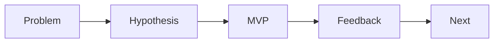

# MVP 설계

> 캡스톤 프로젝트 101 시리즈 (6/10)

<!-- a-grade-intro:begin -->

**핵심 질문**: *MVP* 가 *작은 제품* 이 아니라 *학습 도구* 인 이유는 무엇일까요?

> *가설* 을 *최소 비용* 으로 *검증* 하기 위해서입니다.

<!-- a-grade-intro:end -->

## 이 글에서 배울 것

- *MVP 정의*
- *핵심 흐름* 1개 선정
- *제외* 결정
- *데모 시나리오*
- *피드백* 수집

## 왜 중요한가

*MVP* 가 있어야 *학습* 이 시작됩니다.

## 개념 한눈에 보기



## 핵심 용어 정리

- **MVP**: *Minimum Viable Product*.
- **happy path**: *정상 흐름*.
- **out of scope**: *범위 외*.
- **demo**: *시연*.
- **feedback**: *피드백*.

## Before/After

**Before**: *모든 기능* 을 짠다.

**After**: *한 흐름* 을 *완성* 한다.

## 실습: MVP 표

### 1단계 — 핵심 흐름 선정

```python
flow = "register -> upload -> share"
```

### 2단계 — 제외 목록

```python
out = ["payment", "i18n", "admin"]
```

### 3단계 — 데모 시나리오

```python
demo = ["login_demo_user", "upload_sample", "show_share_link"]
```

### 4단계 — 성공 기준

```python
success = {"happy_path": "<= 60s", "errors": 0}
```

### 5단계 — 피드백 폼

```python
form = ["clarity", "speed", "value"]
```

## 이 코드에서 주목할 점

- *흐름* 은 *문장*.
- *제외* 는 *명시*.
- *기준* 은 *수치*.

## 자주 하는 실수 5가지

1. ***완성도* 를 *기능 개수* 로 본다.**
2. ***예외* 를 *전부* 처리하려 한다.**
3. ***데모 시나리오* 가 없다.**
4. ***피드백* 양식이 없다.**
5. ***외부 의존* 으로 위험을 키운다.**

## 실무에서는 이렇게 쓰입니다

스타트업도 *해피 패스* 한 줄을 먼저 만듭니다.

## 시니어 엔지니어는 이렇게 생각합니다

- *MVP* 는 *학습 도구*.
- *흐름* 은 *하나*.
- *제외* 는 *과감히*.
- *데모* 는 *각본*.
- *피드백* 은 *구조화*.

## 체크리스트

- [ ] *핵심 흐름* 정의.
- [ ] *제외 목록*.
- [ ] *데모 시나리오*.
- [ ] *피드백* 양식.

## 연습 문제

1. *MVP* 가 무엇인가 한 줄.
2. *해피 패스* 정의 한 줄.
3. *Out of scope* 의 의미 한 줄.

## 정리 및 다음 단계

다음 글은 *기술 스택 선택* 입니다.

<!-- toc:begin -->
- [캡스톤 프로젝트란 무엇인가](./01-what-is-capstone.md)
- [주제 선정](./02-choosing-a-topic.md)
- [문제 정의](./03-defining-the-problem.md)
- [요구사항 정리](./04-organizing-requirements.md)
- [팀 역할 나누기](./05-splitting-team-roles.md)
- **MVP 설계 (현재 글)**
- 기술 스택 선택 (예정)
- 일정 관리 (예정)
- 발표 자료 만들기 (예정)
- 프로젝트 회고 (예정)
<!-- toc:end -->

## 참고 자료

- [The Lean Startup - Eric Ries](http://theleanstartup.com/)
- [MVP - Lean Methodology](https://www.atlassian.com/agile/product-management/minimum-viable-product)
- [Inspired - Marty Cagan](https://svpg.com/inspired-how-to-create-products-customers-love/)
- [Continuous Discovery Habits](https://www.producttalk.org/continuous-discovery/)

Tags: Capstone, MVP, Scope, Product, Beginner
