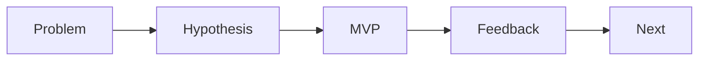

# MVP 설계

MVP는 기능을 조금만 만드는 일이 아니라, 가장 중요한 가설을 가장 적은 비용으로 검증하는 설계입니다. 이 글은 Capstone Project 101 시리즈의 6번째 글입니다. 여기서는 MVP를 작은 완성품이 아니라 학습 도구로 보고, 핵심 흐름 하나를 끝까지 완성하는 감각을 정리해 보겠습니다.

> 멘탈 모델: MVP의 목적은 기능 수를 줄이는 데 있지 않고, 가장 중요한 사용자 흐름 하나를 끝까지 연결해 실제로 배울 수 있게 만드는 데 있습니다.

## 이 글에서 다룰 문제

- MVP는 왜 작은 완성품보다 학습 도구에 가깝다고 할까요?
- 핵심 흐름 하나를 고른다는 말은 무엇을 남기고 무엇을 버린다는 뜻일까요?
- 범위 밖 항목을 문서로 적는 일은 왜 중요할까요?
- 데모 시나리오와 성공 기준은 어떻게 연결되어야 할까요?
- 피드백 수집까지 포함해야 MVP가 살아 있는 실험이 되는 이유는 무엇일까요?

## 이 글에서 배우는 내용

- MVP의 기본 정의
- 핵심 흐름 선정법
- 범위 밖 항목 정리법
- 데모 시나리오 작성
- 피드백 수집 방식

## 왜 중요한가

많은 학생 프로젝트가 기능 개수로 진도를 계산합니다. 하지만 캡스톤에서는 기능이 많아도 핵심 흐름이 살아 있지 않으면 설득력이 약합니다. 사용자가 처음 들어와 가장 중요한 행동 하나를 끝낼 수 있어야 하고, 그 과정에서 무엇을 배웠는지 설명할 수 있어야 합니다.

현업에서도 새 제품이나 새 기능은 처음부터 모든 예외를 처리하지 않습니다. 가장 중요한 흐름을 먼저 붙이고, 그 흐름이 작동하는지 확인한 뒤 확장합니다. MVP는 대충 만든 시제품이 아니라, 우선순위를 극단적으로 정리한 결과물입니다.

## 한눈에 보는 개념



## 핵심 용어

- **MVP**: 가장 작은 검증 가능한 제품입니다.
- **happy path**: 사용자가 가장 정상적으로 밟는 핵심 흐름입니다.
- **out of scope**: 지금은 의도적으로 제외한 범위입니다.
- **demo**: 핵심 흐름을 따라가는 시연입니다.
- **feedback**: 다음 판단을 위한 구조화된 반응입니다.

## Before / After

**Before**: 모든 기능을 조금씩 만듭니다.

**After**: 핵심 흐름 하나를 끝까지 완성합니다.

## 실습: MVP 표

### 1단계 — 핵심 흐름 선정

```python
flow = "register -> upload -> share"
```

핵심 흐름은 한 문장으로 적을 수 있어야 합니다. 한 줄로 안 적히면 아직 너무 큽니다.

### 2단계 — 제외 목록

```python
out = ["payment", "i18n", "admin"]
```

범위 밖 항목은 소극적인 문서가 아니라, MVP를 지키는 가장 강한 장치입니다. 빼 두어야 핵심이 살아납니다.

### 3단계 — 데모 시나리오

```python
demo = ["login_demo_user", "upload_sample", "show_share_link"]
```

데모 시나리오는 구현 우선순위를 정해 줍니다. 발표 당일 어떤 순서로 보여 줄지를 적어 보면 핵심과 부가 기능이 자연스럽게 갈립니다.

### 4단계 — 성공 기준

```python
success = {"happy_path": "<= 60s", "errors": 0}
```

성공 기준은 감상을 숫자로 바꾸는 작업입니다. 무엇을 성공으로 볼지 정해 두어야 데모 이후 평가도 가능합니다.

### 5단계 — 피드백 폼

```python
form = ["clarity", "speed", "value"]
```

피드백 항목이 없으면 발표는 박수로 끝나고 학습은 남지 않습니다. MVP는 결과물인 동시에 실험이기도 합니다.

## 이 코드에서 먼저 볼 점

- 핵심 흐름은 한 문장입니다.
- 범위 밖 항목이 명시적입니다.
- 성공 기준에는 숫자가 들어갑니다.
- 데모와 피드백이 함께 있어야 학습이 남습니다.

## 자주 하는 실수 5가지

1. 진행률을 기능 개수로 계산합니다.
2. 처음부터 모든 예외를 처리하려고 합니다.
3. 데모 시나리오 없이 구현만 먼저 합니다.
4. 피드백 항목을 만들지 않습니다.
5. 외부 의존성을 너무 많이 붙여 위험을 키웁니다.

## 실무에서는 이렇게 이어집니다

스타트업도 처음에는 한 줄짜리 happy path를 먼저 만듭니다. 회원가입 후 업로드가 되는지, 신청 후 승인 메일이 가는지처럼 가장 중요한 흐름부터 확인합니다. 캡스톤에서 MVP를 잘 설계해 본 경험은 이후 우선순위 조정과 스코프 컷팅 감각으로 이어집니다.

## 시니어 엔지니어는 이렇게 생각합니다

- MVP는 학습 도구입니다.
- 흐름은 하나로 유지합니다.
- 범위를 자르는 결정을 두려워하지 않습니다.
- 데모는 미리 각본을 씁니다.
- 피드백은 구조화해 받습니다.

## 체크리스트

- [ ] 핵심 흐름이 정의되어 있습니다.
- [ ] 범위 밖 항목 목록이 있습니다.
- [ ] 데모 시나리오가 있습니다.
- [ ] 피드백 폼이 있습니다.

## 연습 문제

1. MVP의 의미를 한 줄로 설명해 보세요.
2. happy path를 한 줄로 정의해 보세요.
3. out of scope의 의미를 한 줄로 설명해 보세요.

## 정리와 다음 글

MVP는 작은 제품이기 전에 작은 실험입니다. 핵심 흐름 하나를 완성하고, 범위 밖을 분명히 적고, 데모와 피드백으로 가설을 확인해야 비로소 역할을 합니다. 다음 글에서는 이 MVP를 어떤 기술 스택으로 구현할지 살펴보겠습니다.

<!-- toc:begin -->
- [캡스톤 프로젝트란 무엇인가](./01-what-is-capstone.md)
- [주제 선정](./02-choosing-a-topic.md)
- [문제 정의](./03-defining-the-problem.md)
- [요구사항 정리](./04-organizing-requirements.md)
- [팀 역할 나누기](./05-splitting-team-roles.md)
- **MVP 설계 (현재 글)**
- 기술 스택 선택 (예정)
- 일정 관리 (예정)
- 발표 자료 만들기 (예정)
- 프로젝트 회고 (예정)
<!-- toc:end -->

## 참고 자료

- [The Lean Startup - Eric Ries](http://theleanstartup.com/)
- [MVP - Lean Methodology](https://www.atlassian.com/agile/product-management/minimum-viable-product)
- [Inspired - Marty Cagan](https://svpg.com/inspired-how-to-create-products-customers-love/)
- [Continuous Discovery Habits](https://www.producttalk.org/continuous-discovery/)

Tags: Capstone, MVP, Scope, Product, Beginner
