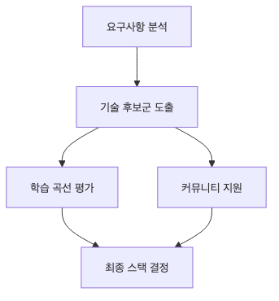

# 기술 스택 선택

기술 스택 선택이 어렵다는 말에는 보통 두 가지가 섞여 있습니다. 새로운 기술을 써 보고 싶은 마음과, 학기 안에 반드시 끝내야 한다는 현실입니다.

캡스톤에서는 이 둘이 자주 충돌합니다. 그래서 좋은 기술보다 지금 우리 팀이 무리 없이 다룰 수 있는 기술을 먼저 정의해야 합니다.

이 글은 Capstone Project 101 시리즈의 7번째 글입니다. 여기서는 친숙도, 학습 비용, 운영 부담, 문서 품질을 함께 보며 현실적인 기술 선택 기준을 정리합니다.

> 멘탈 모델: 좋은 기술 스택은 가장 화려한 조합이 아니라, 지금 팀이 일정 안에 배우고 구현하고 운영할 수 있는 조합입니다.


## 이 글에서 다룰 문제

- 왜 가장 새로운 스택이 항상 정답은 아닐까요?
- 팀의 친숙도는 왜 일정과 직접 연결될까요?
- 학습 비용과 운영 부담은 어떻게 따져야 할까요?
- 대안 비교는 어느 정도까지 하는 편이 좋을까요?
- 결정 이유를 문서로 남겨야 하는 이유는 무엇일까요?

## 이 글에서 배우는 내용

- 친숙도 평가법
- 학습 곡선 비교
- 생태계 확인 포인트
- 운영 비용 감각
- 대안 비교 방식

## 왜 중요한가

캡스톤의 일정은 짧습니다. 그래서 새 기술을 익히는 시간, 디버깅 시간, 배포와 운영 시간을 모두 일정 안에 포함해서 봐야 합니다. 구현보다 도구 학습에 시간이 더 많이 들어가면 프로젝트는 빠르게 흔들립니다.

좋은 선택은 집중을 만듭니다. 반대로 과하게 욕심낸 선택은 학습 비용과 운영 부담이 일정 전체를 잠식하게 만듭니다.

## 한눈에 보는 흐름


*요구사항에서 ADR 기록까지 이어지는 기술 선택 흐름*

## 실전 문서 예시: 간단한 ADR

기술 선택은 말로만 합의하면 나중에 다시 흔들리기 쉽습니다. 아래처럼 한 장짜리 ADR을 남기면 변경 판단이 빨라집니다.

```text
제목: 백엔드 프레임워크로 Flask를 선택한다
문맥: 팀원 4명 중 3명이 Flask 경험이 있고, 6주 안에 데모를 만들어야 한다
대안: FastAPI, Django
선택 이유: 학습 비용이 가장 낮고, 배포 절차가 단순하며, 문서가 충분하다
감수할 단점: 자동 문서화와 구조화 기능은 FastAPI보다 약하다
재검토 조건: 인증, 비동기 API, 관리자 기능 범위가 크게 늘어날 때
```

## 이 문서로 먼저 확인할 것

- 친숙도와 학습 비용을 분리해서 적었는지 확인합니다.
- 운영 부담에 배포와 장애 대응이 포함되어 있는지 봅니다.
- 대안이 두세 개 수준으로 정리되어 있는지 점검합니다.
- 재검토 조건이 있으면 나중에 감정적 논쟁을 줄일 수 있습니다.

## 핵심 용어

- **familiarity**: 팀이 이미 갖고 있는 경험치입니다.
- **learning curve**: 새 기술을 익히는 데 드는 비용입니다.
- **ecosystem**: 라이브러리, 문서, 커뮤니티를 포함한 주변 환경입니다.
- **ops**: 배포하고 운영하는 데 드는 부담입니다.
- **alternative**: 비교를 위해 남겨 둔 대안입니다.

## Before / After

**Before**: 최신 스택이면 무조건 좋다고 생각합니다.

**After**: 친숙도와 비용을 함께 보고 선택합니다.

## 실습: 결정 표

### 1단계 — 후보 정리

```python
candidates = ["FastAPI", "Flask", "Django"]
```

후보는 너무 많이 늘리지 말고 비교 가능한 범위로 줄이는 편이 좋습니다.

### 2단계 — 친숙도 평가

```python
familiar = {"FastAPI": 4, "Flask": 5, "Django": 2}
```

친숙도는 단순 취향이 아니라 속도와 리스크에 직접 연결됩니다. 익숙한 도구는 구현뿐 아니라 디버깅도 빠릅니다.

### 3단계 — 학습 비용

```python
learning_cost = {"FastAPI": 2, "Flask": 1, "Django": 4}
```

새 기술은 배우는 재미가 있지만, 일정 안에서는 비용이기도 합니다. 캡스톤에서는 그 비용을 솔직하게 적는 편이 좋습니다.

### 4단계 — 운영 부담

```python
ops = {"FastAPI": 2, "Flask": 1, "Django": 3}
```

운영 부담은 배포, 설정, 모니터링, 오류 대응까지 포함합니다. 구현이 쉬워도 운영이 무거우면 전체 부담은 커질 수 있습니다.

### 5단계 — 점수 계산

```python
score = {k: familiar[k] - learning_cost[k] - ops[k] for k in candidates}
```

복잡한 모델보다 이런 단순한 계산이 오히려 팀 합의에 더 도움이 되는 경우가 많습니다. 중요한 것은 점수 자체보다 판단 기준을 공유하는 일입니다.

## 이 코드에서 먼저 볼 점

- 점수는 친숙도에서 비용을 빼는 구조입니다.
- 대안은 셋 이하로 유지하는 편이 좋습니다.
- 결정은 반드시 문서로 남겨야 합니다.
- 친숙도와 운영 부담은 동시에 봐야 합니다.

## 자주 하는 실수 5가지

1. 인기만 보고 선택합니다.
2. 팀의 친숙도를 무시합니다.
3. 운영 비용을 뒤늦게 발견합니다.
4. 결정 기록을 남기지 않습니다.
5. 대안 비교 없이 첫 아이디어를 확정합니다.

## 실무에서는 이렇게 이어집니다

실무 팀도 ADR 같은 문서에 결정 이유를 남깁니다. 특히 일정이 짧은 프로젝트에서는 왜 이 기술을 골랐는지를 짧게라도 기록해 두어야 범위 조정이나 기술 변경이 필요할 때 빠르게 판단할 수 있습니다.

## 시니어 엔지니어는 이렇게 생각합니다

- 친숙도는 곧 속도입니다.
- 학습은 비용입니다.
- 운영 부담은 계속 이어집니다.
- 대안은 문서로 비교합니다.
- 결정은 나중에 되돌릴 수 있게 남깁니다.

## 체크리스트

- [ ] 후보가 세 개 있습니다.
- [ ] 친숙도 점수가 있습니다.
- [ ] 학습 비용이 적혀 있습니다.
- [ ] 결정 기록이 있습니다.

## 연습 문제

1. ADR의 의미를 한 줄로 설명해 보세요.
2. familiarity가 중요한 이유를 한 줄로 설명해 보세요.
3. ops burden을 한 줄로 정의해 보세요.

## 정리와 다음 글

기술 스택 선택은 취향 경쟁이 아니라 리스크 조정입니다. 친숙도, 학습 비용, 운영 부담을 함께 보고 기록까지 남기면 기술 결정이 프로젝트를 돕는 방향으로 움직입니다. 다음 글에서는 이 선택을 일정으로 어떻게 관리할지 다룹니다.

<!-- toc:begin -->
- [캡스톤 프로젝트란 무엇인가](./01-what-is-capstone.md)
- [주제 선정](./02-choosing-a-topic.md)
- [문제 정의](./03-defining-the-problem.md)
- [요구사항 정리](./04-organizing-requirements.md)
- [팀 역할 나누기](./05-splitting-team-roles.md)
- [MVP 설계](./06-designing-the-mvp.md)
- **기술 스택 선택 (현재 글)**
- 일정 관리 (예정)
- 발표 자료 만들기 (예정)
- 프로젝트 회고 (예정)
<!-- toc:end -->

## 참고 자료

### 공식 문서와 실무 자료

- [Architecture Decision Records](https://adr.github.io/)
- [Choose Boring Technology](https://boringtechnology.club/)
- [The Twelve-Factor App](https://12factor.net/)
- [Thoughtworks Technology Radar](https://www.thoughtworks.com/radar)

Tags: Capstone, TechStack, Decision, Architecture, Beginner
