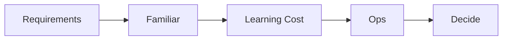

# 기술 스택 선택

기술 스택은 새로움보다 완주 가능성이 중요합니다. 학습 비용과 운영 부담까지 같이 봐야 프로젝트가 흔들리지 않습니다.

이 글은 측스톤 프로젝트 101 시리즈의 7번째 글입니다.

> 캡스톤 프로젝트 101 시리즈 (7/10)


## 이 글에서 다룰 문제

기술 스택은 멋있어 보이는 조합보다 팀이 끝까지 가져갈 수 있는 조합이 중요합니다. 친숙도, 학습 비용, 운영 부담을 같이 봐야 프로젝트가 구현보다 도구 학습에 끌려가지 않습니다.

## 전체 흐름


## Before/After

**Before**: 최신 스택이면 무조건 좋다고 생각합니다.

**After**: 친숙도와 비용을 기준으로 선택합니다.

## 결정 표

### 1단계 — 후보 정리

```python
candidates = ["FastAPI", "Flask", "Django"]
```

### 2단계 — 친숙도 평가

```python
familiar = {"FastAPI": 4, "Flask": 5, "Django": 2}
```

### 3단계 — 학습 비용

```python
learning_cost = {"FastAPI": 2, "Flask": 1, "Django": 4}
```

### 4단계 — 운영 부담

```python
ops = {"FastAPI": 2, "Flask": 1, "Django": 3}
```

### 5단계 — 점수 합산

```python
score = {k: familiar[k] - learning_cost[k] - ops[k] for k in candidates}
```

## 이 코드에서 주목할 점

- 점수는 친숙도에서 학습 비용과 운영 부담을 빼는 단순한 기준입니다. 복잡한 모델보다 이런 식의 단순한 기준이 팀 합의에 더 도움이 됩니다.
- 후보는 너무 많이 늘리지 말고 비교 가능한 범위로 줄이는 편이 좋습니다.
- 결정은 말로 끝내지 말고 문서로 남겨야 나중에 왜 이 선택을 했는지 다시 확인할 수 있습니다.

## 자주 하는 실수 5가지

1. 유행이나 인기만 보고 선택합니다.
2. 팀의 친숙도를 무시해서 초반 시간을 학습에 다 써 버립니다.
3. 배포와 운영에서 드는 비용을 뒤늦게 발견합니다.
4. 결정 기록이 없어 나중에 같은 논의를 반복합니다.
5. 대안 비교 없이 첫 번째 아이디어를 바로 확정합니다.

## 실무에서는 이렇게 쓰입니다

실무 팀도 ADR 같은 문서에 결정 이유를 남깁니다. 특히 캡스톤처럼 일정이 짧은 프로젝트에서는 "왜 이 기술을 골랐는가"를 짧게라도 남겨 두어야 범위 조정이나 기술 변경이 필요할 때 빠르게 판단할 수 있습니다.

## 체크리스트

- [ ] 후보를 3개 이내로 정리했습니다.
- [ ] 친숙도 점수를 매겼습니다.
- [ ] 학습 비용을 적었습니다.
- [ ] 결정 기록을 남겼습니다.

## 정리 및 다음 단계

기술 스택 선택은 취향 경쟁이 아니라 일정과 리스크를 줄이는 의사결정입니다. 다음 글에서는 이렇게 정한 기술과 범위를 실제 일정으로 어떻게 관리할지 이어서 보겠습니다.

<!-- toc:begin -->
- [캡스톤 프로젝트란 무엇인가](./01-what-is-capstone.md)
- [주제 선정](./02-choosing-a-topic.md)
- [문제 정의](./03-defining-the-problem.md)
- [요구사항 정리](./04-organizing-requirements.md)
- [팀 역할 나누기](./05-splitting-team-roles.md)
- [MVP 설계](./06-designing-the-mvp.md)
- **기술 스택 선택 (현재 글)**
- 일정 관리 (예정)
- 발표 자료 만들기 (예정)
- 프로젝트 회고 (예정)
<!-- toc:end -->

## 참고 자료

- [Architecture Decision Records](https://adr.github.io/)
- [Choose Boring Technology - Dan McKinley](https://boringtechnology.club/)
- [The Twelve-Factor App](https://12factor.net/)
- [Tech Radar - Thoughtworks](https://www.thoughtworks.com/radar)

Tags: Capstone, TechStack, Decision, Architecture, Beginner
