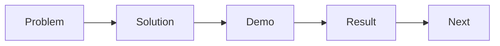

# 발표 자료 만들기

> 캡스톤 프로젝트 101 시리즈 (9/10)


## 이 글에서 다룰 문제

캡스톤 발표는 만든 기능을 전부 늘어놓는 시간이 아닙니다. 어떤 문제를 풀었고, 어떻게 해결했고, 무엇이 달라졌는지를 짧은 시간 안에 전달해야 결과가 제대로 보입니다.

## 전체 흐름


## Before/After

**Before**: 기능 목록만 슬라이드에 올립니다.

**After**: 문제, 해결, 결과 흐름으로 슬라이드를 구성합니다.

## 슬라이드 표

### 1단계 — 서사 만들기

```python
story = ["problem", "solution", "demo", "result", "next"]
```

### 2단계 — 슬라이드 갯수

```python
slides = {"problem": 2, "solution": 3, "demo": 1, "result": 2, "next": 1}
```

### 3단계 — 데모 각본

```python
demo_steps = ["login", "core_action", "result_view"]
```

### 4단계 — Q&A 준비

```python
qna = ["why_this_stack", "how_we_tested", "what_we_cut"]
```

### 5단계 — 시간 분배

```python
minutes = {"talk": 8, "demo": 5, "qna": 7}
```

## 이 코드에서 주목할 점

- 슬라이드 한 장에는 메시지 하나만 담는 편이 전달력이 좋습니다.
- 데모는 욕심내기보다 핵심 장면 3단계 이내로 줄여야 실패 가능성도 함께 줄어듭니다.
- Q&A는 즉흥 대응만 믿지 말고 예상 질문과 답변을 미리 정리해 두는 편이 안전합니다.

## 자주 하는 실수 5가지

1. 슬라이드에 글자를 너무 많이 넣어 발표자가 읽기만 하게 됩니다.
2. 기능 나열에 머물러 왜 이 기능이 중요한지 전달하지 못합니다.
3. 데모 실패에 대비한 화면 캡처나 대체 흐름이 없습니다.
4. Q&A 준비가 없어 핵심 의사결정 이유를 설명하지 못합니다.
5. 시간 배분이 없어 발표가 뒤로 갈수록 급해집니다.

## 실무에서는 이렇게 쓰입니다

실무 발표나 투자자 발표도 문제, 해결, 결과 구조를 자주 사용합니다. 듣는 사람은 기능 개수보다 문제를 얼마나 설득력 있게 설명하는지, 그리고 결과가 얼마나 분명한지에 더 빠르게 반응합니다.

## 체크리스트

- [ ] 서사 5단계를 정리했습니다.
- [ ] 데모 각본을 만들었습니다.
- [ ] Q&A 답변을 준비했습니다.
- [ ] 시간 분배 표를 만들었습니다.

## 정리 및 다음 단계

발표 자료는 프로젝트의 마지막 포장지가 아니라, 팀이 무엇을 배웠는지 보여 주는 요약본입니다. 다음 글에서는 프로젝트를 마친 뒤 무엇을 남겨야 하는지 회고 관점에서 정리하겠습니다.

<!-- toc:begin -->
- [캡스톤 프로젝트란 무엇인가](./01-what-is-capstone.md)
- [주제 선정](./02-choosing-a-topic.md)
- [문제 정의](./03-defining-the-problem.md)
- [요구사항 정리](./04-organizing-requirements.md)
- [팀 역할 나누기](./05-splitting-team-roles.md)
- [MVP 설계](./06-designing-the-mvp.md)
- [기술 스택 선택](./07-choosing-the-tech-stack.md)
- [일정 관리](./08-schedule-management.md)
- **발표 자료 만들기 (현재 글)**
- 프로젝트 회고 (예정)
<!-- toc:end -->

## 참고 자료

- [Presentation Zen - Garr Reynolds](https://www.presentationzen.com/)
- [The Cognitive Style of PowerPoint - Edward Tufte](https://www.edwardtufte.com/tufte/powerpoint)
- [TED Talks - Chris Anderson](https://www.ted.com/playlists/574/how_to_make_a_great_presentation)
- [Pyramid Principle - Barbara Minto](https://en.wikipedia.org/wiki/Pyramid_principle)

Tags: Capstone, Presentation, Demo, Storytelling, Beginner
