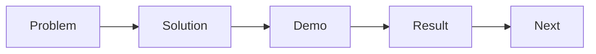

# 발표 자료 만들기

> 캡스톤 프로젝트 101 시리즈 (9/10)


## 이 글에서 다룰 문제

*전달* 이 *결과* 만큼 중요합니다.

## 개념 한눈에 보기



## Before/After

**Before**: *기능 목록* 슬라이드.

**After**: *문제 - 해결 - 결과* 슬라이드.

## 실습: 슬라이드 표

### 1단계 — 서사 만들기

```python
story = ["problem", "solution", "demo", "result", "next"]
```

### 2단계 — 슬라이드 갯수

```python
slides = {"problem": 2, "solution": 3, "demo": 1, "result": 2, "next": 1}
```

### 3단계 — 데모 각본

```python
demo_steps = ["login", "core_action", "result_view"]
```

### 4단계 — Q&A 준비

```python
qna = ["why_this_stack", "how_we_tested", "what_we_cut"]
```

### 5단계 — 시간 분배

```python
minutes = {"talk": 8, "demo": 5, "qna": 7}
```

## 이 코드에서 주목할 점

- *슬라이드 1장 = 메시지 1개*.
- *데모* 는 *3 단계* 이내.
- *Q&A* 는 *준비 답변*.

## 자주 하는 실수 5가지

1. ***글자* 가 *너무 많다*.**
2. ***기능 나열*.**
3. ***데모 실패* 대비가 없다.**
4. ***Q&A* 준비가 없다.**
5. ***시간 초과*.**

## 실무에서는 이렇게 쓰입니다

투자자 발표도 *문제 - 해결 - 결과* 구조를 씁니다.

## 체크리스트

- [ ] *서사* 5단계.
- [ ] *데모* 각본.
- [ ] *Q&A* 답변.
- [ ] *시간 분배* 표.

## 정리 및 다음 단계

다음 글은 *프로젝트 회고* 입니다.

<!-- toc:begin -->
- [캡스톤 프로젝트란 무엇인가](./01-what-is-capstone.md)
- [주제 선정](./02-choosing-a-topic.md)
- [문제 정의](./03-defining-the-problem.md)
- [요구사항 정리](./04-organizing-requirements.md)
- [팀 역할 나누기](./05-splitting-team-roles.md)
- [MVP 설계](./06-designing-the-mvp.md)
- [기술 스택 선택](./07-choosing-the-tech-stack.md)
- [일정 관리](./08-schedule-management.md)
- **발표 자료 만들기 (현재 글)**
- 프로젝트 회고 (예정)
<!-- toc:end -->

## 참고 자료

- [Presentation Zen - Garr Reynolds](https://www.presentationzen.com/)
- [The Cognitive Style of PowerPoint - Edward Tufte](https://www.edwardtufte.com/tufte/powerpoint)
- [TED Talks - Chris Anderson](https://www.ted.com/playlists/574/how_to_make_a_great_presentation)
- [Pyramid Principle - Barbara Minto](https://en.wikipedia.org/wiki/Pyramid_principle)

Tags: Capstone, Presentation, Demo, Storytelling, Beginner
