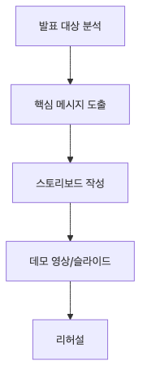

# 발표 자료 만들기

발표 자료가 길어지는 가장 흔한 이유는, 팀이 만든 모든 기능을 다 보여 주려 하기 때문입니다. 하지만 청중은 보통 기능 개수보다 왜 이 프로젝트가 의미 있었는지부터 알고 싶어 합니다.

좋은 발표 자료는 기능 카탈로그가 아니라 선택과 결과를 설명하는 서사입니다. 무엇을 왜 만들었는지, 어떤 결과가 나왔는지, 다음에 무엇을 바꿀지까지 짧게 이어져야 설득력이 생깁니다.

이 글은 Capstone Project 101 시리즈의 9번째 글입니다. 여기서는 문제·해결·결과 구조로 슬라이드를 설계하고, 데모 실패 대비안과 Q&A까지 함께 준비하는 방법을 다룹니다.

> 멘탈 모델: 좋은 발표는 만든 기능을 다 보여 주는 자리가 아니라, 문제와 선택과 결과를 짧은 서사로 묶어 청중이 바로 이해하게 만드는 자리입니다.


## 이 글에서 다룰 문제

- 왜 기능 목록 중심 발표는 지루해질까요?
- 문제·해결·결과 구조는 왜 전달력이 높을까요?
- 슬라이드는 어떻게 구성해야 한 장당 메시지가 선명할까요?
- 데모 각본은 왜 미리 써야 할까요?
- Q&A와 시간 배분은 어떻게 준비해야 할까요?

## 이 글에서 배우는 내용

- 발표 서사 구조
- 슬라이드 구성 원칙
- 데모 각본 작성법
- Q&A 준비법
- 시간 배분 기준

## 왜 중요한가

발표는 결과물을 보여 주는 마지막 순간이자, 팀이 무엇을 배웠는지 설명하는 순간입니다. 같은 결과물이라도 서사가 없으면 단순 기능 나열로 보이고, 서사가 있으면 문제 해결 과정으로 보입니다.

실무 발표나 투자자 발표도 문제, 해결, 결과 구조를 자주 사용합니다. 듣는 사람은 기능 개수보다 어떤 문제를 풀었고 어떤 변화가 있었는지에 더 빠르게 반응합니다.

## 한눈에 보는 흐름


*문제에서 다음 단계까지 이어지는 발표 서사 구조*

## 실전 문서 예시: 발표 운영 시트

슬라이드 파일보다 먼저 아래 같은 운영 시트를 만들면 발표 흐름이 훨씬 안정됩니다.

```text
구간 | 시간 | 핵심 메시지 | 백업 자료
문제 설명 | 2분 | 왜 이 문제가 불편한가 | 사용자 인터뷰 한 장
해결 방식 | 3분 | 왜 이 흐름을 선택했는가 | 요구사항 표 한 장
데모 | 4분 | 핵심 흐름 60초 시연 | 스크린샷 3장, 녹화 영상
결과와 학습 | 2분 | 무엇이 확인되었고 무엇이 남았는가 | 피드백 요약 표
Q&A | 4분 | 스택, 테스트, 범위 컷 설명 | ADR, 회고 메모
```

## 이 문서로 먼저 확인할 것

- 한 슬라이드에 한 메시지만 남겼는지 확인합니다.
- 데모 실패 시 바로 전환할 백업 자료가 있는지 점검합니다.
- 시간 분배가 실제 발표 시간과 맞는지 리허설합니다.
- 예상 질문에 대한 근거 문서를 따로 준비합니다.

## 핵심 용어

- **narrative**: 발표 전체를 묶는 이야기 흐름입니다.
- **slide**: 한 장에 하나의 메시지를 담는 화면입니다.
- **demo**: 미리 준비한 순서대로 보여 주는 시연입니다.
- **QnA**: 예상 질문과 답변 준비입니다.
- **timing**: 발표 시간 배분입니다.

## Before / After

**Before**: 기능 목록 슬라이드를 만듭니다.

**After**: 문제, 해결, 결과 흐름으로 슬라이드를 구성합니다.

## 실습: 슬라이드 표

### 1단계 — 서사 만들기

```python
story = ["problem", "solution", "demo", "result", "next"]
```

이 다섯 단계만 정리해도 발표의 뼈대가 잡힙니다. 기능은 이 흐름 안에서 필요한 만큼만 보여 주면 됩니다.

### 2단계 — 슬라이드 수 배분

```python
slides = {"problem": 2, "solution": 3, "demo": 1, "result": 2, "next": 1}
```

슬라이드 수를 미리 정해 두면 특정 구간이 과하게 길어지는 것을 막을 수 있습니다.

### 3단계 — 데모 각본

```python
demo_steps = ["login", "core_action", "result_view"]
```

데모는 욕심내기보다 세 단계 이내의 핵심 장면으로 줄이는 편이 안전합니다. 길어질수록 실패 가능성도 커집니다.

### 4단계 — Q&A 준비

```python
qna = ["why_this_stack", "how_we_tested", "what_we_cut"]
```

Q&A는 즉흥 대응만 믿지 말고, 예상 질문과 답변을 미리 정리해 두는 편이 좋습니다. 특히 왜 이 기술을 골랐는지, 무엇을 의도적으로 뺐는지는 자주 묻는 질문입니다.

### 5단계 — 시간 분배

```python
minutes = {"talk": 8, "demo": 5, "qna": 7}
```

시간 분배가 없으면 발표는 뒤로 갈수록 급해집니다. 발표 시간도 설계 대상이라고 보는 편이 좋습니다.

## 이 코드에서 먼저 볼 점

- 한 슬라이드에는 한 메시지만 둡니다.
- 데모는 세 단계 이내로 줄입니다.
- Q&A는 미리 준비합니다.
- 시간 배분도 문서에 적어 둡니다.

## 자주 하는 실수 5가지

1. 슬라이드에 텍스트를 너무 많이 넣습니다.
2. 기능 나열에 머뭅니다.
3. 데모 실패에 대비한 대체 흐름이 없습니다.
4. Q&A 준비가 없습니다.
5. 시간을 초과합니다.

## 실무에서는 이렇게 이어집니다

실무 발표나 투자자 피치도 문제, 해결, 결과 구조를 자주 사용합니다. 듣는 사람은 모든 기능을 알고 싶어 하기보다, 왜 이 일이 중요하고 어떤 결과가 있었는지를 먼저 이해하고 싶어 합니다. 캡스톤 발표도 같은 원리로 준비하는 편이 훨씬 설득력 있습니다.

## 시니어 엔지니어는 이렇게 생각합니다

- 서사가 기능보다 먼저입니다.
- 슬라이드는 시각적으로 단순해야 합니다.
- 데모는 리허설합니다.
- Q&A도 각본을 씁니다.
- 시간을 반드시 지킵니다.

## 체크리스트

- [ ] 다섯 단계 서사가 있습니다.
- [ ] 데모 각본이 있습니다.
- [ ] Q&A 답변이 있습니다.
- [ ] 시간 배분 표가 있습니다.

## 연습 문제

1. narrative 구조를 한 줄로 적어 보세요.
2. 데모 실패 대비책을 한 줄로 설명해 보세요.
3. Q&A 준비 방법 하나를 한 줄로 적어 보세요.

## 정리와 다음 글

발표 자료의 핵심은 많이 보여 주는 것이 아니라 빨리 이해시키는 것입니다. 문제·해결·결과 구조, 데모 각본, 백업 자료, Q&A 근거를 함께 준비하면 발표가 훨씬 단단해집니다. 다음 글에서는 프로젝트를 마친 뒤 학습을 남기는 회고를 다룹니다.

<!-- toc:begin -->
- [캡스톤 프로젝트란 무엇인가](./01-what-is-capstone.md)
- [주제 선정](./02-choosing-a-topic.md)
- [문제 정의](./03-defining-the-problem.md)
- [요구사항 정리](./04-organizing-requirements.md)
- [팀 역할 나누기](./05-splitting-team-roles.md)
- [MVP 설계](./06-designing-the-mvp.md)
- [기술 스택 선택](./07-choosing-the-tech-stack.md)
- [일정 관리](./08-schedule-management.md)
- **발표 자료 만들기 (현재 글)**
- 프로젝트 회고 (예정)
<!-- toc:end -->

## 참고 자료

### 공식 문서와 실무 자료

- [Presentation Zen](https://www.presentationzen.com/)
- [The Cognitive Style of PowerPoint](https://www.edwardtufte.com/tufte/powerpoint)
- [TED guide to public speaking](https://www.ted.com/playlists/574/how_to_make_a_great_presentation)
- [Pyramid Principle](https://en.wikipedia.org/wiki/Pyramid_principle)

Tags: Capstone, Presentation, Demo, Storytelling, Beginner
