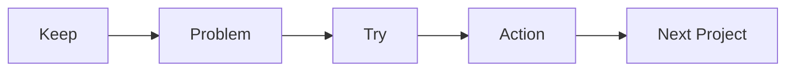

# 프로젝트 회고

> 캡스톤 프로젝트 101 시리즈 (10/10)


## 이 글에서 다룰 문제

회고를 감상문처럼 끝내면 같은 문제가 다음 프로젝트에서도 반복됩니다. 사실, 원인, 다음 행동까지 남겨야 이번 경험이 다음 프로젝트의 자산이 됩니다.

## 전체 흐름


## Before/After

**Before**: 감정만 쏟아 놓고 끝냅니다.

**After**: 사실과 다음 행동을 함께 기록합니다.

## 회고 표

### 1단계 — KPT

```python
kpt = {"keep": [], "problem": [], "try": []}
```

### 2단계 — 데이터

```python
metrics = {"velocity": 12, "bugs": 5, "review_time": 1.5}
```

### 3단계 — 5 Whys

```python
whys = ["bug_at_demo", "missed_test", "no_ci", "no_template", "first_time"]
```

### 4단계 — 다음 행동

```python
actions = [{"who": "A", "what": "add_ci", "by": "next_sprint"}]
```

### 5단계 — 학습 정리

```python
lessons = ["scope_first", "ci_early", "demo_dryrun"]
```

## 이 코드에서 주목할 점

- KPT는 Keep, Problem, Try 세 칸으로 나누면 회고의 관점을 단순하게 유지할 수 있습니다.
- 데이터는 느낌보다 수치로 남겨야 회고가 추측으로 흐르지 않습니다.
- 다음 행동은 담당자와 마감을 함께 적어야 실제 실행으로 이어집니다.

## 자주 하는 실수 5가지

1. 누가 잘못했는지부터 따져 회고를 책임 공방으로 만듭니다.
2. 감정만 적고 어떤 사실이 있었는지는 남기지 않습니다.
3. 다음 행동이 없어 회고가 기록으로만 끝납니다.
4. 속도, 버그 수, 리뷰 시간 같은 데이터가 빠져 판단 근거가 약해집니다.
5. 다음 프로젝트에 적용할 연결 고리를 만들지 않습니다.

## 실무에서는 이렇게 쓰입니다

실무 팀도 스프린트 회고와 포스트모템을 꾸준히 운영합니다. 중요한 점은 잘한 사람을 칭찬하거나 못한 사람을 지적하는 데서 끝내지 않고, 다음 스프린트에서 바꿀 행동을 작게라도 정하는 것입니다.

## 체크리스트

- [ ] KPT 표를 만들었습니다.
- [ ] 데이터를 수집했습니다.
- [ ] 5 Whys를 정리했습니다.
- [ ] 다음 행동 3개를 적었습니다.

## 정리 및 다음 단계

이로써 캡스톤 입문 시리즈가 끝났습니다. 프로젝트를 끝내는 가장 좋은 방법은 결과물을 닫는 것이 아니라, 다음 프로젝트에 가져갈 교훈을 또렷하게 남기는 일입니다. 다음 시리즈에서는 이 경험을 포트폴리오 프로젝트로 어떻게 이어 갈지 다룹니다.

<!-- toc:begin -->
- [캡스톤 프로젝트란 무엇인가](./01-what-is-capstone.md)
- [주제 선정](./02-choosing-a-topic.md)
- [문제 정의](./03-defining-the-problem.md)
- [요구사항 정리](./04-organizing-requirements.md)
- [팀 역할 나누기](./05-splitting-team-roles.md)
- [MVP 설계](./06-designing-the-mvp.md)
- [기술 스택 선택](./07-choosing-the-tech-stack.md)
- [일정 관리](./08-schedule-management.md)
- [발표 자료 만들기](./09-presentation-materials.md)
- **프로젝트 회고 (현재 글)**
<!-- toc:end -->

## 참고 자료

- [Agile Retrospectives - Esther Derby](https://pragprog.com/titles/dlret/agile-retrospectives/)
- [The Five Whys - Toyota Production System](https://en.wikipedia.org/wiki/Five_whys)
- [Postmortem Culture - Google SRE](https://sre.google/sre-book/postmortem-culture/)
- [Project Retrospectives - Norman Kerth](https://retrospectives.com/)

Tags: Capstone, Retrospective, Learning, Reflection, Beginner
