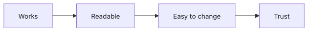

# What Is Clean Code?

Most code problems do not show up when the code first runs. They show up a few weeks later, when someone tries to change it without breaking a nearby path.

This is the first post in the Clean Code 101 series.

Here we will separate working code from readable code and from code that stays cheap to change, then turn that difference into concrete signals you can inspect in a real codebase.

---

## Questions this article answers

- What signals should you inspect first when deciding whether code is clean?
- What separates working code from readable code, and readable code from code that stays easy to change?
- Why do small principles create such a large difference in real maintenance cost?
- How far can the feeling that code is "clean" be turned into objective criteria?
- How does the rest of this series build on that foundation?

> Working code is the starting point. Clean code is the discipline of making the next person faster at understanding and changing it.

## Why It Matters

Code is written once and read a hundred times. Readability decides the cost of change.

> Clean code is the act of saving the next person's time.

## Concept at a Glance



*Core clean-code flow: working code becomes readable code, then code that stays easy to change.*

Working is the start, trust is the end.

## Key Terms

- **Clean code**: Code with clear intent and a low cost of change.
- **Readability**: Other developers understand it fast.
- **Cognitive load**: Mental effort to understand a unit of code.
- **Smell**: A signal of trouble (duplication, giant functions, etc.).
- **Refactoring**: Changing structure without changing behavior.

## Before/After

**Before — works, that's all**

```python
def f(d, t):
    return d * (1 + t)
```

**After — intent visible**

```python
def total_with_tax(amount: int, tax_rate: float) -> float:
    return amount * (1 + tax_rate)
```

Names and types speak the intent.

## Hands-on: Measure the Mess

### Step 1 — Function length

```python
# 1_length.py
def process(order):
    # 80 lines ...
    pass
```

Past 20 lines, write down "why?".

### Step 2 — Argument count

```python
# 2_args.py
def create_user(name, email, age, address, role, plan, ref):
    ...
```

More than three is a candidate for an object.

### Step 3 — Indentation depth

```python
# 3_depth.py
if a:
    if b:
        if c:
            do()
```

Past depth 3 is a candidate for extraction.

### Step 4 — Honest names

```python
# 4_name.py
def calc(x):  # of what?
    ...
def calculate_invoice_total(line_items):
    ...
```

If the name lies, the code lies.

### Step 5 — Measure cognitive load

```bash
# 5_cc.sh
radon cc app/ -a -s
```

Cyclomatic complexity 10+ is a candidate for decomposition.

## How to Verify This in a Real Codebase

```bash
radon cc app/ -a -s
ruff check app/
```

**Expected output**

- You can see which functions already sit in the high-complexity range.
- Naming, branching, and function-shape issues show up in one pass.

## Failure Modes to Watch

- Treating complexity as the only signal and ignoring naming or responsibility.
- Letting noisy lint debt hide the truly expensive design problems.

## What to Notice in This Code

- Names speak intent.
- Length, depth, and arg count are measurable signals.
- Small rules compound into a large effect.

## Five Common Mistakes

1. **"It works, ship it".** Six months later, that line is debt.
2. **Giant functions.** Debugging becomes torture.
3. **Lying names.** Code and name disagree.
4. **Deep indentation.** Branches obscure the intent.
5. **No measurement.** Things do not improve.

## How This Shows Up in Production

Strong teams put thresholds on length, complexity, and naming into a code review guide and gradually enforce them via lint. Large functions get auto-flagged on PRs.

## How a Senior Engineer Thinks

- Code is written once and read a hundred times.
- Names are half the documentation.
- What is measured improves.
- Small rules compose into large code quality.
- Clean code is consideration for the next person.

## Checklist

- [ ] Are functions 20 lines or fewer?
- [ ] Are arguments three or fewer?
- [ ] Is indentation depth three or fewer?
- [ ] Do names speak intent?
- [ ] Do you measure complexity?

## Practice Problems

1. Pick the longest function in your repo and write a decomposition plan.
2. Find three lying names and rename them.
3. Add three lint rules to your project.

## Wrap-up and Next Steps

Clean code is the sum of small, measurable principles. Next, we look at the single highest-leverage one — naming.

<!-- toc:begin -->
- **What Is Clean Code? (current)**
- Naming (upcoming)
- Small Functions (upcoming)
- Simplifying Conditionals (upcoming)
- Removing Duplication (upcoming)
- Error Handling (upcoming)
- Comments and Documentation (upcoming)
- Testable Code (upcoming)
- Refactoring Basics (upcoming)
- Good Code Review Standards (upcoming)
<!-- toc:end -->

## References

- [Clean Code — Robert C. Martin](https://www.oreilly.com/library/view/clean-code-a/9780136083238/)
- [A Philosophy of Software Design — John Ousterhout](https://web.stanford.edu/~ouster/cgi-bin/aposd.php)
- [Refactoring — Martin Fowler](https://martinfowler.com/books/refactoring.html)
- [Google — Code Health Articles](https://testing.googleblog.com/search/label/Code%20Health)
- [Ruff rule reference](https://docs.astral.sh/ruff/rules/)
- [radon documentation](https://radon.readthedocs.io/en/latest/)
Tags: Computer Science, CleanCode, Readability, SoftwareEngineering, CodeQuality, Refactoring
