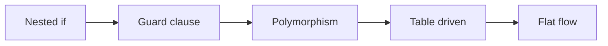

# Simplifying Conditionals

> Clean Code 101 series (4/10)

<!-- a-grade-intro:begin -->

**Core question**: Why do nested if statements grow so fast?

> Because one function carries more than one responsibility. Splitting responsibilities reduces depth.

This is post 4 in the Clean Code 101 series.

<!-- a-grade-intro:end -->

## What You Will Learn

- Guard clauses and early return
- Avoiding negative and double-negative conditions
- Removing if/else chains with polymorphism
- Separating branches with the Strategy pattern
- Table-driven branching

## Why It Matters

Nested conditionals are the most common source of complexity. Reducing depth by one already doubles readability.

> Depth is cognitive load.

## Concept at a Glance



More tools, fewer branches.

## Key Terms

- **Guard Clause**: Return early for exceptional cases at the top of a function.
- **Early Return**: Exit early instead of nesting deeper.
- **Polymorphism**: Move type-specific behavior into classes.
- **Strategy Pattern**: Inject the algorithm from outside.
- **Table-driven**: Express branches as data structures.

## Before/After

**Before**

```python
def price(user, item):
    if user is not None:
        if user.is_active:
            if item is not None:
                if item.in_stock:
                    return item.price * (0.9 if user.is_member else 1.0)
                else:
                    return None
            else:
                return None
        else:
            return None
    else:
        return None
```

**After**

```python
def price(user, item):
    if user is None or not user.is_active: return None
    if item is None or not item.in_stock: return None
    rate = 0.9 if user.is_member else 1.0
    return item.price * rate
```

Depth dropped from 4 to 1.

## Hands-on: Five Steps to Reduce Branches

### Step 1 — Flatten with guard clauses

```python
# 1_guard.py
def total(items):
    if not items:
        return 0
    return sum(it.price for it in items)
```

Empty input returns immediately.

### Step 2 — Flip negative conditions

```python
# 2_positive.py
# Before: if not user.is_inactive: ...
# After:
def can_login(user):
    if not user.is_active:
        return False
    return user.email_verified
```

Always avoid double negation.

### Step 3 — Remove branches with polymorphism

```python
# 3_poly.py
class Shape:
    def area(self): ...
class Circle(Shape):
    def __init__(self, r): self.r = r
    def area(self): return 3.14 * self.r * self.r
class Square(Shape):
    def __init__(self, a): self.a = a
    def area(self): return self.a * self.a

def total_area(shapes): return sum(s.area() for s in shapes)
```

Type branches dissolve into classes.

### Step 4 — Strategy pattern

```python
# 4_strategy.py
def percent_off(price, rate): return price * (1 - rate)
def fixed_off(price, amount): return max(0, price - amount)

DISCOUNTS = {"member": lambda p: percent_off(p, 0.1),
             "coupon10": lambda p: fixed_off(p, 10)}

def apply(price, kind): return DISCOUNTS[kind](price)
```

Dict lookup replaces branching.

### Step 5 — Table-driven

```python
# 5_table.py
GRADES = [(90, "A"), (80, "B"), (70, "C"), (0, "F")]
def grade(score):
    return next(g for s, g in GRADES if score >= s)
```

The if/elif chain becomes data.

## What to Notice in This Code

- Guard clauses cut indentation.
- Polymorphism removes the if statement entirely.
- Tables express policy as data.

## Five Common Mistakes

1. **Nesting without guards.** else blocks pile up.
2. **Keeping negative conditions.** Double negation creeps in.
3. **Branching on types.** isinstance everywhere.
4. **Stateful strategies.** Hard to test.
5. **Order-dependent tables.** Easy to break priorities.

## How This Shows Up in Production

Pricing, authorization, and routing — anywhere branches resemble data — are great candidates for tables and strategies. Policy changes no longer require code edits.

## How a Senior Engineer Thinks

- Depth above 3 is a design smell.
- More than five if/elif arms hint at polymorphism.
- Branches that change with external input belong in tables.
- Flip negative conditions to positive in one pass.
- Keep strategies stateless.

## Checklist

- [ ] Function depth ≤ 3?
- [ ] Guard clauses placed first?
- [ ] Negative conditions flipped?
- [ ] Type branches considered for polymorphism?
- [ ] Policy branches considered for tables/strategies?

## Practice Problems

1. Find a depth-4 branch in your code and flatten it.
2. Convert an if/elif chain of 5+ arms into a table.
3. Replace an isinstance branch with polymorphism.

## Wrap-up and Next Steps

Fewer conditions, clearer code. Next we tackle the second great enemy: duplication.

<!-- toc:begin -->
- [What Is Clean Code?](./01-what-is-clean-code.md)
- [Naming](./02-naming.md)
- [Small Functions](./03-small-functions.md)
- **Simplifying Conditionals (current)**
- Removing Duplication (upcoming)
- Error Handling (upcoming)
- Comments and Documentation (upcoming)
- Testable Code (upcoming)
- Refactoring Basics (upcoming)
- Good Code Review Standards (upcoming)
<!-- toc:end -->

## References

- [Refactoring — Replace Nested Conditional with Guard Clauses](https://refactoring.com/catalog/replaceNestedConditionalWithGuardClauses.html)
- [Refactoring — Replace Conditional with Polymorphism](https://refactoring.com/catalog/replaceConditionalWithPolymorphism.html)
- [Strategy Pattern (Refactoring Guru)](https://refactoring.guru/design-patterns/strategy)
- [Clean Code (Ch. 3 Functions, Ch. 6 Objects)](https://www.oreilly.com/library/view/clean-code-a/9780136083238/)

Tags: Computer Science, CleanCode, Conditionals, GuardClauses, Refactoring, Readability
