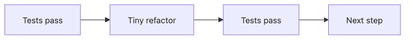

# Refactoring Basics

Refactoring looks risky when it is approached as a rewrite. It becomes manageable when every step is small enough that a failing test can tell you exactly where the move went wrong.

This is post 9 in the Clean Code 101 series.

Here we will use characterization tests, rename and extraction moves, and the “two hats” rule to turn legacy cleanup into a sequence of reviewable, reversible steps.

---

## What You Will Learn

- What refactoring is and what it is not
- Core techniques from the Fowler catalog
- Characterization tests
- A safe step-by-step refactoring process
- Strategies for legacy code

## Why It Matters

Refactoring is not rewriting. It improves internal structure while preserving external behavior.

> Refactoring is an investment that lowers the cost of the next change.

## Concept at a Glance



*Refactoring rhythm: move from one green test state to the next through small, reversible steps.*

Small steps between green and green.

## Key Terms

- **Refactoring**: Internal change that does not alter external behavior.
- **Characterization test**: Locks in current behavior.
- **Code smell**: Improvement signal (long function, large class, data clumps).
- **Two hats**: Never add features and refactor in the same change.
- **Mikado method**: Decompose a big change into a graph of small steps.

## Before/After

**Before**

```python
def order_total(o):
    s = 0
    for it in o.items:
        s += it.price * it.qty
    if o.coupon: s -= 10
    if o.member: s = s * 0.9
    return s
```

**After**

```python
def subtotal(items): return sum(i.price * i.qty for i in items)
def with_coupon(s, coupon): return s - 10 if coupon else s
def with_member(s, member): return s * 0.9 if member else s

def order_total(o):
    s = subtotal(o.items)
    s = with_coupon(s, o.coupon)
    s = with_member(s, o.member)
    return s
```

Each step splits one piece of meaning.

## Hands-on: Five Steps to Safe Refactoring

### Step 1 — Characterization tests as a safety net

```python
# 1_characterize.py
def test_legacy_total():
    o = make_order(items=[(100, 2)], coupon=True, member=True)
    assert order_total(o) == 171  # capture current behavior as is
```

Capture before you understand.

### Step 2 — Extract Function

```python
# 2_extract.py
def subtotal(items): return sum(i.price * i.qty for i in items)
```

Cut into small units of meaning.

### Step 3 — Rename

```python
# 3_rename.py
# Rename progressively so that names reveal intent.
def items_subtotal(items): ...
```

Use IDE refactoring tools.

### Step 4 — Inline and Move

```python
# 4_move.py
# Move a misplaced function to the right module/class.
class OrderPricing:
    def total(self, order): ...
```

Raise cohesion.

### Step 5 — Keep two hats separate

```python
# 5_two_hats.py
# Never mix feature changes and refactoring in one PR.
# PR-1: refactor (preserves behavior)
# PR-2: add feature (new behavior)
```

Make the change reviewable.

## How to Verify This in a Real Codebase

```bash
python -m pytest -q tests/test_order_total.py
python -m pytest -q tests/test_legacy_characterization.py
```

**Expected output**

- Characterization tests should go green before structural changes begin.
- Extraction, rename, and move steps must preserve the same result set.

## Failure Modes to Watch

- Feature changes slip into the same refactoring commit.
- Names improve but misplaced responsibilities stay where they were.

## What to Notice in This Code

- Tests stay green after every step.
- Each change is small.
- Names reveal intent.

## Five Common Mistakes

1. **Starting without tests.** Regressions become accidents.
2. **One huge step.** No way to roll back.
3. **Mixing with features.** Reviews are impossible.
4. **Changing structure but keeping old names.** Half the value lost.
5. **Aesthetic refactoring.** Does not make the next change easier.

## How This Shows Up in Production

Strong teams require a refactoring PR to be merged before each feature PR. Feature PRs shrink and reviews speed up.

## How a Senior Engineer Thinks

- Refactors only when the next change becomes easier.
- Takes small steps with fast tests.
- Keeps the two hats apart.
- Starts legacy work with characterization tests.
- Decomposes big changes via the Mikado graph.

## Checklist

- [ ] Are tests green before starting?
- [ ] Are steps small enough?
- [ ] Are features kept out of the refactor?
- [ ] Do names now reveal intent?
- [ ] Has the next change become easier?

## Practice Problems

1. Pin one 50+ line function with characterization tests and decompose it in three steps.
2. Move one misplaced function to a more appropriate module.
3. Open and merge one refactor-only PR.

## Wrap-up and Next Steps

Refactoring is an investment that lowers the next change's cost. The final episode wraps the series with good code review standards.

<!-- toc:begin -->
- [What Is Clean Code?](./01-what-is-clean-code.md)
- [Naming](./02-naming.md)
- [Small Functions](./03-small-functions.md)
- [Simplifying Conditionals](./04-simplifying-conditionals.md)
- [Removing Duplication](./05-removing-duplication.md)
- [Error Handling](./06-error-handling.md)
- [Comments and Documentation](./07-comments-and-docs.md)
- [Testable Code](./08-testable-code.md)
- **Refactoring Basics (current)**
- Good Code Review Standards (upcoming)
<!-- toc:end -->

## References

- [Refactoring (Martin Fowler)](https://martinfowler.com/books/refactoring.html)
- [Refactoring Catalog](https://refactoring.com/catalog/)
- [Working Effectively with Legacy Code (M. Feathers)](https://www.oreilly.com/library/view/working-effectively-with/0131177052/)
- [The Mikado Method](https://mikadomethod.info/)
- [Refactoring catalog](https://refactoring.com/catalog/)
- [Working Effectively with Legacy Code](https://www.oreilly.com/library/view/working-effectively-with/0131177052/)
Tags: Computer Science, CleanCode, Refactoring, Patterns, LegacyCode, Quality
