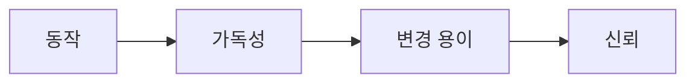

# Clean Code란 무엇인가?

Clean Code의 정의, 가독성과 의도, 변경 비용을 줄이는 작은 원칙을 정리합니다.

이 글은 Clean Code 101 시리즈의 1번째 글입니다.

> Clean Code 101 시리즈 (1/10)


## 이 글에서 다룰 문제

코드는 한 번 작성하고 훨씬 더 자주 읽습니다. 그래서 가독성은 곧 변경 비용으로 이어집니다.

> Clean Code는 다음 사람의 시간을 줄이는 일이다.

## 전체 흐름


코드는 동작하는 것에서 출발하지만, 결국 신뢰할 수 있어야 합니다.

## Before/After

**Before — 동작만 OK**

```python
def f(d, t):
    return d * (1 + t)
```

**After — 의도 분명**

```python
def total_with_tax(amount: int, tax_rate: float) -> float:
    return amount * (1 + tax_rate)
```

이름과 타입만 봐도 함수의 의도가 바로 드러납니다.

## 더러움을 측정하기

### 1단계 — 함수 길이

```python
# 예시 파일: 1_length.py
def process(order):
    # 본문이 대략 80줄이라고 가정합니다.
    pass
```

함수가 20줄을 넘기기 시작하면, 왜 이렇게 길어졌는지 먼저 설명할 수 있어야 합니다.

### 2단계 — 매개변수 수

```python
# 예시 파일: 2_args.py
def create_user(name, email, age, address, role, plan, ref):
    ...
```

매개변수가 3개를 넘으면 하나의 객체로 묶을지 검토하는 편이 좋습니다.

### 3단계 — 들여쓰기 깊이

```python
# 예시 파일: 3_depth.py
if a:
    if b:
        if c:
            do()
```

들여쓰기가 3단계를 넘으면 분기를 나누거나 함수를 쪼갤 시점으로 보는 것이 좋습니다.

### 4단계 — 이름의 정직함

```python
# 예시 파일: 4_name.py
def calc(x):  # 무엇을 계산하는지 드러나지 않습니다.
    ...
def calculate_invoice_total(line_items):
    ...
```

이름이 흐리면 코드를 읽는 사람도 잘못된 기대를 갖게 됩니다.

### 5단계 — 인지 부담 측정

```bash
# 예시 파일: 5_cc.sh
radon cc app/ -a -s
```

순환 복잡도가 10 이상이라면 작은 단위로 나눌 여지가 있는지 살펴봐야 합니다.

## 이 코드에서 주목할 점

- 이름은 코드의 의도를 가장 먼저 보여 줍니다.
- 함수 길이, 들여쓰기 깊이, 매개변수 수는 측정 가능한 경고 신호입니다.
- 작은 원칙을 꾸준히 지키면 코드 품질이 눈에 띄게 달라집니다.

## 자주 하는 실수 5가지

1. **"동작하면 됐어"라고 끝내기.** 몇 달 뒤에는 유지보수 비용으로 돌아옵니다.
2. **거대 함수를 그대로 두기.** 디버깅과 변경이 함께 어려워집니다.
3. **거짓말하는 이름.** 코드와 이름이 다르면 독자가 계속 속습니다.
4. **깊은 들여쓰기.** 분기가 많아질수록 핵심 흐름이 묻힙니다.
5. **측정하지 않기.** 수치로 보지 않으면 나빠지는 시점을 놓치기 쉽습니다.

## 실무에서는 이렇게 쓰입니다

좋은 팀은 함수 길이, 복잡도, 이름 규칙 같은 기준을 코드 리뷰 가이드에 명시합니다. 그리고 lint나 정적 분석으로 반복되는 문제를 자동으로 잡아 냅니다.

## 체크리스트

- [ ] 함수가 20 lines 이하인가?
- [ ] 매개변수가 3개 이하인가?
- [ ] 들여쓰기 3 depth 이하인가?
- [ ] 이름이 의도를 말하는가?
- [ ] 복잡도를 측정하는가?

## 정리 및 다음 단계

Clean Code는 추상적인 미학이 아니라, 측정 가능한 작은 원칙을 꾸준히 지키는 습관입니다. 다음 글에서는 그중에서도 가장 즉각적인 효과를 내는 이름 짓기를 살펴보겠습니다.

<!-- toc:begin -->
- **Clean Code란 무엇인가? (현재 글)**
- 이름 짓기 (예정)
- 함수 작게 만들기 (예정)
- 조건문 줄이기 (예정)
- 중복 제거 (예정)
- 오류 처리 (예정)
- 주석과 문서화 (예정)
- 테스트 가능한 코드 (예정)
- 리팩토링 기초 (예정)
- 좋은 코드 리뷰 기준 (예정)
<!-- toc:end -->

## 참고 자료

- [Clean Code — Robert C. Martin](https://www.oreilly.com/library/view/clean-code-a/9780136083238/)
- [A Philosophy of Software Design — John Ousterhout](https://web.stanford.edu/~ouster/cgi-bin/aposd.php)
- [Refactoring — Martin Fowler](https://martinfowler.com/books/refactoring.html)
- [Google — Code Health Articles](https://testing.googleblog.com/search/label/Code%20Health)

Tags: Computer Science, CleanCode, Readability, SoftwareEngineering, CodeQuality, Refactoring
