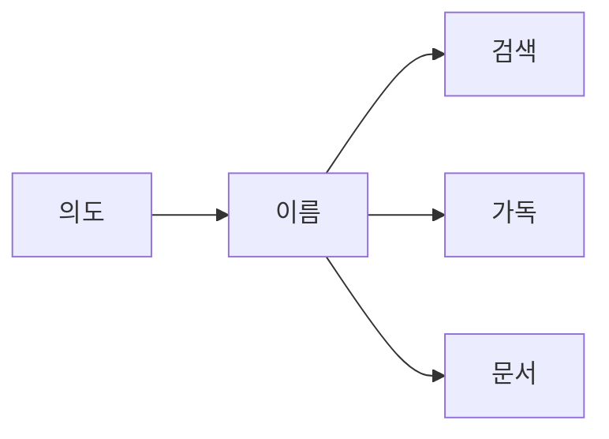

# 이름 짓기

좋은 이름의 신호, 변수·함수·클래스 이름 짓기, 자주 하는 이름 실수를 정리합니다.

이 글은 Clean Code 101 시리즈의 2번째 글입니다.

> Clean Code 101 시리즈 (2/10)


## 이 글에서 다룰 문제

이름은 코드에서 가장 자주 읽히는 요소입니다. 한 번 어긋나면 그 오해가 계속 누적됩니다.

> 검색 가능한 이름이 유지보수의 시작이다.

## 전체 흐름


좋은 이름은 의도를 앞으로 끌어올립니다.

## Before/After

**Before**

```python
d = 86400  # ?
```

**After**

```python
SECONDS_PER_DAY = 86400
```

상수에도 역할과 맥락을 함께 담아야 합니다.

## 이름 6원칙

### 1단계 — 의도 드러내기

```python
# 예시 파일: 1_intent.py
def f(x): return x[0]            # 무엇을 반환하는지 드러나지 않습니다.
def first_completed_order(orders): return orders[0]
```

좋은 이름은 호출하는 쪽에서 이미 설명이 되게 만듭니다.

### 2단계 — 검색 가능

```python
# 예시 파일: 2_search.py
TAX = 0.08                       # 어디에 쓰이는지 이름만으로는 알기 어렵습니다.
DEFAULT_SALES_TAX_RATE = 0.08
```

검색 한 번으로 정확히 찾아낼 수 있어야 합니다.

### 3단계 — 도메인 용어

```python
# 예시 파일: 3_domain.py
def calc(items): ...             # 도메인 맥락이 사라집니다.
def calculate_invoice_subtotal(line_items): ...
```

코드와 비즈니스 문맥이 같은 단어를 써야 대화 비용이 줄어듭니다.

### 4단계 — 부정형 피하기

```python
# 예시 파일: 4_negative.py
if not is_not_empty(x): ...      # 이중 부정입니다.
if is_empty(x): ...
```

긍정형 이름이 읽는 사람의 부담을 훨씬 줄여 줍니다.

### 5단계 — 짧음과 정확의 균형

```python
# 예시 파일: 5_balance.py
i, j, k                          # 좁은 루프 범위에서는 허용할 수 있습니다.
customer_balance_cents           # 도메인 값은 길어도 정확한 편이 낫습니다.
```

스코프가 좁으면 짧아도 되지만, 오래 살아남는 이름일수록 더 정확해야 합니다.

## 이 코드에서 주목할 점

- 이름은 호출 부위에서 바로 의미를 만들어야 합니다.
- 검색 가능한 이름은 디버깅과 분석 속도를 높여 줍니다.
- 도메인 용어를 맞추면 사용자 요구와 코드가 자연스럽게 이어집니다.

## 자주 하는 실수 5가지

1. **`data`, `info`, `obj`.** 정보 전달 0.
2. **약어 남발.** `usrCtxMgr`처럼 팀 밖에서는 해석하기 어려운 이름입니다.
3. **숫자 접미사.** `process2`, `process3` — 의미 없음.
4. **타입을 이름에.** `user_dict` 대신 `user`.
5. **거짓말 이름.** `getXxx`인데 mutate함.

## 실무에서는 이렇게 쓰입니다

좋은 팀은 저장소 안에 도메인 용어집을 두고, PR에서 용어 일관성을 계속 맞춥니다. 또한 lint로 한 글자 변수나 허용되지 않은 약어를 점검해 이름 품질을 자동으로 지킵니다.

## 체크리스트

- [ ] 이름이 의도를 드러내는가?
- [ ] grep으로 검색 가능한가?
- [ ] 도메인 용어를 쓰는가?
- [ ] 부정형을 피했는가?
- [ ] 스코프와 길이가 균형인가?

## 정리 및 다음 단계

이름은 가장 값싼 가독성 도구이면서도 효과는 가장 큽니다. 다음 글에서는 그 이름이 가리키는 단위, 즉 함수를 어떻게 작게 유지할지 살펴보겠습니다.

<!-- toc:begin -->
- [Clean Code란 무엇인가?](./01-what-is-clean-code.md)
- **이름 짓기 (현재 글)**
- 함수 작게 만들기 (예정)
- 조건문 줄이기 (예정)
- 중복 제거 (예정)
- 오류 처리 (예정)
- 주석과 문서화 (예정)
- 테스트 가능한 코드 (예정)
- 리팩토링 기초 (예정)
- 좋은 코드 리뷰 기준 (예정)
<!-- toc:end -->

## 참고 자료

- [Clean Code (Ch. 2 Meaningful Names)](https://www.oreilly.com/library/view/clean-code-a/9780136083238/)
- [Domain-Driven Design — Eric Evans](https://www.oreilly.com/library/view/domain-driven-design-tackling/0321125215/)
- [Google Style Guide — Naming](https://google.github.io/styleguide/pyguide.html#316-naming)
- [PEP 8 — Naming Conventions](https://peps.python.org/pep-0008/#naming-conventions)

Tags: Computer Science, CleanCode, Naming, Readability, Refactoring, SoftwareEngineering
