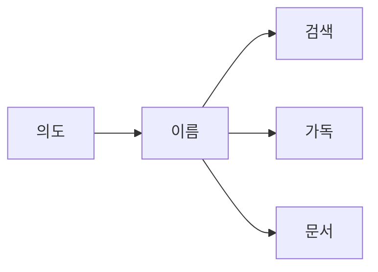

# 이름 짓기

> Clean Code 101 시리즈 (2/10)


## 이 글에서 다룰 문제

이름은 가장 자주 읽히는 요소입니다. 한 번 잘못 지으면 영원히 잘못 부릅니다.

> 검색 가능한 이름이 유지보수의 시작이다.

## 개념 한눈에 보기



이름이 의도를 들어올립니다.

## Before/After

**Before**

```python
d = 86400  # ?
```

**After**

```python
SECONDS_PER_DAY = 86400
```

상수에 의미를 박습니다.

## 실습: 이름 6원칙

### 1단계 — 의도 드러내기

```python
# 1_intent.py
def f(x): return x[0]            # 무엇을?
def first_completed_order(orders): return orders[0]
```

이름이 호출을 설명합니다.

### 2단계 — 검색 가능

```python
# 2_search.py
TAX = 0.08                       # 어디에 쓰임? 모름
DEFAULT_SALES_TAX_RATE = 0.08
```

grep 한 번에 잡히도록.

### 3단계 — 도메인 용어

```python
# 3_domain.py
def calc(items): ...             # 도메인 잃음
def calculate_invoice_subtotal(line_items): ...
```

코드와 비즈니스가 같은 말을 합니다.

### 4단계 — 부정형 피하기

```python
# 4_negative.py
if not is_not_empty(x): ...      # 이중 부정
if is_empty(x): ...
```

긍정형이 머리를 덜 씁니다.

### 5단계 — 짧음과 정확의 균형

```python
# 5_balance.py
i, j, k                          # 짧은 루프 OK
customer_balance_cents           # 도메인은 길게 OK
```

스코프가 좁으면 짧게, 넓으면 정확하게.

## 이 코드에서 주목할 점

- 이름이 호출 부위에서 의미를 만듭니다.
- 검색 가능성이 미래의 분석을 가능케 합니다.
- 도메인 용어가 사용자와 개발자를 잇습니다.

## 자주 하는 실수 5가지

1. **`data`, `info`, `obj`.** 정보 전달 0.
2. **약어 남발.** `usrCtxMgr` 같은 이름.
3. **숫자 접미사.** `process2`, `process3` — 의미 없음.
4. **타입을 이름에.** `user_dict` 대신 `user`.
5. **거짓말 이름.** `getXxx`인데 mutate함.

## 실무에서는 이렇게 쓰입니다

좋은 팀은 도메인 용어집(glossary)을 저장소에 두고 PR에서 일관성 강제. lint로 1글자 변수 금지(루프 제외), 약어 화이트리스트.

## 체크리스트

- [ ] 이름이 의도를 드러내는가?
- [ ] grep으로 검색 가능한가?
- [ ] 도메인 용어를 쓰는가?
- [ ] 부정형을 피했는가?
- [ ] 스코프와 길이가 균형인가?

## 정리 및 다음 단계

이름은 가장 큰 단일 가독성 도구입니다. 다음 글에서는 그 이름이 가리키는 단위 — 함수 — 를 작게 만드는 법을 봅니다.

<!-- toc:begin -->
- [Clean Code란 무엇인가?](./01-what-is-clean-code.md)
- **이름 짓기 (현재 글)**
- 함수 작게 만들기 (예정)
- 조건문 줄이기 (예정)
- 중복 제거 (예정)
- 오류 처리 (예정)
- 주석과 문서화 (예정)
- 테스트 가능한 코드 (예정)
- 리팩토링 기초 (예정)
- 좋은 코드 리뷰 기준 (예정)
<!-- toc:end -->

## 참고 자료

- [Clean Code (Ch. 2 Meaningful Names)](https://www.oreilly.com/library/view/clean-code-a/9780136083238/)
- [Domain-Driven Design — Eric Evans](https://www.oreilly.com/library/view/domain-driven-design-tackling/0321125215/)
- [Google Style Guide — Naming](https://google.github.io/styleguide/pyguide.html#316-naming)
- [PEP 8 — Naming Conventions](https://peps.python.org/pep-0008/#naming-conventions)

Tags: Computer Science, CleanCode, Naming, Readability, Refactoring, SoftwareEngineering
