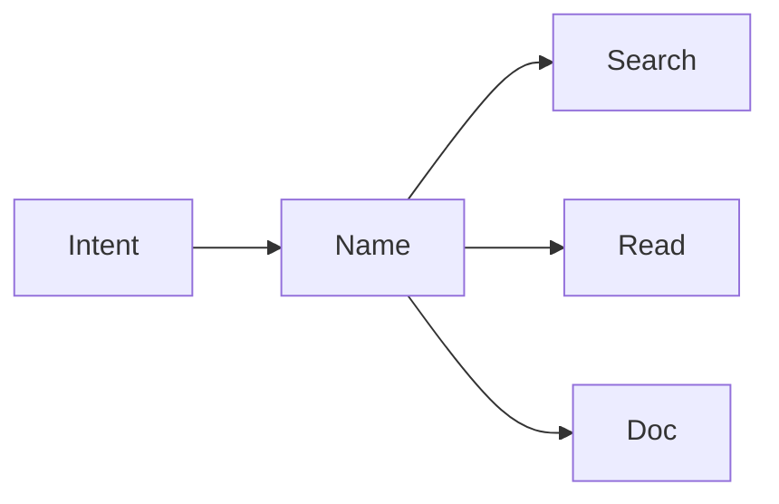

# 이름 짓기

코드에서 가장 자주 읽히는 것은 로직보다 이름입니다. 이 글은 Clean Code 101 시리즈의 2번째 글입니다. 여기서는 좋은 이름이 왜 주석을 줄이고 검색 비용을 낮추는지, 그리고 변수·함수·클래스 이름을 어떻게 다르게 다뤄야 하는지 정리하겠습니다.

## 이 글에서 다룰 문제

- 좋은 이름을 판단할 때 어떤 신호를 봐야 할까요?
- 변수 이름과 함수 이름, 클래스 이름은 무엇이 다를까요?
- 도메인 용어를 코드 안으로 어떻게 자연스럽게 가져올 수 있을까요?
- 자주 반복되는 이름 실수는 무엇일까요?
- 이름을 바꿀 때 어떤 순서로 해야 안전할까요?

> 좋은 이름은 코드를 짧게 만드는 것이 아니라, 의도를 더 빨리 보이게 만드는 도구입니다.

## 왜 중요한가

이름은 코드의 가장 작은 단위이면서도 가장 오래 남는 설계 결정입니다. 한 번 잘못 붙인 이름은 변수 하나를 넘어 함수, 문서, PR 대화, 심지어 팀의 공통 용어까지 오염시킵니다.

반대로 좋은 이름은 호출 지점에서 이미 많은 설명을 끝냅니다. 검색도 쉬워지고, 리뷰도 빨라지고, 주석도 줄어듭니다. 그래서 이름 짓기는 사소한 스타일 문제가 아니라 유지보수성의 출발점입니다.

## 한눈에 보는 개념



이름은 의도를 보이게 만들고, 그 의도는 검색과 읽기와 문서화를 동시에 돕습니다.

## 핵심 용어

- **Intention-revealing**: 무엇을 왜 하는지 이름만으로 드러나는 상태입니다.
- **Searchable**: 한 번의 grep으로 정확히 찾을 수 있는 이름입니다.
- **Pronounceable**: 회의나 리뷰에서 자연스럽게 말할 수 있는 이름입니다.
- **Domain term**: 비즈니스에서 쓰는 단어를 코드에도 그대로 쓰는 방식입니다.
- **Length budget**: 짧음보다 정확성을 우선하는 길이 감각입니다.

## Before/After

**Before**

```python
d = 86400  # ?
```

**After**

```python
SECONDS_PER_DAY = 86400
```

상수 하나도 이름이 붙는 순간 의미를 가집니다. 좋은 이름은 값을 설명문으로 바꾸지 않고도 맥락을 전달합니다.

## 실전 적용: 이름을 개선하는 다섯 단계

### Step 1 — Reveal intent

```python
# 1_intent.py
def f(x): return x[0]            # of what?
def first_completed_order(orders): return orders[0]
```

호출 지점에서 바로 이해되는 이름이 좋습니다. 함수 본문보다 이름이 먼저 읽힌다는 사실을 항상 기억해야 합니다.

### Step 2 — Searchable

```python
# 2_search.py
TAX = 0.08                       # used where? unclear
DEFAULT_SALES_TAX_RATE = 0.08
```

검색 가능한 이름은 나중의 분석 비용을 줄입니다. 너무 짧거나 흔한 이름은 찾는 순간부터 비용을 만듭니다.

### Step 3 — Domain terms

```python
# 3_domain.py
def calc(items): ...             # domain lost
def calculate_invoice_subtotal(line_items): ...
```

코드가 비즈니스와 다른 단어를 쓰기 시작하면 대화가 꼬입니다. 도메인 언어를 그대로 들여오면 사용자와 개발자의 문맥이 맞춰집니다.

### Step 4 — Avoid negatives

```python
# 4_negative.py
if not is_not_empty(x): ...      # double negative
if is_empty(x): ...
```

이중 부정은 읽는 순간 사고를 한 번 더 요구합니다. 긍정형 표현이 대개 더 빠르고 덜 위험합니다.

### Step 5 — Balance brevity and accuracy

```python
# 5_balance.py
i, j, k                          # short loops are fine
customer_balance_cents           # domain names can be long
```

좁은 범위에서는 짧아도 되지만, 넓은 범위에서는 정확해야 합니다. 이름 길이는 미학이 아니라 범위와 책임에 대한 판단입니다.

## 이 코드에서 먼저 봐야 할 점

- 이름은 호출 지점에서 의미를 만듭니다.
- 검색 가능성은 미래의 분석 비용을 줄입니다.
- 도메인 용어는 사용자와 개발자 사이의 번역 비용을 없앱니다.

## 자주 하는 실수 5가지

1. **`data`, `info`, `obj` 같은 이름 쓰기.** 정보가 거의 없습니다.
2. **과한 축약어 사용하기.** `usrCtxMgr` 같은 이름은 읽는 비용만 올립니다.
3. **숫자 접미사 붙이기.** `process2`, `process3`는 의미를 설명하지 못합니다.
4. **타입을 이름에 넣기.** `user_dict`보다 `user`가 더 좋습니다.
5. **거짓말하는 이름 쓰기.** `getXxx`가 실제로 값을 바꾸면 신뢰가 무너집니다.

## 실무에서는 이렇게 보입니다

성숙한 팀은 저장소 안에 도메인 용어집을 두고, PR에서 용어 일관성을 함께 리뷰합니다. 한 글자 변수는 루프 안처럼 좁은 범위에서만 허용하고, 축약어는 허용 목록을 두는 식으로 관리하기도 합니다.

## 시니어 엔지니어는 이렇게 생각합니다

- 이름은 문서의 절반입니다.
- 짧음보다 정확함이 우선입니다.
- 검색 가능성이 미래 비용을 좌우합니다.
- 도메인 용어는 그대로 코드로 들어와야 합니다.
- 거짓말하는 이름은 작은 사기가 됩니다.

## 체크리스트

- [ ] 이름이 의도를 드러내는가?
- [ ] grep으로 정확히 찾을 수 있는가?
- [ ] 도메인 용어를 사용했는가?
- [ ] 부정형과 이중 부정을 피했는가?
- [ ] 범위에 맞는 길이인가?

## 연습 문제

1. `data`/`info`/`obj` 같은 이름 다섯 개를 찾아 바꿔 보세요.
2. 축약어 다섯 개를 풀어서 더 읽기 쉽게 만들어 보세요.
3. 한 페이지짜리 도메인 용어집을 만들어 보세요.

## 정리 및 다음 단계

이름 짓기는 가독성에서 가장 레버리지가 큰 도구입니다. 다음 글에서는 그 이름이 가리키는 단위를 더 작게 만드는 방법, 즉 작은 함수에 대해 다룹니다.

<!-- toc:begin -->
- [Clean Code란 무엇인가?](./01-what-is-clean-code.md)
- **이름 짓기 (현재 글)**
- 함수 작게 만들기 (예정)
- 조건문 줄이기 (예정)
- 중복 제거 (예정)
- 오류 처리 (예정)
- 주석과 문서화 (예정)
- 테스트 가능한 코드 (예정)
- 리팩토링 기초 (예정)
- 좋은 코드 리뷰 기준 (예정)
<!-- toc:end -->

## 참고 자료

- [Clean Code (Ch. 2 Meaningful Names)](https://www.oreilly.com/library/view/clean-code-a/9780136083238/)
- [Domain-Driven Design — Eric Evans](https://www.oreilly.com/library/view/domain-driven-design-tackling/0321125215/)
- [Google Style Guide — Naming](https://google.github.io/styleguide/pyguide.html#316-naming)
- [PEP 8 — Naming Conventions](https://peps.python.org/pep-0008/#naming-conventions)

Tags: Computer Science, CleanCode, Naming, Readability, Refactoring, SoftwareEngineering
