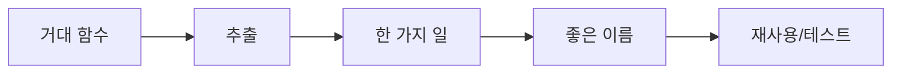

# 함수 작게 만들기

작은 함수의 효과, 한 가지 일만 하기, 추출 절차, 부수효과 제거 패턴을 정리합니다.

이 글은 Clean Code 101 시리즈의 3번째 글입니다.

> Clean Code 101 시리즈 (3/10)


## 이 글에서 다룰 문제

작은 함수는 이름만으로 역할을 설명합니다. 반대로 큰 함수는 주석에 기대기 쉬운데, 그런 주석은 금방 낡습니다.

> 함수가 작아지면 이름이 일을 한다.

## 전체 흐름


함수를 잘게 나누면 이름을 붙일 수 있고, 이름이 생기면 재사용과 테스트도 쉬워집니다.

## Before/After

**Before**

```python
def checkout(cart, user, addr, coupon):
    # 검증, 가격 계산, 세금, 배송, 로그, 메일, 저장이 한곳에 섞여 있습니다.
    ...
```

**After**

```python
def checkout(cart, user, addr, coupon):
    items = validate_cart(cart, user)
    total = price_with_tax(items, addr)
    order = save_order(user, items, total, coupon)
    notify_user(user, order)
    return order
```

함수 본문이 곧 작업 순서를 보여 주는 목차가 됩니다.

## 안전하게 함수 추출

### 1단계 — 부분 추출

```python
# 예시 파일: 1_extract.py
def total(items):
    s = 0
    for it in items:
        s += it.price * it.qty
    return s
```

반복문은 가장 먼저 추출 후보로 살펴볼 만한 지점입니다.

### 2단계 — 의도 이름

```python
# 예시 파일: 2_intent.py
def line_total(item): return item.price * item.qty
def total(items): return sum(line_total(it) for it in items)
```

좋은 이름은 주석 없이도 코드를 짧고 분명하게 만듭니다.

### 3단계 — 명령/질의 분리

```python
# 예시 파일: 3_cqs.py
class Account:
    def withdraw(self, amount):  # 명령
        self.balance -= amount
    def is_overdrawn(self):      # 질의
        return self.balance < 0
```

질의 함수는 값을 알려 주기만 하고 상태를 바꾸지 않아야 합니다.

### 4단계 — 인자 객체

```python
# 예시 파일: 4_param_obj.py
from dataclasses import dataclass
@dataclass
class Range: lo: int; hi: int
def in_range(value, r: Range): return r.lo <= value <= r.hi
```

함수 인자가 3개를 넘기면 인자 객체로 묶을 수 있는지 점검해 볼 만합니다.

### 5단계 — 순수 함수로

```python
# 예시 파일: 5_pure.py
def discount(price: int, rate: float) -> int:
    return int(price * (1 - rate))
```

순수 함수는 테스트 코드도 자연스럽게 단순해집니다.

## 이 코드에서 주목할 점

- 함수 본문이 목차처럼 읽히면 이해 속도가 빨라집니다.
- 좋은 이름은 불필요한 주석을 거의 없애 줍니다.
- 명령과 질의를 분리하면 버그를 좁혀 가기가 쉬워집니다.

## 자주 하는 실수 5가지

1. **거대 함수를 변수만 늘려 정리하기.** 핵심 역할은 여전히 분리되지 않습니다.
2. **추출 후 인자 폭증.** 객체로 묶으세요.
3. **질의가 mutate함.** 가장 흔한 버그 원천.
4. **테스트 없이 추출.** 회귀 위험.
5. **지나치게 잘게 쪼개기.** 한 줄 함수만 끝없이 이어지면 오히려 흐름이 끊깁니다.

## 실무에서는 이렇게 쓰입니다

좋은 팀은 함수 길이, 인자 수, 순환 복잡도 같은 기준을 lint로 관리합니다. 큰 함수가 들어오면 리뷰에서 바로 추출 후보를 이야기할 수 있도록 기준을 공유해 둡니다.

## 체크리스트

- [ ] 함수가 한 가지 일만 하는가?
- [ ] 본문이 목차처럼 읽히는가?
- [ ] 인자 ≤ 3?
- [ ] 질의는 부수효과가 없나?
- [ ] 추출 전후 테스트가 있는가?

## 정리 및 다음 단계

작은 함수는 좋은 이름과 빠른 테스트를 가능하게 합니다. 다음 글에서는 큰 함수를 키우는 대표 원인인 조건문을 어떻게 줄일지 살펴보겠습니다.

<!-- toc:begin -->
- [Clean Code란 무엇인가?](./01-what-is-clean-code.md)
- [이름 짓기](./02-naming.md)
- **함수 작게 만들기 (현재 글)**
- 조건문 줄이기 (예정)
- 중복 제거 (예정)
- 오류 처리 (예정)
- 주석과 문서화 (예정)
- 테스트 가능한 코드 (예정)
- 리팩토링 기초 (예정)
- 좋은 코드 리뷰 기준 (예정)
<!-- toc:end -->

## 참고 자료

- [Clean Code (Ch. 3 Functions)](https://www.oreilly.com/library/view/clean-code-a/9780136083238/)
- [Refactoring — Extract Function](https://refactoring.com/catalog/extractFunction.html)
- [Martin Fowler — Command Query Separation](https://martinfowler.com/bliki/CommandQuerySeparation.html)
- [Refactoring — Introduce Parameter Object](https://refactoring.com/catalog/introduceParameterObject.html)

Tags: Computer Science, CleanCode, Functions, SRP, Refactoring, Readability
